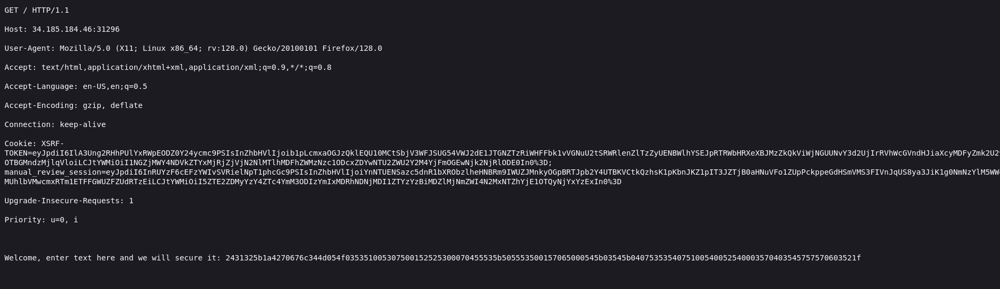
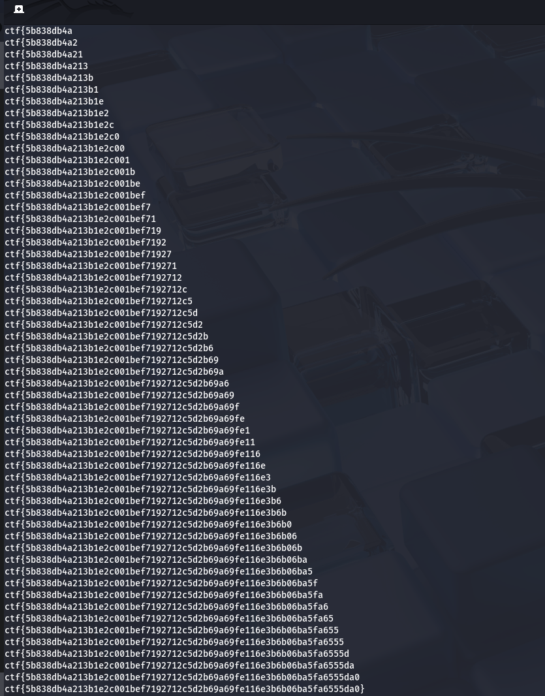

# Write-up: 
##  alien-console

**Category:** Misc
**Platform:** CyberEdu
**URL:** `https://app.cyber-edu.co/challenges/84ed6180-0c76-11eb-973a-09571eea0293`

---

I used `nc` to connect to the challenge's ip and started testing the service:


For "tudor", all 3 responses have some common characters : `17010214470`

For "tudo" : `170102145`.

I tested again and got the same output for 'tudo'. This might mean that if the session cookies remain the same, the output wont change for the same input string.



I don't know what type of encryption the site is using, I only know
that the flag format is `ctf{sha256}`.

Let's try to input `ctf{` and see what we got:


Ok, this is a big hint. Apparently, the first 8 characters are 0,
2 zeros for each character from `ctf{` string.

Let's brute force the flag with a script:

``` bash
from pwn import *

context.log_level = "critical"
# stop showing "Connecting to.."/"Closed connection"


def tryFlag(flag):

    expectedZeros = '0' * 2 * len(flag)

    r = remote('34.185.184.46',31296)
    r.recvuntil(b": ")
    r.sendline(flag.encode())
    r.recvuntil((flag + "\r\n").encode()) #skip my input
    resp = r.recvuntil(b"\r\n")[:-2].decode()
    r.close()
    if resp.startswith(expectedZeros):
        return True
    else:
        return False
    
characters = "0123456789abcdef}" #sha256 flg format
flag = "ctf{"

while flag[:-1] != "}":
    for c in characters:
        if tryFlag(flag+c):
            flag = flag + c
            print(flag)
            break


```

We run this code and after a few moments of waiting, we got the flag!

