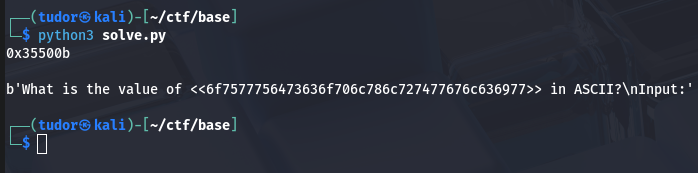
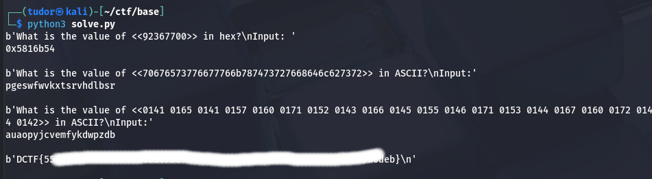

# Write-up: 
##  base

**Category:** Misc | Programming
**Platform:** CyberEdu
**URL:** `https://app.cyber-edu.co/challenges/55e16d00-7f21-11ea-99d5-e91c3e9dcacc`

---

Fun challenge that tested my knowledge of basic Python socket scripting and data encoding conversions.

When I tried to reach the address given by this challenge, I got this output:


Every time i pressed the refresh button, it gave me a different value between `<< >>`

I also tried to connect to the port using
` nc 34.185.184.46 31060 ` and I had to type in
the value of the given number but in Hex in a too short time.

Ok, so given the short amonut of time I had to type in my result(including the conversion from decimal to hex), the simplest way was to create a python script.

```bash

import socket

HOST = '34.185.184.46'
PORT = 31060


sock = socket.socket()
sock.connect((HOST,PORT))

response = sock.recv(4096)
str_response = repr(response)

idxSt = str_response.find('<') + 2
idxDr = str_response.find('>')

numar = str_response[idxSt:idxDr]

response_corect = str(hex(int(numar)))
response_corect += '\n'
print(response_corect)
sock.send(bytes(response_corect,'utf8'))


response = sock.recv(4096)
print(response)

sock.close()

```
When i ran `solve.py`, I got this answer:

Ok, so this wasn't all. I modified the code for the next step


```bash

import socket

HOST = '34.185.184.46'
PORT = 31060


sock = socket.socket()
sock.connect((HOST,PORT))


caz = 0

while caz < 2:

    response = sock.recv(4096)
    str_response = repr(response)

    idxSt = str_response.find('<') + 2
    idxDr = str_response.find('>')

    numar = str_response[idxSt:idxDr]

    if caz == 0:
        response_corect = str(hex(int(numar)))
    else:
        #hex to ascii
        response_corect = bytes.fromhex(numar).decode("utf-8")

    response_final = response_corect + '\n'

    print(response)
    print(response_final)

    sock.send(bytes(response_final,'utf8'))
    caz = caz + 1


response = sock.recv(4096)
print(response)

sock.close()


```
Ok, it seemed like there was another input request(hopefully the last one)
It told me that I had to convert from octal to ASCII:


```bash

import socket

HOST = '34.185.180.177'
PORT = 31060


sock = socket.socket()
sock.connect((HOST,PORT))


caz = 0

while caz < 3:

    response = sock.recv(4096)
    str_response = repr(response)

    idxSt = str_response.find('<') + 2
    idxDr = str_response.find('>')

    numar = str_response[idxSt:idxDr]

    if caz == 0:
        response_corect = str(hex(int(numar)))
    elif caz == 1:
        #hex to ascii
        response_corect = bytes.fromhex(numar).decode("utf-8")
    else:
        #oct to ascii
        response_splitted = numar.split(' ')
        response_corect = ""
        for i in response_splitted:
            converted_in_oct = chr(int(i,8))
            response_corect += converted_in_oct


    response_final = response_corect + '\n'

    print(response)
    print(response_final)

    sock.send(bytes(response_final,'utf8'))
    caz = caz + 1


response = sock.recv(4096)
print(response)

sock.close()


```
## Anddd... I got it!

