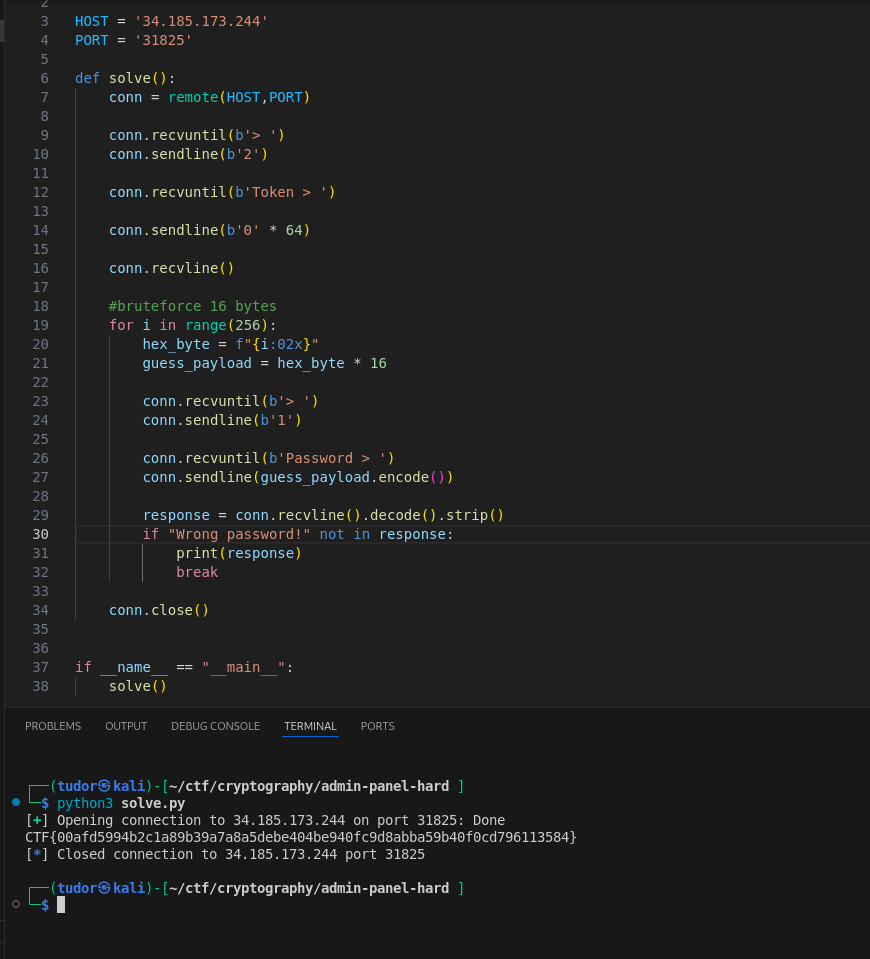

# Write-up: 
##  bro64 

**Category:** Cryptography
**Platform:** CyberEdu
**URL:** `https://app.cyber-edu.co/challenges/be6a8830-449b-11ed-8f36-f76a151e1d23`

---

At first glance I thought it was AES-ECB encryption but after looking carefully, it was just `AES-CFB` (Cipher Feedback).
This behaviour(updating byte-by-byte not block-by-block) is what makes the vulnerability possible.

`state = state[1:] + bytes([ct[i]])` acts as the shifter.

The key of this challenge is to send a repeating 64 bytes sequence. The code will xor the token with a random byte so it will remain a repeating sequence. In the decrypt function, the shift register fills up a single byte at a time. Since it's fed a constant stream of identical ct bytes, the internal state is going to become static. This will result in a 16 repeating bytes password which we can brute force in maximum 256 tries:

