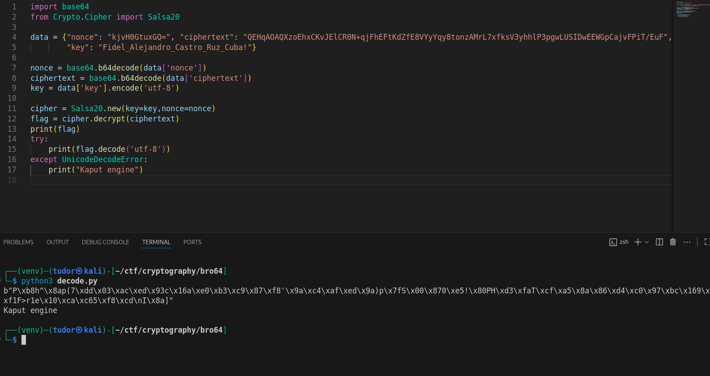
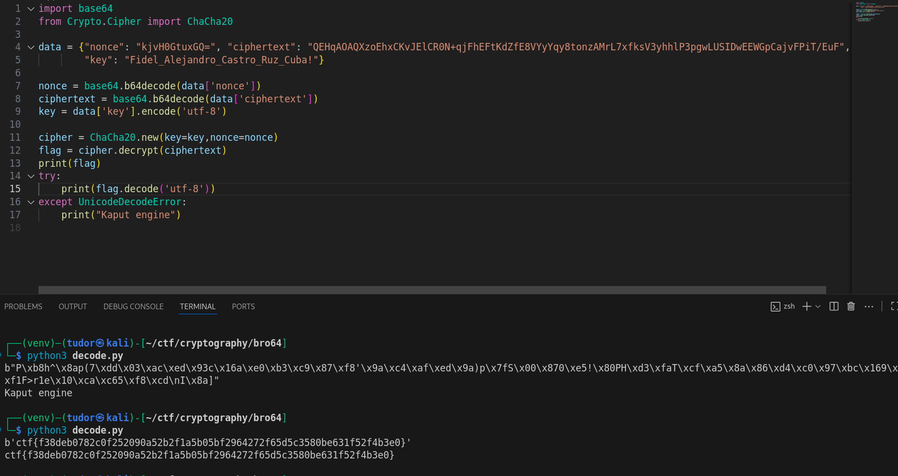

# Write-up: 
##  bro64 

**Category:** Cryptography
**Platform:** CyberEdu
**URL:** `https://app.cyber-edu.co/challenges/b05ef8c0-233c-11eb-9ced-1538e98e4f9a`

---

Every time I connect to the remote host, I get:
-> `nonce`
-> `ciphertext`
-> `key` (stays the same "Fidel_Alejandro_Castro_Ruz_Cuba!")

nonce is a unique value for every encryption, used in algorithms like stream cipher or block cipher.

for `AES-GCM`, the nonce's size has to be 12 bytes

our nonce is 8 bytes long though...

After searching on google for cryptographic algorithms, I found this list: `https://en.wikipedia.org/wiki/List_of_cryptosystems`.

The keywords `Cuba`, `Dance` from this challenge helped me to choose `Salsa20` and `ChaCha20` as potential "winners" for decrypting the ciphertext.

Let's write a script do decrypt using Salsa20:

Apparently, Salsa20 is not the right choice. Let's try ChaCha20:

There it is our flag!