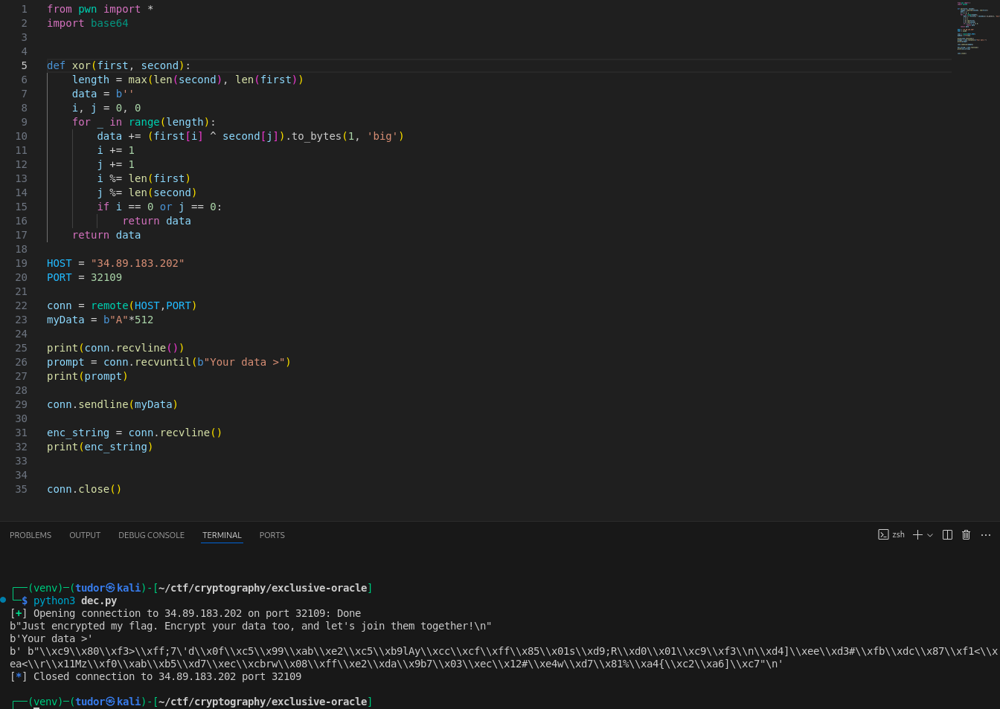

# Write-up: 
##  exclusive-oracle

**Category:** Cryptography
**Platform:** CyberEdu
**URL:** `https://app.cyber-edu.co/challenges/54c24020-449c-11ed-bec3-79b6e23ebbdc`

---
I analyzed the python program the challenge gave us and I found the vulnerability.
The code uses `XOR` encryption, so if I xor again the output with my input, I will get the secret and the key.

`print(secret + xor(data, KEY), sep="\n")`

The thing is, I don't know where the secret ends in the string and where my data starts.
We'll see this later.

The payload I'm currently using in my script has the length of 512 bytes, just to be sure that it's not too short(it's exaggeratedly, I know...)

I used the same xor function `main.py` has.

`ast.literal_eval` is the safe way to evaluate the pyton literals
for example: if token was 'b"\\xc9\\x80>"', it would return the object in bytes format b'\xc9\x89>`

The length of the secret + xor(data,key) is 78 bytes. I'm 100% sure that there is no way my payload is too short.
In the xor function, we see `length = max(len(second), len(first))`, but also if one of the strings we xor ends, it returns the xored data until there.

This means that in those 78 bytes we have the key 2 times, so 39 bytes + 39 bytes.
That means that the secret(flag) is 39 bytes and the length of my input should also be only 39 bytes.
Let's check the output for the payload of length 38 and 39:

Ok, this checks everything.
Now I will extract the first 39 bytes(the flag), but also the last 39 bytes(the key).

There it is our flag!