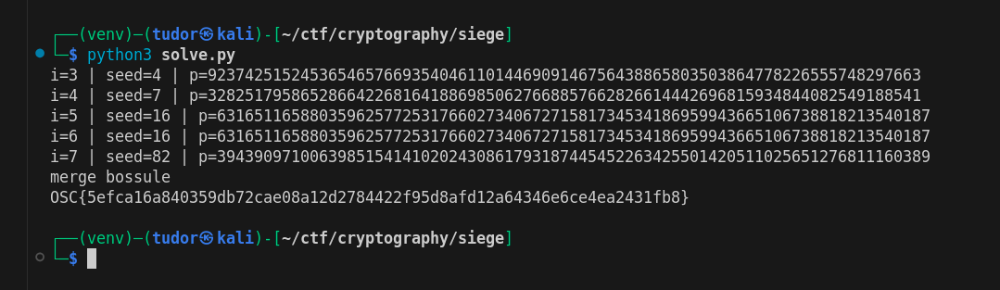

# Write-up: 
##  siege

**Category:** Cryptography
**Platform:** CyberEdu
**URL:** `https://app.cyber-edu.co/challenges/9eeadb9a-c1c8-4d97-a351-257553f38144`


------------------------------------------------

Let's analyze `main.py`:

-> `import secrets` .  secrets is the libraray we want to use if we need a safe number generator. it uses `os.urandom`(the entropy of the system), not the unsafe `random` generator

-> `random` is deterministic and not secure for keys or tokens; an attacker learning the internal state can predict future values

Although the program generates a safe seed `secrets.randbelow(2**i)`, it then uses `random.Random(seed)`, which creates a deterministic RNG starting from that small seed. We can bruteforce it because the seed is small (0..2^3, 0..2^4, 0..2^5, 0..2^6, 0..2^7).

We also have the output split by spaces, so we can see the corresponding values for N, C_key, iv and ct.

We will reconstruct the N by bruteforcing the prime numbers, one for each seed in range(3,8) and then find the other encrypted values.

If we want to find the `aes_int` variable, we have to use advanced algebra(in my opinion, it is advanced :D).

`C_key = pow(aes_int, E, N)` <=> C_key ≡ (aes_int)^E mod N

So aes_int is ≡ C_key ^ d (mod N), where d is the d that e *d ≡ 1 (mod phi(N))

If gcd(m,N) = 1, then m^(phi(N)) ≡ 1 (mod N) (`Euler' theorem`).

phi(N) is given by the formula at `https://ro.wikipedia.org/wiki/Indicatorul_lui_Euler`(you can read more here, I'm not good at explaining math terms).

Ok, enough with the explanation for now, here is the script I used:

```py

import secrets
import random
import math
from Crypto.Util.number import isPrime
from Crypto.Cipher import AES
from Crypto.Util.Padding import unpad
from collections import Counter

FLAG = b"OSC{~}"
E = 0x10001


def find_first_prime(seed):
    rng = random.Random(seed)
    while True:
        p = rng._randbelow(1 << 256) | 1
        if isPrime(p):
            return p

corr_output = "5de30d6f229594805cf5bd3bcf921561b1b18883f02a36f1b85be47d646c527a945e4137ef06897d546f27759e2129efc0ba462ec06fdb28f664d489bff91aaf6e688d0d9c66698821fd43ac615f2133b0fe322c3737354eef149568d925c9568fb17f7e555d14d766846815a2a1a9a0055b26923f8096b961174429edc4b7e72e73a25ee9641e1b9f6e6deb5ed2b1b5a7e1c3c4414c1ec009d8b8b24547bf7 1a727061128645f52013b40c282ee3c1a64f238bb94280b684138187e1d7d7b8ba28e3816b14501862e27c2c2a324774f5d65ba1abe4ad364788afa5744109e64b89e336844d34d68d566d4943634fa0a297bed74fdc06e951312aa2d98d3f550bf4d110822ca88b1f3369c895497b009bcd9084e32c4444e24bf3c7b65a96f104d6658d6cdce1d0023acf6ec086baa4ccdcddebec2258f3a7631cc3866cb19 00fe4c7eeecf24dc1e4883585c0da618 8b15e8c2d547b79ba50552d4cecce7e26efd84d8e3f605805f6a2a406e01a2fd8962154db8663fa080802a1f48c400ca34b179ddf66495055e680a05c10c7b4b8e13a4e2da952d88cc06c91622f10277"
N_hex,C_key_hex,iv_hex,ct_hex = corr_output.strip().split()
N_int = int(N_hex,16)
C_key_int = int(C_key_hex,16)
iv = bytes.fromhex(iv_hex)
ct = bytes.fromhex(ct_hex)

N_copy = N_int
primes = []

for i in range(3,8):
    for seed in range(0,2**i):
        p = find_first_prime(seed)
        if N_copy % p == 0:
            N_copy = N_copy // p
            primes.append(p)
            print(f"i={i} | seed={seed} | p={p}")
            break
    
if N_copy == 1:
    print("merge bossule")

#C_key = pow(aes_int, E, N) <=> C ≡ (aes_int)^E mod N

phi = 1
prime_powers = Counter(primes)
for p,e in prime_powers.items():
    phi = phi * (p-1) *(p ** (e-1))

d = pow(E, -1, phi) #invers modular

aes_int = pow(C_key_int, d, N_int)

#aes_int = int.from_bytes(aes_key, 'big')

aes_key = aes_int.to_bytes(16,'big')

#cipher = AES.new(aes_key, AES.MODE_CBC, iv)
#AES-CBC decryption
cipher = AES.new(aes_key, AES.MODE_CBC, iv)

#ct = cipher.encrypt(pad(FLAG, AES.block_size))
ct_decrypt = unpad(cipher.decrypt(ct), AES.block_size)

print(ct_decrypt.decode(errors="ignore"))

```

