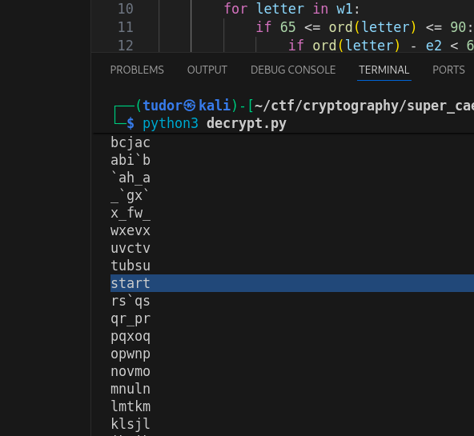
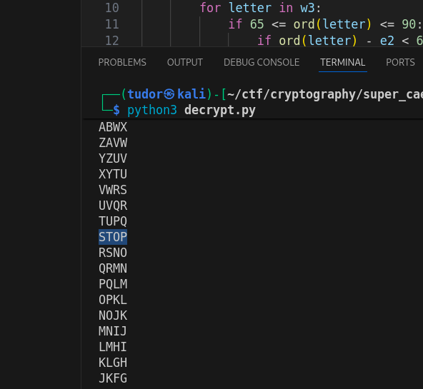
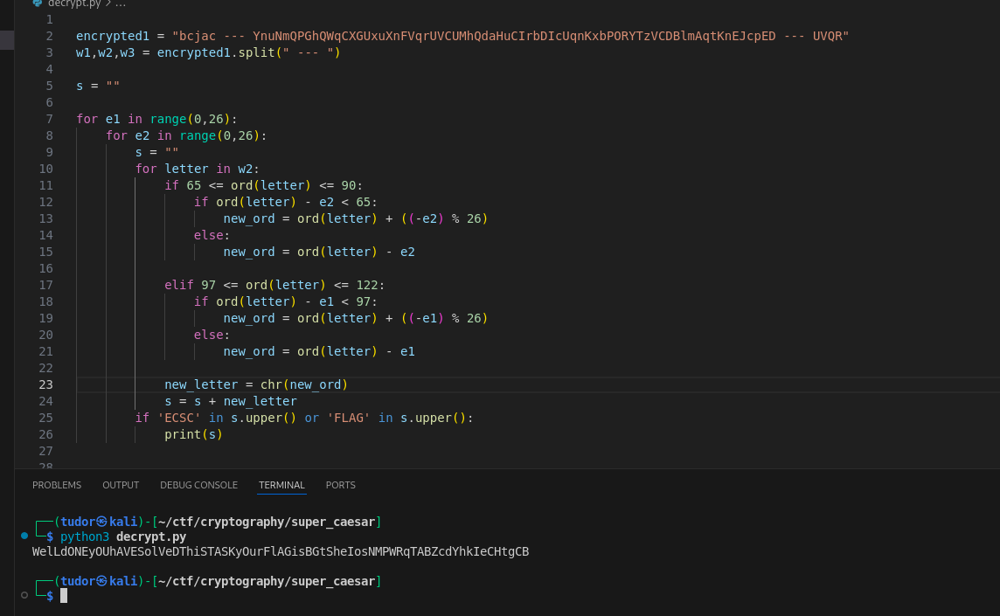

# Write-up: 
##  super_caesar 

**Category:** Cryptography
**Platform:** CyberEdu
**URL:** `https://app.cyber-edu.co/challenges/55f21ce0-7f21-11ea-a10a-117aa12fee20`

---
I tried to bruteforce w1=`bcjac` and w3=`UVQR` using a python script:

``` py

encrypted1 = "bcjac --- YnuNmQPGhQWqCXGUxuXnFVqrUVCUMhQdaHuCIrbDIcUqnKxbPORYTzVCDBlmAqtKnEJcpED --- UVQR"
w1,w2,w3 = encrypted1.split(" --- ")

s = ""

for e1 in range(0,26):
    for e2 in range(0,26):
        s = ""
        for letter in w1:
            if 65 <= ord(letter) <= 90:
                if ord(letter) - e2 < 65:
                    new_orde2 = ord(letter) + ((-e2) % 26)
                else:
                    new_orde2 = ord(letter) - e2

                new_letter = chr(new_orde2)

                if ord(new_letter) - e1 < 65:
                    new_orde1 = ord(new_letter) + ((-e1) % 26)
                else:
                    new_orde1 = ord(new_letter) - e1

            elif 97 <= ord(letter) <= 122:
                if ord(letter) - e2 < 97:
                    new_orde2 = ord(letter) + ((-e2) % 26)
                else:
                    new_orde2 = ord(letter) - e2

                new_letter = chr(new_orde2)

                if ord(new_letter) - e1 < 97:
                    new_orde1 = ord(new_letter) + ((-e1) % 26)
                else:
                    new_orde1 = ord(new_letter) - e1
            
            litera = chr(new_orde1)
            s = s + litera
        print(s)


```

while analyzing the results, there were two words that caught my attention.
for w1: `start`
for w3: `STOP`




After running the code for w2, I realized that one key was for the upper characters and the other for the lower ones.
I modified my script and got the flag!

