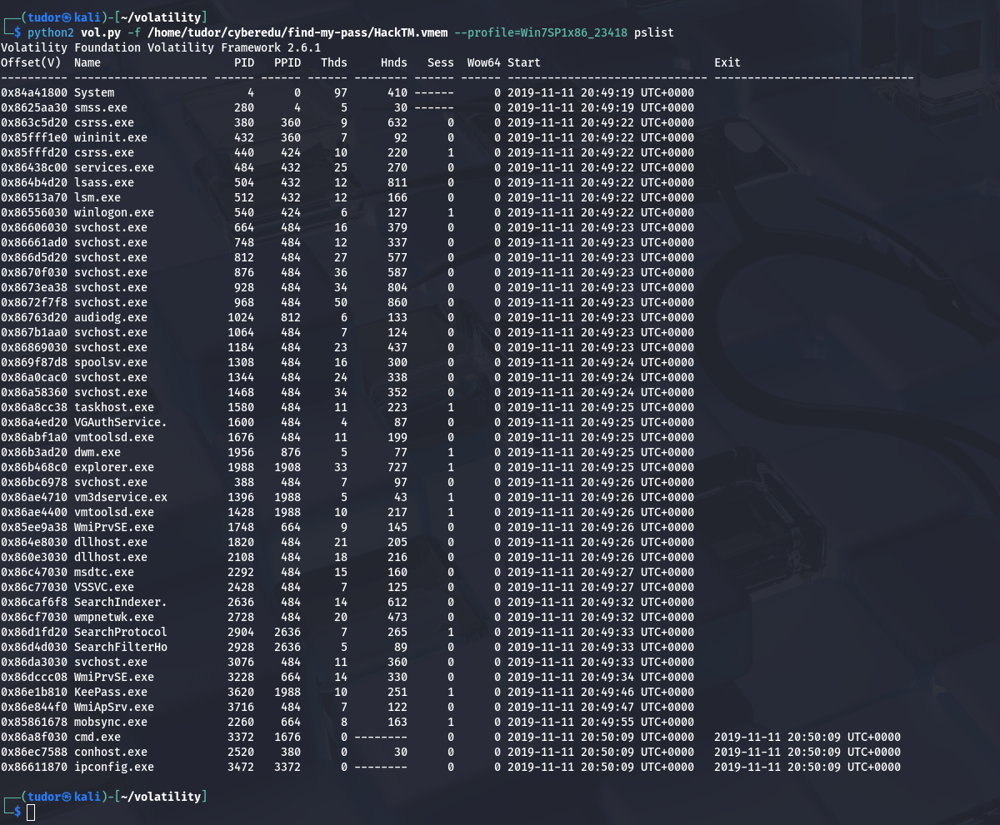
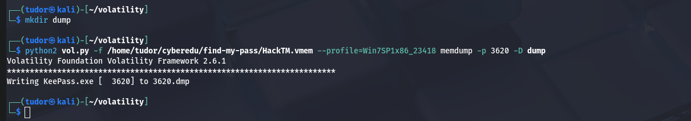
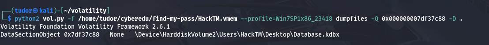
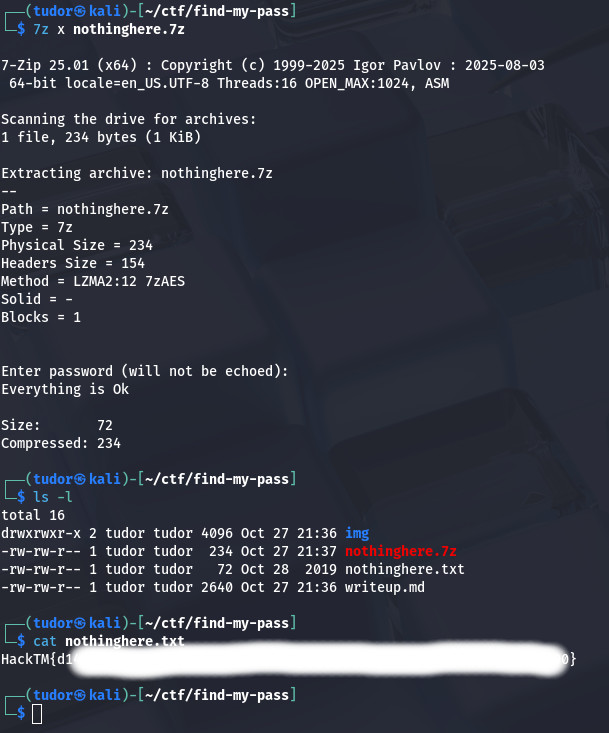

# Write-up: 
##  find-my-pass

**Category:** Forensics
**Platform:** CyberEdu
**URL:** `https://app.cyber-edu.co/challenges/25b34580-a58a-11ea-b67a-77fc80e73ad8`

---

This is a classic `memory forensics` challenge. When the user saved a memory dump, the KeePass process was still running so the main password for KeePass was saved in the RAM memory allocated to KeePass.exe

After I extracted the archive, I got the memory dump named `HackTM.vmem`. This is what I have to analyse; the complete RAM memory of a Windows system


To analyse the memory dump, I will use `volatility`.

The command

` python3 vol.py -f /home/tudor/cyberedu/find-my-pass/HackTM.vmem windows.pslist.PsList `

shows a list of all the processes in the memory dump.

I found the KeePass process :

` 3620	1988	KeePass.exe	0x86e1b810	10	251	1	False	2019-11-11 20:49:46.000000 UTC	N/A	Disabled `


Ok there are some plugins that haven't been implemented yet in volatility 3 so I downgraded to volatility 2.

First I need to find my profile: 


We will confirm that KeePass.exe has PID 3620:



First, I need to doa dump of the memory allocated for KeePass process:



We know that the user is not good with computers so maybe... he copy+pasted his password?
That means it's still in the clipboard. Let's check it!

`-v` is the flag we must use to view the contents of clipboard


We got something, let s copy it:

```bash                                                                                                                                                                                                                             
┌──(tudor㉿kali)-[~/volatility]
└─$ strings /home/tudor/cyberedu/find-my-pass/HackTM.vmem | grep dmVZQ
dmVZQmdzOlUrcEBlRj87dHQ3USVBIn


```

This is the keypass for the .kdbx file, the data base of all the informations.
The .kdbx file is encrypted. Inside, it uses a XML structure to organize all the entries.

Let's find the .kdbx :


Found it! The one at the offset `0x000000007df37c88` is our target. (others are just shortcuts)

Now I will use `dumpfiles` plugin with that address to save it on my system



-> `-Q` specifies the physical address
-> `-D .` specifies to save the file in cwd

Now, I will run `keepass2` and open this file

The master password is the one we got from the clipboard: `dmVZQmdzOlUrcEBlRj87dHQ3USVBIn`


There we have it, `nothinghere.7z`
We extract the content and we got the flag!

