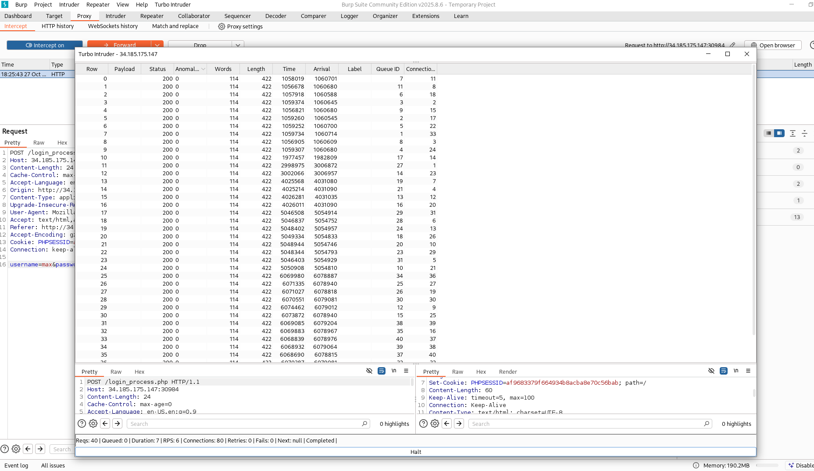

# Write-up: 
##  formula1

**Category:** Web
**Platform:** CyberEdu
**URL:** `https://app.cyber-edu.co/challenges/9e5004bc-3bb0-4fed-8c88-7749931fccf5`

---

The challenge has a web application that welcomes you with a login page.
The form requires the racer s first name in lowercase and a pit code.


There are two big hints:
    1. `Only for F1 champions`
    2. The Red Bull car background

Let's test the red bull world champions `Max Verstappen` and `Sebastian Vettel`:


If I enter `max` and a random pit code, I get `Invalid password. Try again.`, but if I try `sebastian`,
it redirects me to the same `login_process.php` page but containing the `Invalid username. Try again.` message.

So the username is `max`. I think pit code means max's pit code number and that is `33`.
This is a `Turbo Racing` CTF challenge, it requires the user to race against the server's defense.
The server's security has a rate limiting for preventing the brute-force attacks.

In burpsuite, I will use Turbo Intruder to send the same request in a very short amount of time,
hoping that it will bypass the layer of security of the web application:

``` bash

POST /login_process.php HTTP/1.1
Host: 34.185.175.147:30984
Content-Length: 24
Cache-Control: max-age=0
Accept-Language: en-US,en;q=0.9
Origin: http://34.185.175.147:30984
Content-Type: application/x-www-form-urlencoded
Upgrade-Insecure-Requests: 1
User-Agent: Mozilla/5.0 (X11; Linux x86_64) AppleWebKit/537.36 (KHTML, like Gecko) Chrome/140.0.0.0 Safari/537.36
Accept: text/html,application/xhtml+xml,application/xml;q=0.9,image/avif,image/webp,image/apng,*/*;q=0.8,application/signed-exchange;v=b3;q=0.7
Referer: http://34.185.175.147:30984/
Accept-Encoding: gzip, deflate, br
Cookie: PHPSESSID=af9683379f664934b8acba8e70c56bab
Connection: keep-alive

username=max&password=33

```



## And it redirected me to the `/flag.php` page!

