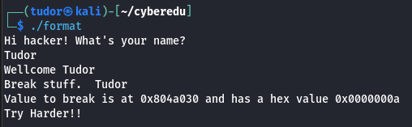
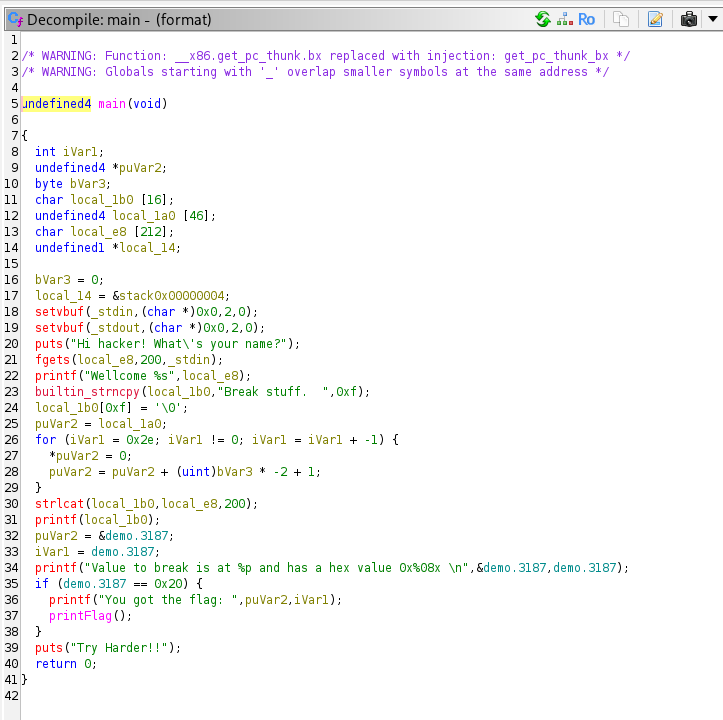
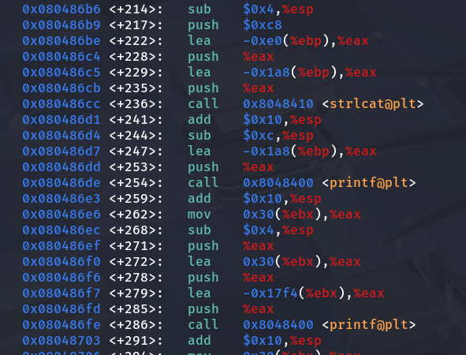

# Write-up: CyberEdu - Format String 101

**Categorie:** pwn (Binary Exploitation)
**Platformă:** CyberEdu
**URL:** `https://app.cyber-edu.co/challenges/08ef6340-c1e4-11eb-9b9f-6bd8e9c6de87/`

---

## 1. Analiza Inițială (Static Analysis)

Analiza binarului a început cu rularea comenzii `file` pentru a-i determina proprietățile:


Din output, am extras următoarele informații critice:

* **`ELF 32-bit`**: Acesta este un binar pe **32 de biți**. Toate adresele și pointerii vor avea 4 octeți. Registrele de interes vor fi `EBP`, `ESP`, `EIP`.
* **`LSB (Least Significant Byte)`**: Binarul este **Little-Endian**. Aceasta este o informație crucială pentru construcția payload-ului, deoarece adresele (de ex. `0x0804a030`) trebuie scrise în memorie cu octeții inversați (`\x30\xa0\x04\x08`).
* **`not stripped`**: Binarul **nu este `stripped`**. Acesta este un bonus major, deoarece tabela de simboluri este intactă. Acest lucru face analiza în Ghidra mult mai ușoară, permițându-ne să vedem nume de funcții clare, precum `main` și `printFlag`.

---

## 2. Analiza Dinamică și Ghidra

La o primă rulare, programul ne oferă un indiciu valoros: adresa exactă a variabilei pe care trebuie să o modificăm.



Programul ne informează: `"Value to break is at 0x0804a030 and has a hex value 0x0000000a"`.

În continuare, am deschis binarul în Ghidra pentru a analiza logica programului.

### Funcția `main`



Analizând funcția `main`, observăm următorul flux:
1.  Input-ul utilizatorului este citit în `local_e8` folosind `fgets`.
2.  Un prefix (`"Break stuff.  "`) este copiat în `local_1b0`.
3.  Input-ul nostru (`local_e8`) este concatenat la `local_1b0` folosind `strlcat`.
4.  **🚨 Vulnerabilitatea:** `printf(local_1b0)` este apelat. Deoarece controlăm conținutul `local_1b0`, acesta este un caz clasic de **Format String Vulnerability**.
5.  **🎯 Obiectivul:** Programul verifică dacă `demo.3187` (variabila de la `0x0804a030`) este egală cu `0x20`. Dacă da, apelează `printFlag()`.

### Funcția `printFlag`


Funcția `printFlag` este simplă: execută un apel de sistem `execve` pentru a rula `/usr/bin/cat flag.txt`, afișând astfel conținutul flag-ului.

---

## 3. Depanare și Construcția Payload-ului

Scopul este clar: să folosim vulnerabilitatea de format string pentru a scrie valoarea `0x20` la adresa `0x0804a030`.

### Găsirea Offset-ului (`N`)

Am pornit programul în GDB și am setat un breakpoint chiar înainte de apelul vulnerabil `printf`.



La atingerea breakpoint-ului, am inspectat stiva (`x/20wx $esp`) pentru a vedea unde este localizat buffer-ul nostru:


Putem observa că buffer-ul nostru (`local_1b0`) începe la adresa `0xffffcc70`, care corespunde celui de-**al 4-lea argument** (`Arg 4`) de pe stivă. Acesta este *offset-ul de bază*.

> **Cum funcționează atacul:**
> Specificantul `%n` scrie numărul de octeți afișați până în acel punct la o adresă specificată de un argument de pe stivă. Folosind un specificant pozițional (de ex. `%8$n`), îi putem spune lui `printf` la care argument să se uite pentru a găsi adresa la care să scrie.

### Alinierea Payload-ului

Acum trebuie să plasăm adresa noastră țintă (`0x0804a030`) pe stivă, la o locație aliniată (multiplu de 4 octeți) față de baza noastră (`Arg 4`).

1.  Prefixul `"Break stuff.  "` are **14 octeți** (inclusiv cele două spații de la final).
2.  Pentru a alinia adresa noastră la o graniță de 4 octeți (16), trebuie să adăugăm **2 octeți de padding** (de ex. `\x90\x90`).
3.  Plasăm adresa noastră țintă (`\x30\xa0\x04\x08`) imediat după.

Am verificat noua structură a stivei în GDB:


Perfect. Adresa noastră `0x0804a030` este acum plasată la `0xffffcc80`.

Să calculăm indexul final `N`:
* **Baza:** `Arg 4` (la adresa `0xffffcc70`)
* **Offset-ul adresei:** `0xffffcc80 - 0xffffcc70 = 0x10` (16 octeți)
* **Offset-ul în argumente:** $16 \text{ octeți} / 4 \text{ octeți/arg} = 4$
* **Index Final `N`:** $4 \text{ (Baza)} + 4 \text{ (Offset)} = \textbf{8}$

Vom folosi **`%8$n`** pentru a-i spune lui `printf` să scrie la adresa găsită la al 8-lea argument.

---

## 4. Payload-ul Final și Testarea Locală

Ultimul pas este să ne asigurăm că `printf` afișează *exact* `0x20` (32) de caractere înainte de a întâlni `%8$n`.

Calculul caracterelor afișate:
* **Prefix:** 14 caractere (`"Break stuff.  "`)
* **Padding aliniere:** 2 caractere (`\x90\x90`)
* **Adresa:** 4 caractere (tratate ca text de `printf`)
* **Total până acum:** $14 + 2 + 4 = 20$ de caractere.
* **Padding de numărare:** $32 \text{ (ținta)} - 20 \text{ (actual)} = \textbf{12}$ caractere (de ex. `A` * 12).

Payload-ul final devine:

```python
payload = (
    b"\x90" * 2 +          # 2 octeți padding de aliniere
    b"\x30\xa0\x04\x08" +  # Adresa țintă (little-endian)
    b"A" * 12 +           # 12 octeți padding de numărare (32 total)
    b"%8$n"               # Specificantul de scriere la Arg 8
)