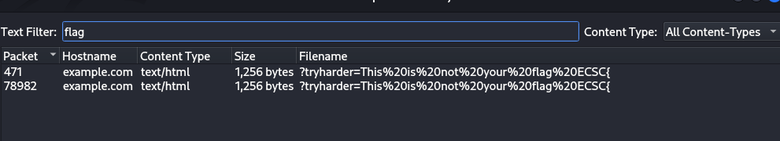
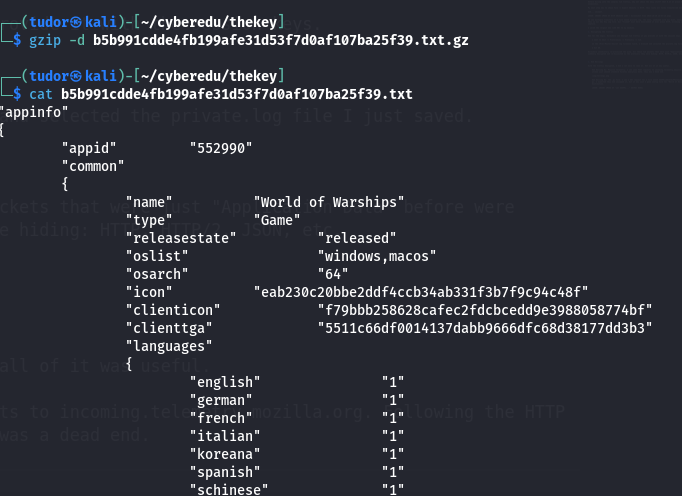

# Write-up

**Category:** Network | Forensics
**Platform:** CyberEdu
**URL:** `https://app.cyber-edu.co/challenges/ba6d3450-94f7-11ea-9f93-799a62ddedfd`
---

This was a super fun network challenge. The prompt itself was a massive clue :D, but let's break down the process from the start.

## 1. Initial Analysis
We were given an archive .zip that contains the bun.pcapng file.
The first thing I always do with a pcap is open it in Wireshark

> First, i checked the Protocol Hierarchy (Statistics -> Protocol Hierarchy):

Right away, two things jumped out:

* **Transport Layer Security (TLS):** 4.1% of the packets. This is our "encrypted traffic" from the prompt.
* **Hypertext Transfer Protocol (HTTP):** 0.2% of the packets. This is unencrypted traffic.

The prompt, "Can I intercept encrypted traffic if I am on a friend computer?", is a classic hint. It strongly implies that we have access to the session keys that the browser generated to create the encrypted traffic. If we're "on the computer," we can steal the keys.

This means we're looking for an SSL/TLS Key Log File.

## 2. The Hunt for the Key

Before diving into the complex TLS traffic, why not check the easy stuff? That 0.2% of plain HTTP traffic is suspicious.

My next step was to check `File -> Export Objects -> HTTP`. This lists all files transferred over unencrypted HTTP.

I searched for "flag" and got this:

Haha, I thought it was not going to be this easy but who knows...
Also, "ECSC" didn t get me any leads.

I tried searching for files named "*.log" and jackpot:

We see multiple transfers of a file named `private.log`. The name, combined with our hint, makes it almost certain: this is our SSL Key Log file. Our "friend" must have downloaded it over plain HTTP, allowing us to see it in the capture.

I saved the largest one (146 KB) to my machine.

## 3. Decrypting the Traffic

Now for the magic. Wireshark can decrypt TLS traffic *if* you provide it with the session keys.

1.  I went to `Edit -> Preferences -> Protocols -> TLS`.
2.  In the `(Pre)-Master-Secret log filename` field, I browsed and selected the `private.log` file I just saved.
3.  I hit `OK`.

Wireshark immediately re-processed the pcap. All those `TLS` packets that were just "Application Data" before were suddenly decrypted and re-dissected as the protocols they were hiding: `HTTP`, `HTTP/2`, `JSON`, etc.

## 4. Red Herrings

With the traffic decrypted, I had a lot more to look at. Not all of it was useful.

* **Red Herring #1: Mozilla Telemetry:** I saw some `POST` requests to `incoming.telemetry.mozilla.org`. Following the HTTP stream just showed standard Firefox analytics data. This was a dead end.

* **Red Herring #2: The .gz File:** I saw a `GET` request for a file named `b5b991cdde4fb199afe31d53f7d0af107ba25f39.txt.gz`. I exported this and unzipped it, but it was just a game config file for "World of Warships." Another distraction.

## 5. Finding the Flag

After ignoring the distractions, I went back to the most efficient method: `File -> Export Objects -> HTTP`. Now that all the TLS traffic was decrypted, this list was much bigger.

Instead of looking through it manually, I just used the text filter at the top and typed in "flag".

And there it is. The flag was hidden in a `GET` request to `googleads....` The browser made a request where the flag was passed as a URL parameter. Without the `private.log` file, this request would have been completely invisible inside the TLS encryption.