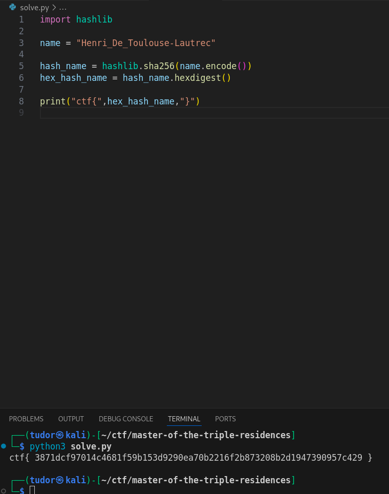

# Write-up: 
##  master-of-the-triple-residences 

**Category:** OSINT
**Platform:** CyberEdu
**URL:** `https://app.cyber-edu.co/challenges/9e501d9b-8fc1-4175-895b-ed2c8a82256e`

---

I used AI to find the full name of the "famous artist that lived there at number 19,19bis an 21."

`Henri de Toulouse-Lautrec`

