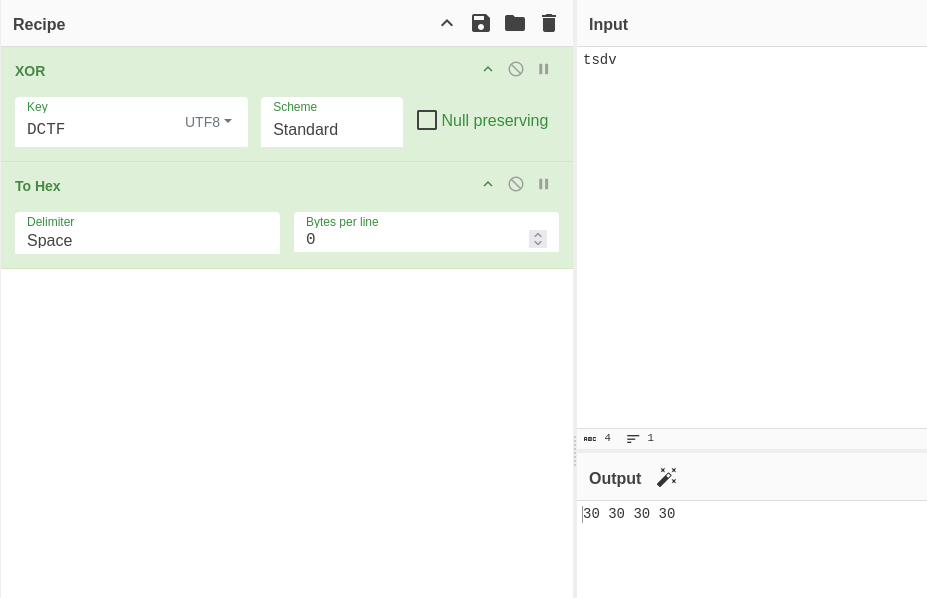

# Write-up: 
##  cross-or-zero

**Category:** Misc | Code Review
**Platform:** CyberEdu
**URL:** `https://app.cyber-edu.co/challenges/55bdb360-7f21-11ea-af3b-91f50ec4f0b1`

---
The challenge gave me a python script named `chall.py`.

The function `string_xor()` implements a repeating XOR cipher.

There it is the encoded flag: `dHNkdktTAVUHAABUA1VWVgIHBAlSBAFTBAMFUwECAgcAAAFWAFUFCFMACFFUAwQAVgBSBwQJBVZTAFYGCQYHVQABB1IJTQ==`.

The next thing we need to do is finding the key. We know the flag pattern is `DCTF{...}`.

`DCTF` characters in hex are:  0x44 0x43 0x54 0x46

`key = base64.decode(Encoded text) ^ flag`

We apply base64.decode on first 4 characters `dHNk` and we get the values in hex: 0x74 0x73 0x64 0x76


Now, XOR-ing the first 4 bytes from decoded text and flag we get:



So the key is 0x30. 
I made a script to give me the full flag:

```bash

import base64

encoded_text = "dHNkdktTAVUHAABUA1VWVgIHBAlSBAFTBAMFUwECAgcAAAFWAFUFCFMACFFUAwQAVgBSBwQJBVZTAFYGCQYHVQABB1IJTQ=="
key = 0x30

flag = ""

decoded64_text = base64.b64decode(encoded_text).hex()

for i in range(0, len(decoded64_text), 2):
    hex_x = int(decoded64_text[i:i+2],16)
    flag = flag + chr(hex_x ^ key)

print(flag)

```
And there it is the flag!


