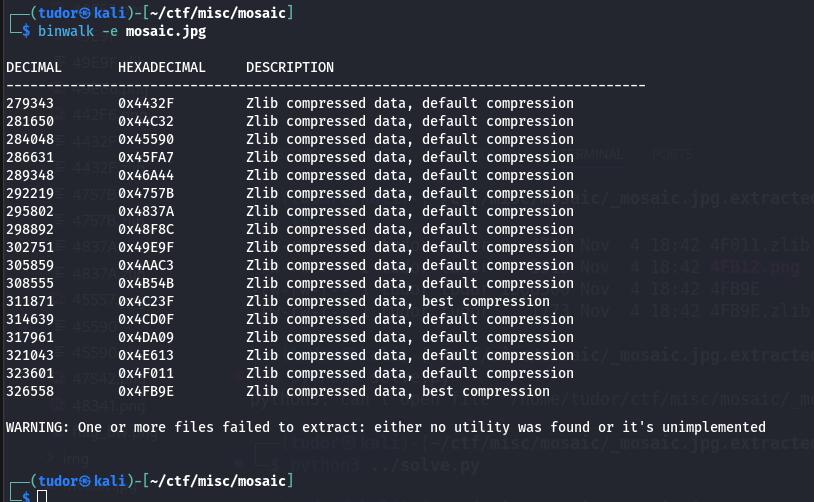
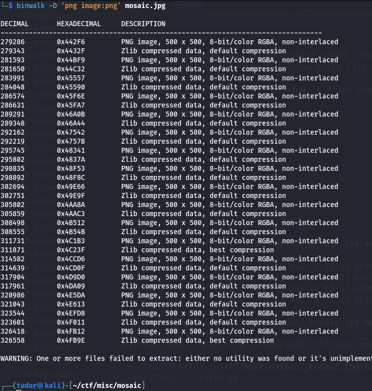
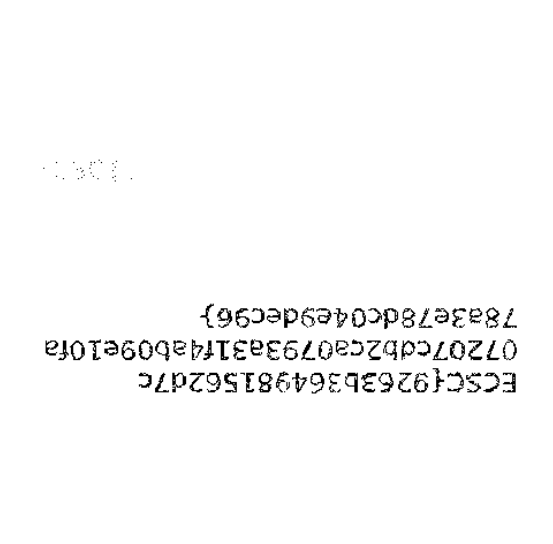

# Write-up: 
##  mosaic

**Category:** Misc
**Platform:** CyberEdu
**URL:** `https://app.cyber-edu.co/challenges/55c2fae0-7f21-11ea-bd37-5dca62813e86`

---

The challenge gave me an archive named `mosaic.jpg.zip`. Interesting name...
I extracted the files and found a jpg file.

Using the `binwalk -e` command, I found out that there were multiple layers of files inside.

Let's see if we have pngs:

Those images have some weird drawings on them, some lines. Most of them have aligned lines, but some need adjustments(rotating). After rotating them, we can finally overlay them: "Could you imagine that so many layers go into the creation of this pice of art?" (good hint from the challenge description)

We can use `GIMP` or we can write a small python script. I'll go with the script.

If one pixel is white in all *png s, then the pixel in the new image will be white too.
But if the pixel is colored in at least one *png, then the pixel will be black(so we can form our flag on the image).

There it is the flag!(I need to rotate the img)

