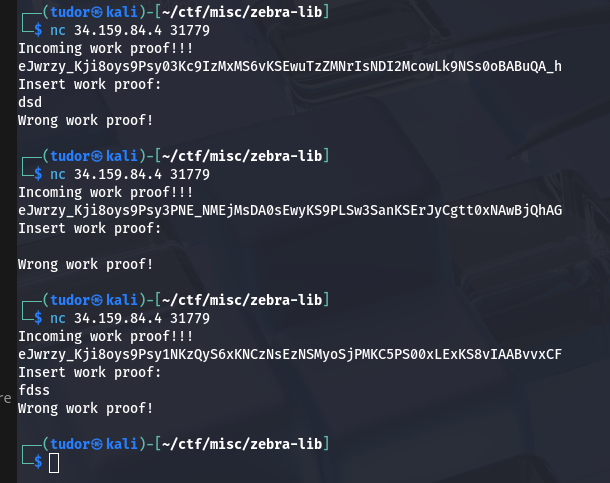
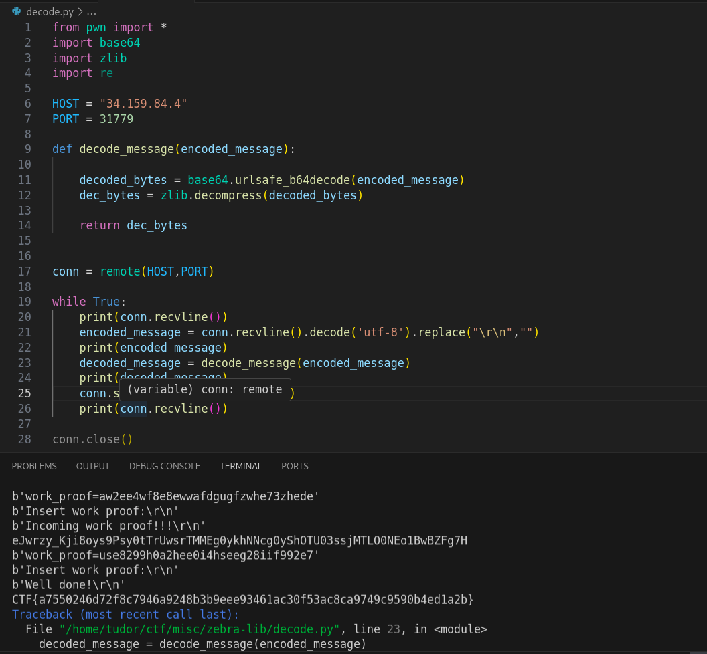

# Write-up: 
##  zebra-lib

**Category:** Misc
**Platform:** CyberEdu
**URL:** `https://app.cyber-edu.co/challenges/d7eb5cb0-8a4e-11ec-bfd7-5114d2b0bde2`

---

I used the 'swiss knife' nc command to get the data from the challenge address and every time i run it, it gives me a different output but with a common prefix `eJwrzy_Kji8oys9Ps`:



It looks like it's base64 encoded.


The first two bytes `78 9c` are the zlib magic headers:

``` bash

78 01 - No Compression/low
78 5E - Fast Compression
78 9C - Default Compression
78 DA - Best Compression 

```
The challenge also gives it away with the name `zebra-lib`.

I wrote a python script to decode the string from base64 and then decompress it, but guess what? It was not enough to get the flag... After the 499th decode, the server sent me my well deserved flag!

