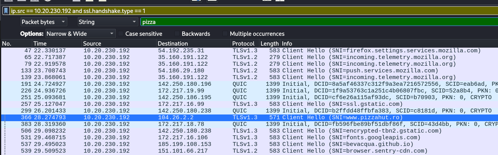

# Write-up: 
##  n4twork urg3nt investigation 

**Category:** Network | Forensics | Misc

**Platform:** CyberEdu

**URL:** `https://app.cyber-edu.co/challenges/f255ac60-0705-11ec-8e13-a3dd582f28ab`

---

The questions are encrypted in pikalang programming language
I used an online decoder to find out the original questions:

## 1. What is the esoteric programming language used by the attacker?

`Pikalang`

## 2. What is the name of the tool used by the security analyst?

Try and error (Wireshark, tshark, NetworkMiner...)
`NetworkMiner`

## 3.  What is the IP of the Linux compromised machine?

First, in Wireshark go to `Statistics` -> `Conversations` -> `IPv4` Tab

10.20.230.192 is probably the local machine or something like a porxy server, even a host

`10.20.230.192`

## 4.  We know that the attacker also ordered a pizza from the compromised host. Can you please tell us the place, we want to contact them, maybe they can give us the necessary files?

I applied TLS filter on the packages sent by the compromised machine 10.20.230.192 and I also filtered the packages by "pizza" keyword in the packet bytes :

So, the answer for this question is `www.pizzahut.ro`