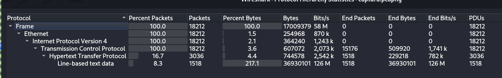
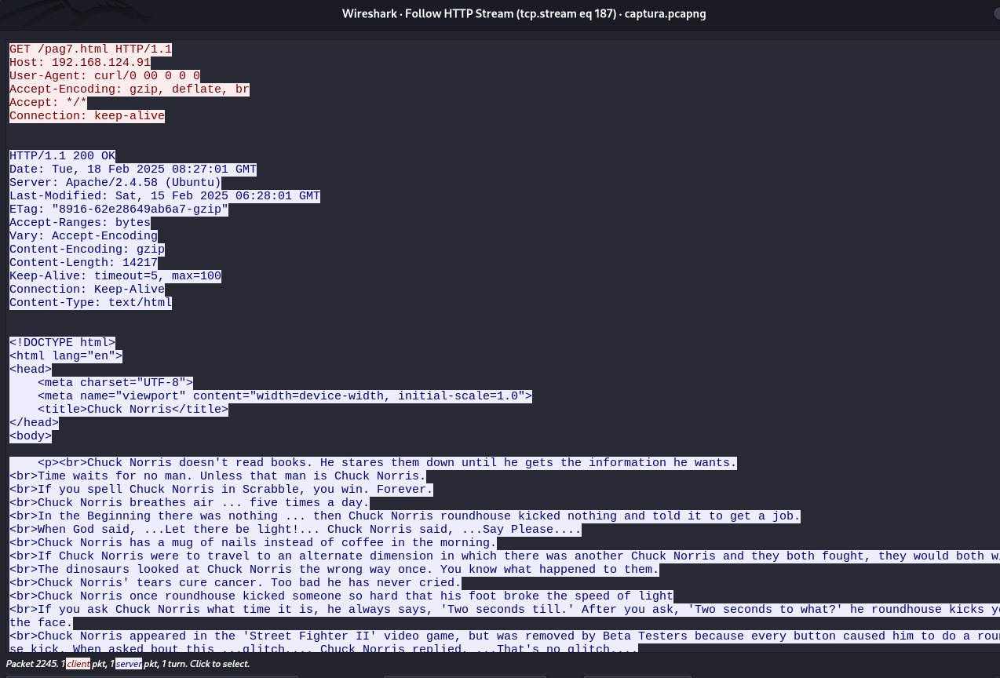
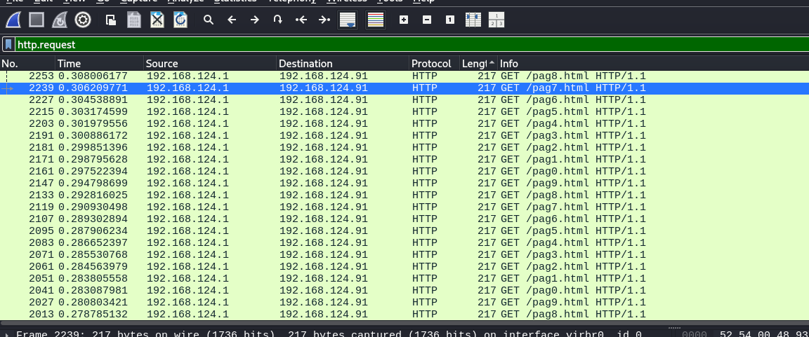
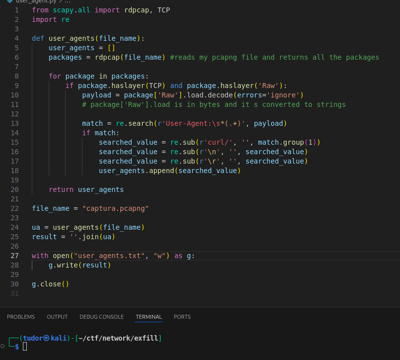
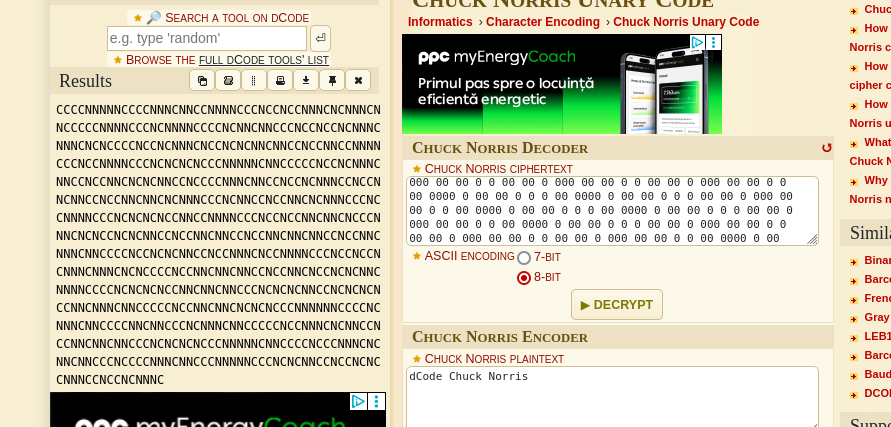
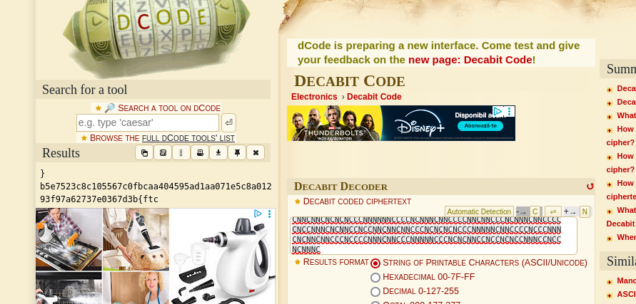

# Write-up: 
##  exfill - very funny 

**Category:** Network
**Platform:** CyberEdu
**URL:** `https://app.cyber-edu.co/challenges/9e5005d6-c189-4d30-a680-52282fa3227e`

---
In wireshark, I first looked at protcol hierarchy:



`line-based text data` packages are 217.1% of total bytes... that is unusual

I applied it as a filter, pressed on a random package then follow the http stream and it is a page about the myth, the legend... Chuck Norris!!!



Also, another thing that caught my attention here is the `User-Agent` param in the header of the request.
As we can see, its value is `curl/0 00 0 0 0`(usually, it's something like `curl/8.5.0`, `Mozilla/5.0`). Given the category of the challenge being also `cryptography`, maybe it's something encoded.




The user, 192.168.124.1, sent get requests to 192.168.124.91, for html pacakges : `pag0.html` .. `pag9.html`.
Every request has a weird User-agent too.

Let's extract all the User-agent values.



The resulted content looks like `Chuck Norris encoding`.
Its idea is like this:

    -> if we have a sequence of bits: 1110001
    -> it separates the sequence in consecutive blocks of identical bits: 111 | 000 | 1
    -> it s going to be encoded : 
        => 111 -> 0 000 (0 for "1", 3 zeros for length 3)
        => 000 -> 00 000 (00 for "0", 3 zeros for length 3)
        => 1   -> 0 0 (0 for "1", 1 zero for length 1)

I'm going to use `https://www.dcode.fr/chuck-norris-code` to decode my text: 



This long sequence that contains only `N` and `C` is a hint for the next decoding , the `Decabit decoding`. Why?
Decabit code is a code made by 10 units sequences containing only `+` and `-`. In our case, the letter N plays the role for + and C for -.

I'm going to use another web tool, `https://www.dcode.fr/decabit-code` to decode my text:



We got the flag, but it s reversed. I used a small python script to reverse my flag and it's the right one.

```py

rev_flag = "}b5e7523c8c105567c0fbcaa404595ad1aa071e5c8a01293f97a62737e0367d3b{ftc"
print(rev_flag[::-1])

```