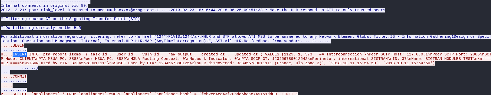
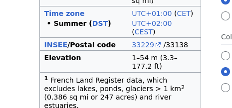

# Write-up: 
##  global-cell 

**Category:** Network | Forensics
**Platform:** CyberEdu
**URL:** `https://app.cyber-edu.co/challenges/55ebaac0-7f21-11ea-8de6-95a87208dc38`

---

This was a fun challenge.

I took a look at `Statistics->Protocol Hierarchy`

-> `MySQL` protocol : 23.8% of total packages
-> `HTTP` protocol : only 2.8% of total packages

Without doubt, MySQL is the primary suspect at this point :D

Let's analyze the traffic

I filtered the search by "mysql" packages which contain "Request Query"
in their Info field. I then selected one package and i followed the TCP stream.

There was a lot of data, so I tried to filter it by "INSERT":

That `France` caught my attention. I noticed that in protocol hierarchy, there was traffic categorized under `GSM Mobile Application`. 
I encountered the term "gcell" while analyzing, and based on the context of telecommunication and GSM traffic, "gcell" is almost
certainly an abbreviation for `GSM Cell`.

I concluded it was related to the internal workings of the mobile network itself, rather than the "leaked location" (like a city or coordinates) that the challenge required.

I found a Global Cell ID

It contains all the information I need to enter on `http://opencellid.org` and use their search engine.

This site gave me some coordinates

` https://opencellid.org/#zoom=18&lat=44.703316&lon=-1.03705 `

I entered thos coordinates on google maps and found this:

Those coordinates indicate `Lanton, France`.

Now, the only thing that's left is to search for the area code of this town and hash that code using `SHA256`.

I tried the first one and it worked!

`50fb4a9bee63b51141c2b32e42251d1f88104731d1a7b73ff9750626227d7f5a`
