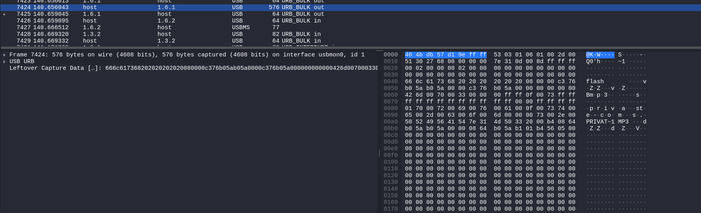
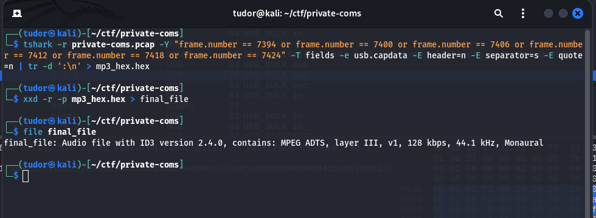

# Write-up: 
##  private-coms

**Category:** Network
**Platform:** CyberEdu
**URL:** `https://app.cyber-edu.co/challenges/9ef063d6-7b33-4232-bacc-83ae44ebab04`

---

For this task, I used `Wireshark` to open the network capture.
First, I took a look at the `Protocol Hierarchy`:

The most suspicious protocols were:
    
    1. USB 49% of total packages
    2. Bluetooth 23.3% of total packages

I had to document myself about how the USB is transferring data and got some informations on SCSI.
SCSI is like a set of rules that tells the drive what to do when the computer wants to do something.

When the computer wants to write something on USB, it creates a SCSI command `Write(10)`. The SCSI command is then packaged up with other flags/params and so on and is sent over.

Let's analyze SCSI in our network capture:

Ok so I can see that there have been 6 different size packages sent from `host` to `1.6.1`.
The computer told the USB drive where to write the data using `LBA(Logical Block Addressing)`(the entire
storage device is one single list of blocks).

After each package that contains a SCSI `WRITE` command, it should be a `BULK OUT` USB packet that actually sends the data from host to USB.

Bingo!
The content that has been sent from the host to the USB has been split across multiple packages.

In the `Leftover Capture Data` field from the last package sent, there are some suspicious bytes:

Ok now I'm sure that our flag resides in those packages.
I will extract the raw data from those 6 specific packages and concatenate them into a .hex file.
After that, I will convert the hex file into a binary.

There it is, the mp3 file that was indicated by the last package(package number 7424).
This file contains our flag; you can either listen to the audio and write down the flag, or you can extract the flag using an audio to text converter tool.