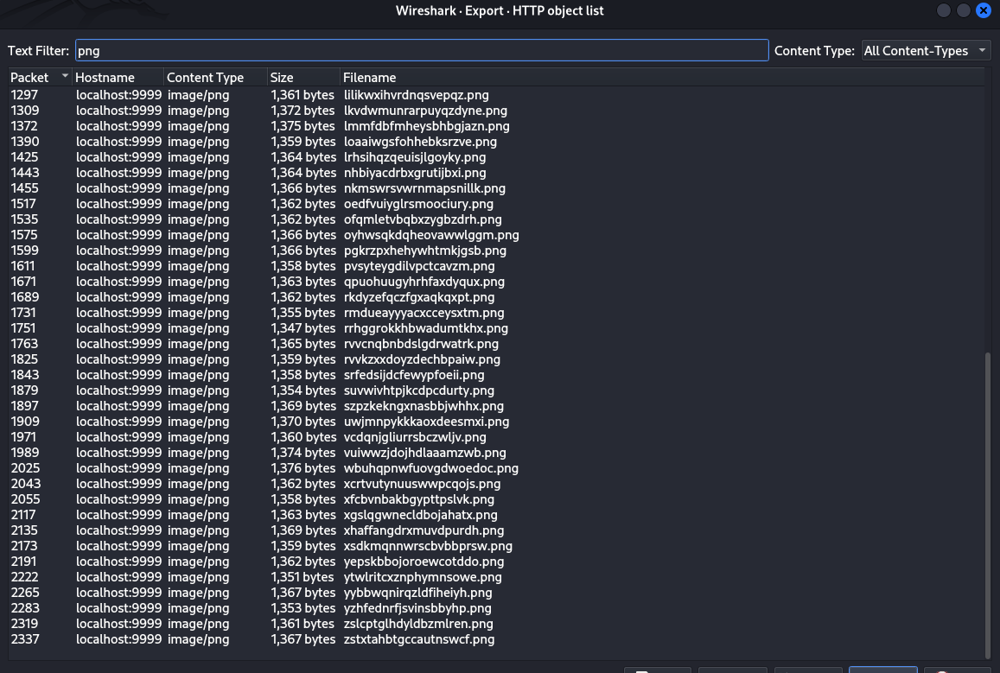
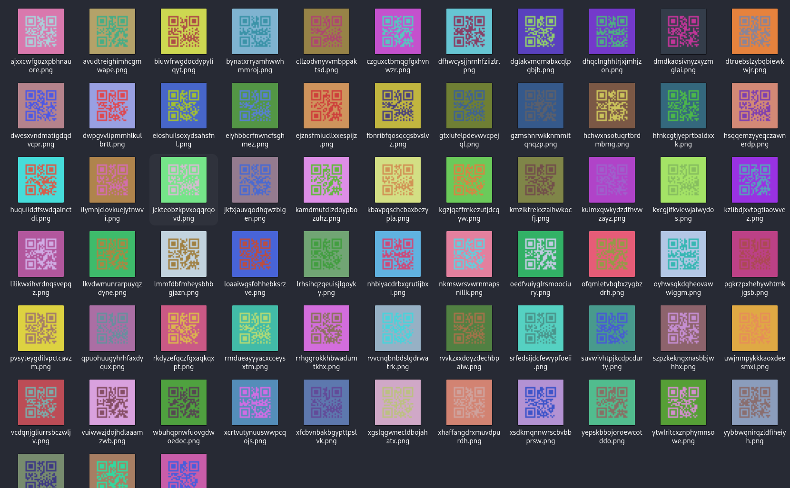
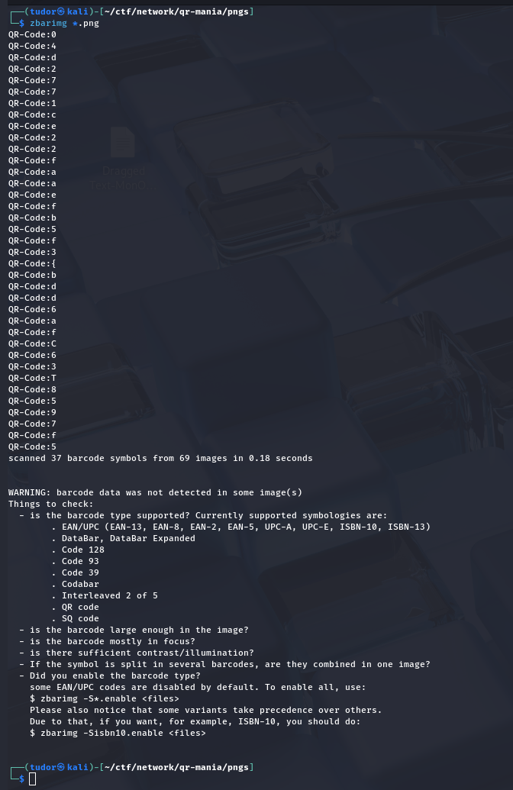
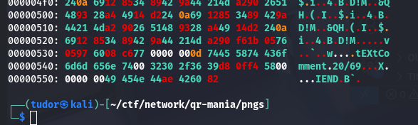
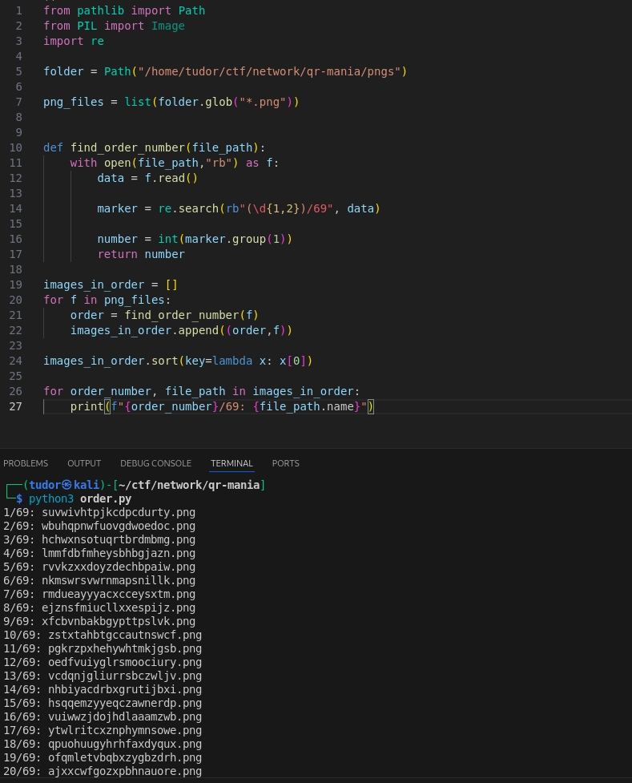
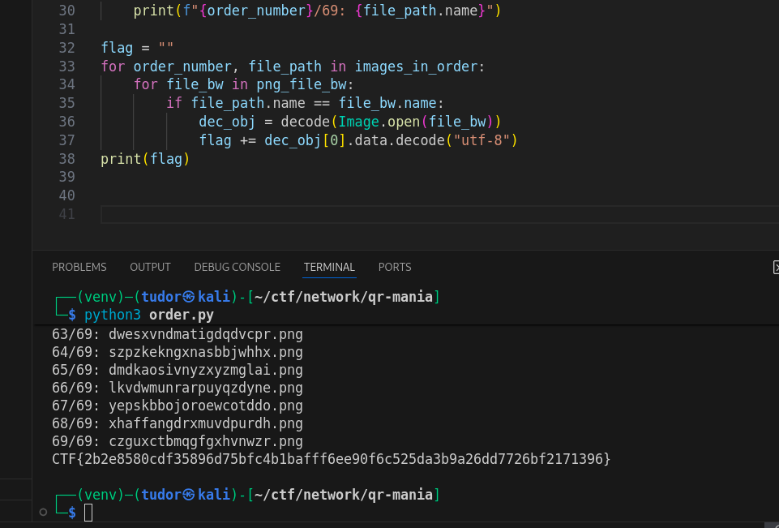

# Write-up: 
##  qr-mania 

**Category:** Network | Misc | Programming
**Platform:** CyberEdu
**URL:** `https://app.cyber-edu.co/challenges/e40d5bc0-3565-11eb-b8d6-afd86980505c`

---

I opened the capture in wireshark and I saw that there are a lot of pngs, so I extracted them.



`tshark -r challenge.pcap --export-objects http,./http_objects`
`mv http_objects/*.png pngs/`

Ok so there are 69 qr codes.



I ran the `zbarimg` command to see what each qr code represents but it worked for only 37/69:



But even from those codes we can see those are characters that form our flag : `D`, `C`, `T`, `F`, `{`...

But we don't know what's the correct order for the qr's.
Let's dive deeper in their hexdump:



Bingo! The final bytes from every file contain the order number of every png in the flag

Let's organize them by those numbers:




``` bash

1/69: suvwivhtpjkcdpcdurty.png
2/69: wbuhqpnwfuovgdwoedoc.png
3/69: hchwxnsotuqrtbrdmbmg.png
4/69: lmmfdbfmheysbhbgjazn.png
5/69: rvvkzxxdoyzdechbpaiw.png
6/69: nkmswrsvwrnmapsnillk.png
7/69: rmdueayyyacxcceysxtm.png
8/69: ejznsfmiucllxxespijz.png
9/69: xfcbvnbakbgypttpslvk.png
10/69: zstxtahbtgccautnswcf.png
11/69: pgkrzpxhehywhtmkjgsb.png
12/69: oedfvuiyglrsmoociury.png
13/69: vcdqnjgliurrsbczwljv.png
14/69: nhbiyacdrbxgrutijbxi.png
15/69: hsqqemzyyeqczawnerdp.png
16/69: vuiwwzjdojhdlaaamzwb.png
17/69: ytwlritcxznphymnsowe.png
18/69: qpuohuugyhrhfaxdyqux.png
19/69: ofqmletvbqbxzygbzdrh.png
20/69: ajxxcwfgozxpbhnauore.png
21/69: xcrtvutynuuswwpcqojs.png
22/69: yybbwqnirqzldfiheiyh.png
23/69: xsdkmqnnwrscbvbbprsw.png
24/69: lrhsihqzqeuisjlgoyky.png
25/69: srfedsijdcfewypfoeii.png
26/69: dwpgvvlipmmhlkulbrtt.png
27/69: biuwfrwgdocdypyliqyt.png
28/69: kgzjqaffmkezutjdcqyw.png
29/69: kuimxqwkydzdfhvwzayz.png
30/69: eioshuilsoxydsahsfnl.png
31/69: rrhggrokkhbwadumtkhx.png
32/69: kxcgjifkviewjaiwydos.png
33/69: yzhfednrfjsvinsbbyhp.png
34/69: kbavpqschcbaxbezypla.png
35/69: pvsyteygdilvpctcavzm.png
36/69: kzlibdjxvtbgtiaowvez.png
37/69: kamdmutdlzdoypbozuhz.png
38/69: zslcptglhdyldbzmlren.png
39/69: avudtreighimhcgmwape.png
40/69: jckteobzkpvxoqqrqovd.png
41/69: hfnkcgtjyeprtbaldxxk.png
42/69: xgslqgwnecldbojahatx.png
43/69: kmziktrekxzaihwkocfj.png
44/69: cllzodvnyvvmbppaktsd.png
45/69: dglakvmqmabxcqlpgbjb.png
46/69: bynatxrryamhwwhmmroj.png
47/69: jkfxjauvqodhqwzblgen.png
48/69: gzmshnrwkknmmitqnqzp.png
49/69: rvvcnqbnbdslgdrwatrk.png
50/69: lilikwxihvrdnqsvepqz.png
51/69: huquiiddfswdqalnctdi.png
52/69: fbnribfqosqcgsbvslvz.png
53/69: uwjmnpykkkaoxdeesmxi.png
54/69: dhqclnghhlrjxjmhjzon.png
55/69: oyhwsqkdqheovawwlggm.png
56/69: dfhwcysjjnrnhfziizlr.png
57/69: dtruebslzybqbiewkwjr.png
58/69: eiyhbbcrfnwncfsghmez.png
59/69: loaaiwgsfohhebksrzve.png
60/69: rkdyzefqczfgxaqkqxpt.png
61/69: ilymnjclovkuejytnwvi.png
62/69: gtxiufelpdevwvcpejql.png
63/69: dwesxvndmatigdqdvcpr.png
64/69: szpzkekngxnasbbjwhhx.png
65/69: dmdkaosivnyzxyzmglai.png
66/69: lkvdwmunrarpuyqzdyne.png
67/69: yepskbbojoroewcotddo.png
68/69: xhaffangdrxmuvdpurdh.png
69/69: czguxctbmqgfgxhvnwzr.png
```

The next step is to remove the unnecessary colors from the qr.


It's time for the final step: combining our 2 scripts into one!

```py
from pathlib import Path
from PIL import Image
from pyzbar.pyzbar import decode
import re

folder = Path("/home/tudor/ctf/network/qr-mania/pngs")
folder_bw = Path("/home/tudor/ctf/network/qr-mania/pngs_bw")

png_files = list(folder.glob("*.png"))
png_file_bw = list(folder_bw.glob("*.png"))

def find_order_number(file_path):
    with open(file_path,"rb") as f:
        data = f.read()

        marker = re.search(rb"(\d{1,2})/69", data)

        number = int(marker.group(1))
        return number

images_in_order = []

for f in png_files:
    order = find_order_number(f)
    images_in_order.append((order,f))

images_in_order.sort(key=lambda x: x[0])

for order_number, file_path in images_in_order:
    print(f"{order_number}/69: {file_path.name}")

flag = ""
for order_number, file_path in images_in_order:
    for file_bw in png_file_bw:
        if file_path.name == file_bw.name:
            dec_obj = decode(Image.open(file_bw))
            flag += dec_obj[0].data.decode("utf-8")
print(flag)


```


