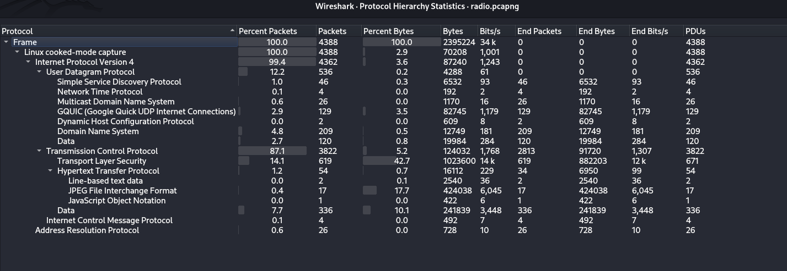
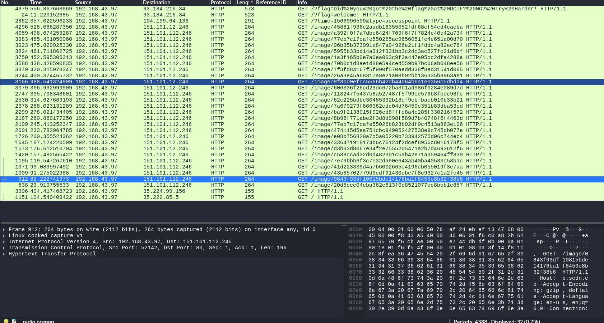
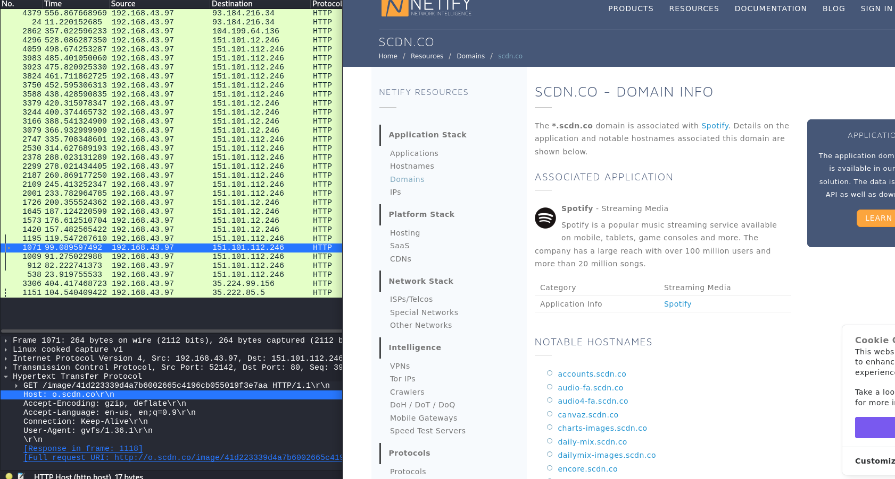
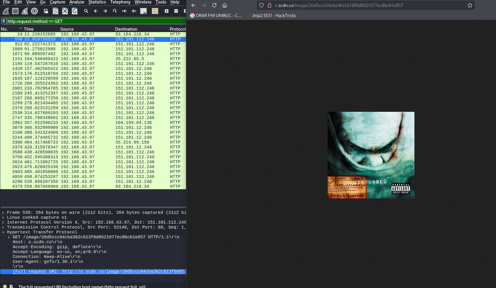
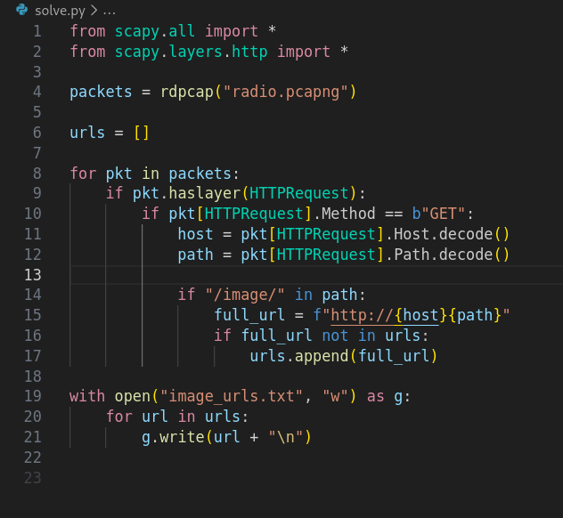
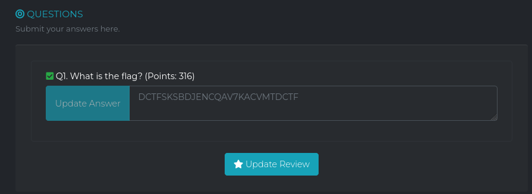

# Write-up: 
##  super_caesar 

**Category:** Network
**Platform:** CyberEdu
**URL:** `https://app.cyber-edu.co/challenges/55ba2940-7f21-11ea-9efc-a7863a9d4c74`

---

I saw in protocol hierarchy that there were some jpegs. Since the challenge description mentions something about an a artist, maybe those images contain some pictures made by artists.

First I thought that the flag was composed from every first letter of the image name but there wasn't any "f" letter for DCTF.

The `scdn.co` domain is associated with spotify. Those 27 images might be our lead(4+19+4 characters).

Those are covers of spotify albums and for the first 4 images, the first letter of the name of the `artist` concatenates in a string `DCTF`. I will now extract every image in order and get the first letter of each artist, using a python script.

Using `wget -i image_urls.txt` I downloaded all the images from image_urls.txt.
I opened every image in order and got the flag `DCTFSKSBDJENCQAV7KACVMTDCTF`.

