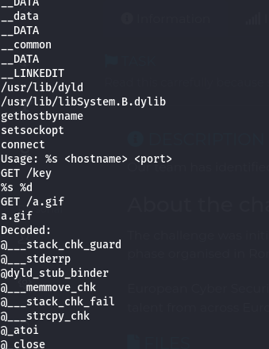
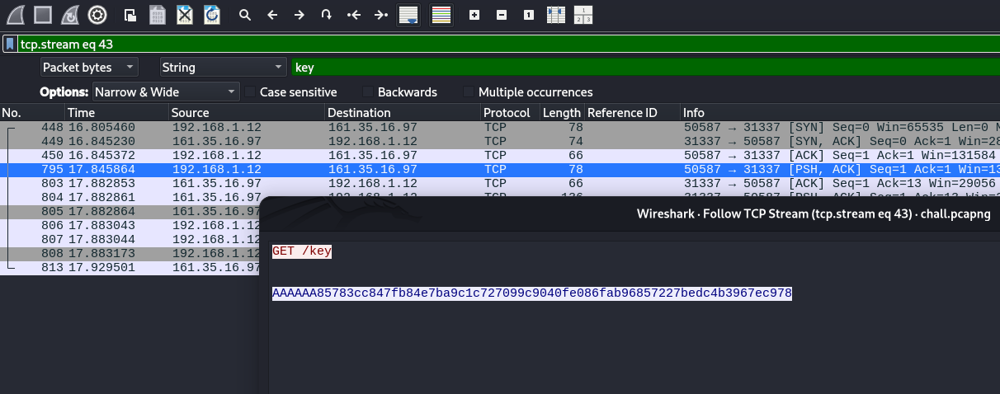
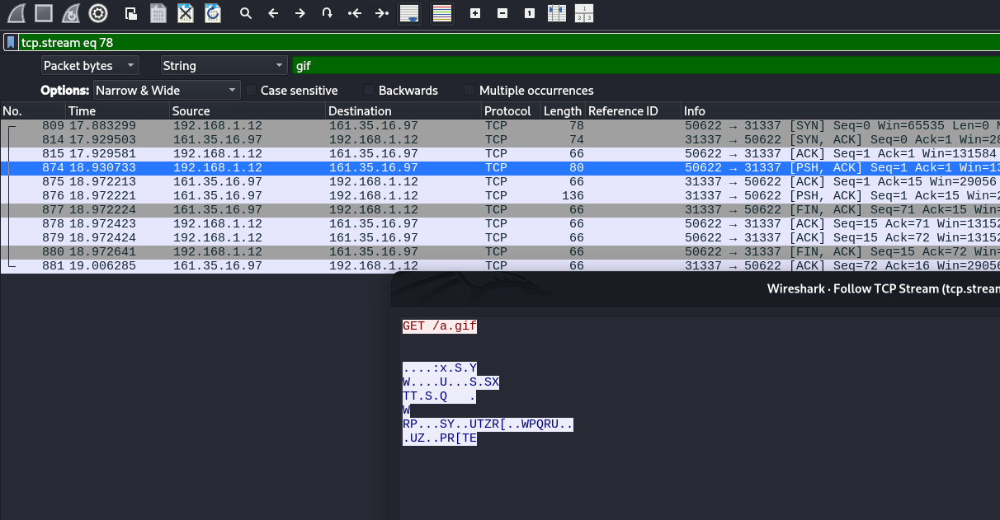
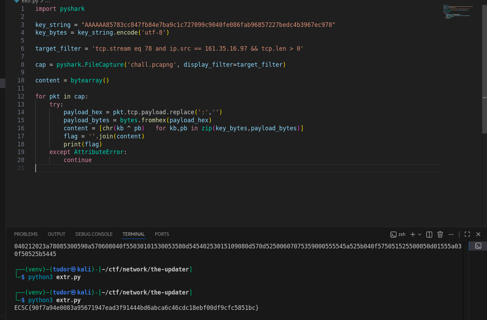

# Write-up: 
##  the-updater

**Category:** Network
**Platform:** CyberEdu
**URL:** `https://app.cyber-edu.co/challenges/0b9f2e20-94f7-11ea-8ea8-fb6427e5d683`

---

The challenge gave us a network capture but also a MACH binary.
I used the 'strings' command on the binary and got something interesting:

This makes me think that I need to find a key to decrypt a gif file. I'll filter the packages by the word `key` and `gif` inside packet bytes:

Now I will write a quick python script to extract the bytes from the reponse of the `GET /a.gif` request and XOR those bytes with the key:

