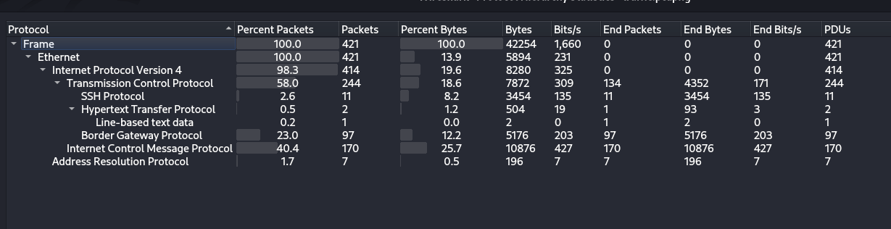
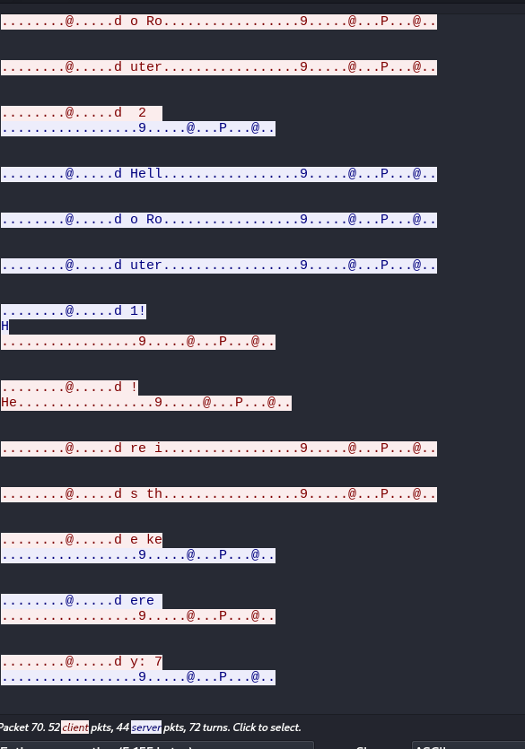
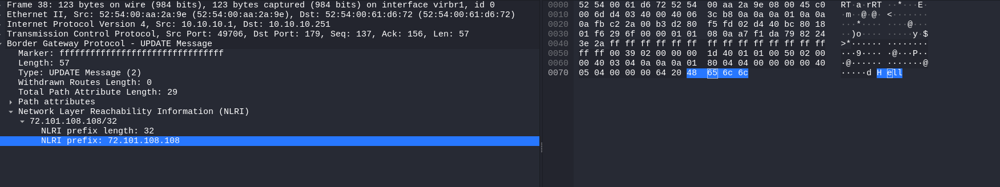
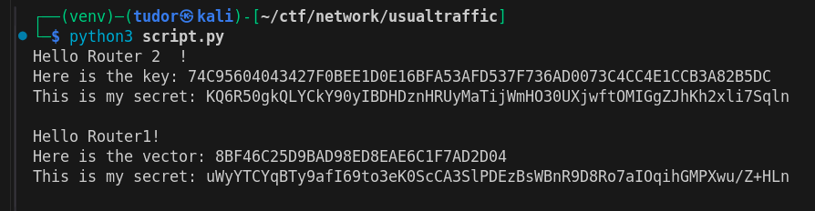
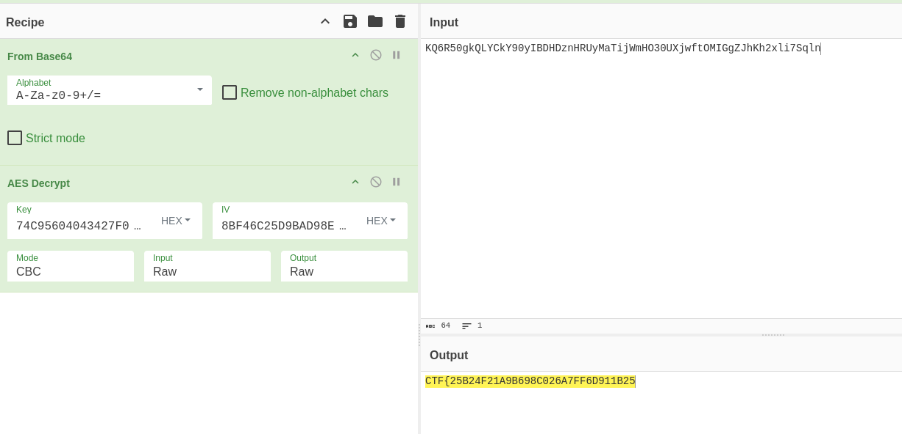
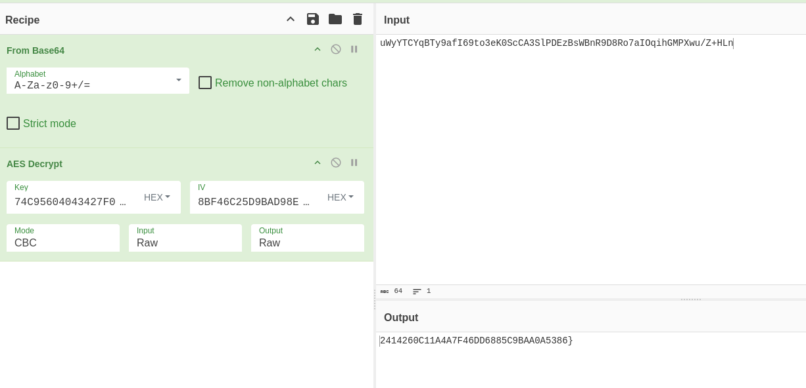

# Write-up: 
##  usualtraffic

**Category:** Network | Cryptography
**Platform:** CyberEdu
**URL:** `https://app.cyber-edu.co/challenges/4fbddad0-1430-11eb-83ee-554d4bde0f5d`

---

First, I looked at protocol hierarchy:



There was a lot of `ICMP` communication, but I didn't got nothing.

I saw some BGP packets, I pressed on one of them and then `Follow TCP Stream`.
Turns out, there was small data hidden in every BGP packet:



I wrote a small python script to extract only the nlri_prexi from the bgp `UPDATE Message` packages:



``` py

import pyshark

cap = pyshark.FileCapture('traffic.pcapng', display_filter='bgp.type == 2')

field_name = 'nlri_prefix'
enc = ""
enc_iv = ""
for i,pkt in enumerate(cap,start = 1):
    ip_src = pkt.ip.src
    ip_dest = pkt.ip.dst

    if ip_src == "10.10.10.1":
        nlri = pkt.bgp.get_field_value(field_name)
        if i != 1:
            num_list = nlri.split(".")
            s = ''.join([chr(int(n)) for n in num_list])
            enc = enc + s
    else:
        nlri = pkt.bgp.get_field_value(field_name)
        if i != 2:
            iv_list = nlri.split(".")
            iv_s = ''.join([chr(int(n)) for n in iv_list])
            enc_iv = enc_iv + iv_s

        


print(enc)
print(enc_iv)

cap.close()

```

The results were:



Now it's time for the cryptography part.

So we got 2 secrets, 1 key and 1 vector... The vector it 16 bytes, this is the "Initialization Vector" for the AES Encryption.

I used cyberchef for decryption and got the flag by concatenating the two secrets:


