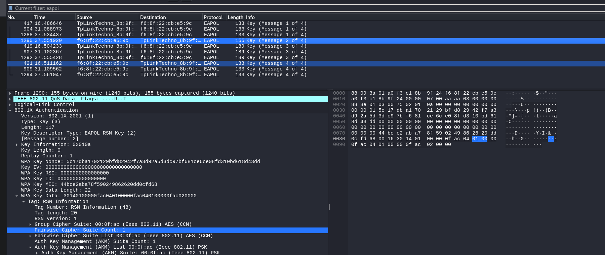
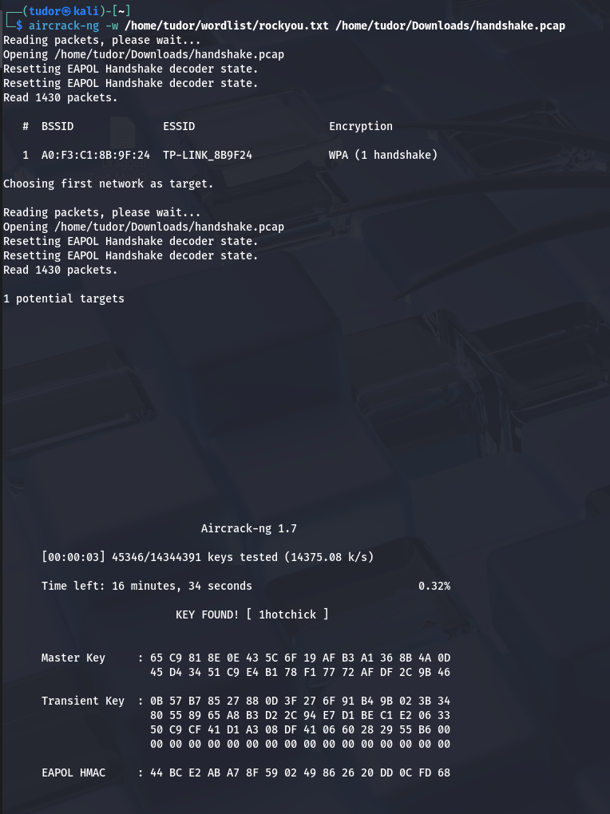
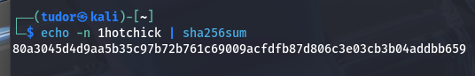

# Write-up: 
##   wifi-get-me 

**Category:** Network
**Platform:** CyberEdu
**URL:** `https://app.cyber-edu.co/challenges/9e27b774-e044-4c6c-b6ab-8e977cb43cee`

---

The challenge says something about the WPA2 security protocol for wireless network.

WPA2 is the standard for security.
The password the user knows for connecting to the wifi it is the `Pre-Shared Key(PSK)`.

For obvious security reasons, the device is never going to send the password to the router(security vuln). When I want to connect to the router, the device and the router must prove that both of them know the actual password, without telling it.

This concept is named the `4-Way Handshake`.

The protocol used to send those 4 messages is `EAPOL (Extensible Authentication Protocol over LAN)`.

Let's explain it a little bit:
AP = access point(router)
STA = client(sta stands for station)

1. Package no1 (AP->STA)
    -> the AP sends the ANonce
2. Package no2 (STA->AP)
    -> the client generates his own number SNonce
    -> using the PSK, ANonce, SNonce and their MAC addresses, he is using the WPA2 algorithm and it produces a unique digital signature ( `MIC` = `Message Integrity Code`)
3. Package no3 (AP->STA)
    ->the AP does the same thing
    -> if the MIC he generated is the same as the MIC sent by the client, then it s ok, the client knows the password
    -> the router send his own MIC to prove to the client that he knows the password too
4. Package no4 (STA->AP)
    -> the client checks the MIC recieved
    -> if it s the same, he just sends a confirmation package back

Ok, enough with theory by now.
Oh, wait, I forgot something :D

From this handshake, we need only the second package; the MAC addresses(AP's and client's), the SSID of the netowrk(TP-LINK_8B9F24), ANonce(from package 1), SNonce(from package 2), MIC(from pacakge 2).

The .pcap contains it all.

Only thing we don't have right now, it's the PSK!

We cannot revert the process to find out the PSK, so I'm going to use a tool named `aircrack-ng`.

aircrack-ng runs a brute force approach, an attack of offline dictionary type.
aircrack-ng takes every word from a wordlist(rockyou.txt) and tries to guess the PSK.

let's try it out:

There it is, our PSK : `1hotchick`

