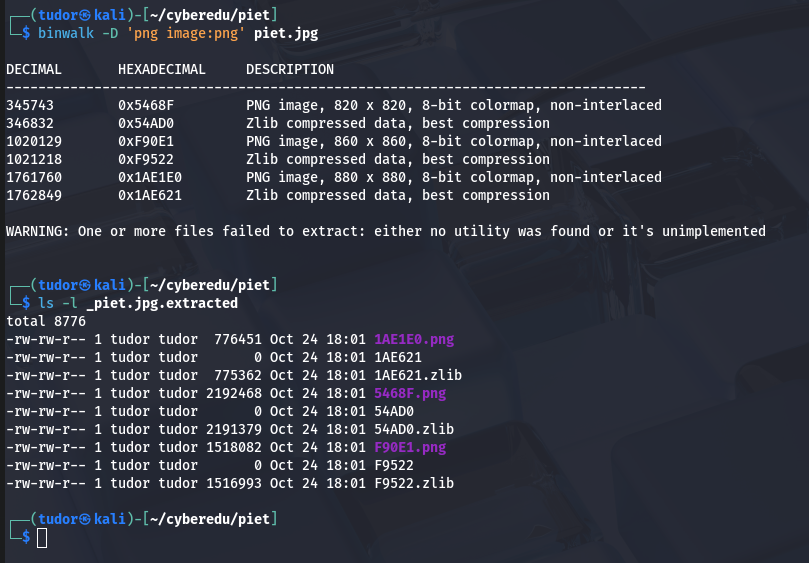

# Write-up: 

**Category:** Misc | Steganography
**Platform:** CyberEdu
**URL:** `https://app.cyber-edu.co/challenges/55c92040-7f21-11ea-a6f5-6790778f13ce`

---
This was a very tricky challenge...

I downloaded the .jpg and changed its name because the one that the challenge provided was too long. :D

I tried running
    `stegseek piet.jpg /home/tudor/wordlist/rockyou.txt`
but no luck..

The strings command didn't give me something either:
    

I ran the binwalk command and got something
    
This was a starting point...

I tried out to decompress the .zlib files and i got to this point:

The decompression left garbage after the valid data.
TTComp is another archive type(old format).
This feels like a "Matryoshka" challenge XD

After seeing that there are multiple layers of .zlib, I used 
`binwalk -M piet.jpg `
and I scanned all the extracted files:

Ok so there are multiple pngs in there, we will extract them out using the `-D` flag:

I didn't knew what to do next so I searched online about "Piet", the programming language(hint from the challenge description).

`https://www.bertnase.de/npiet/`

Npiet was initially developed to read only .ppm format so we can't
do much with our .png extensions.
Another alternative to solve this problem 