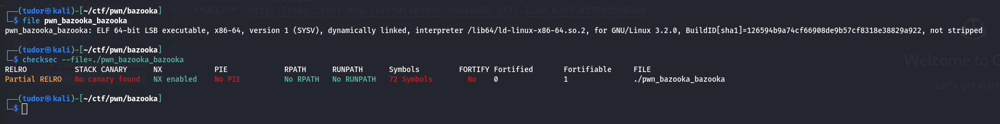
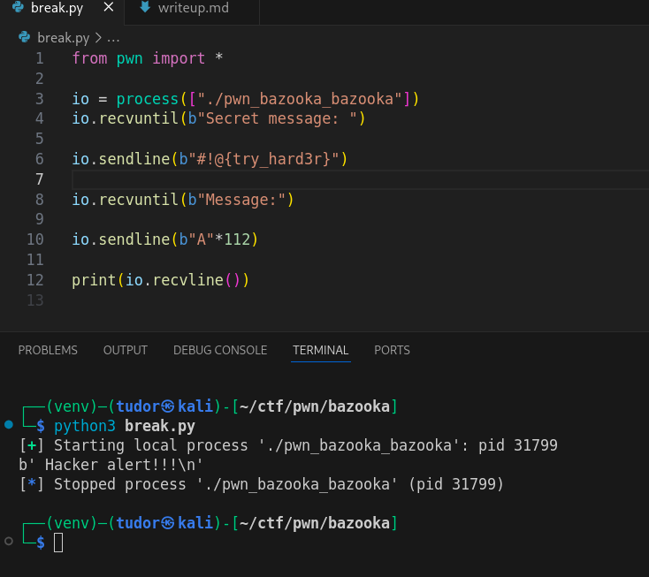
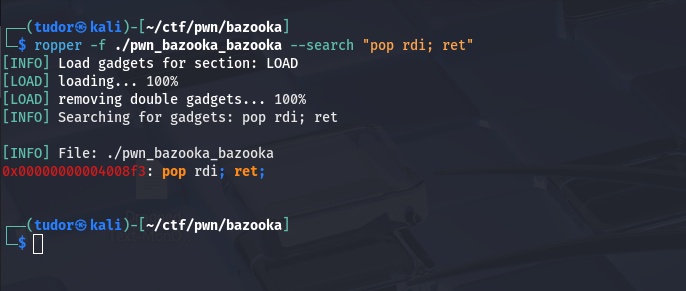
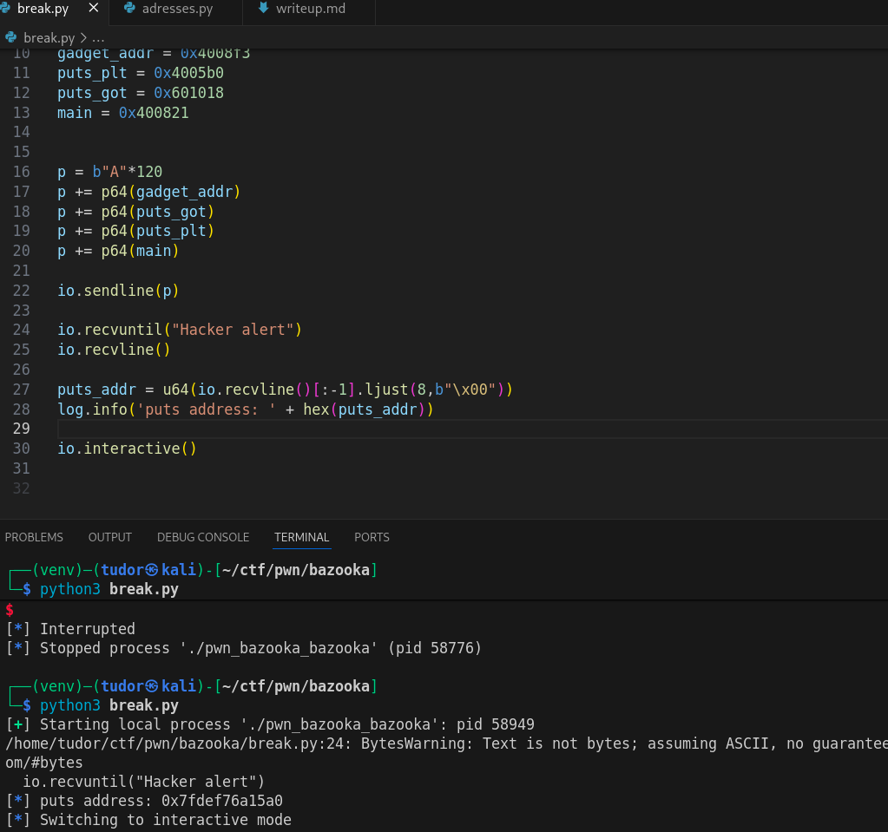
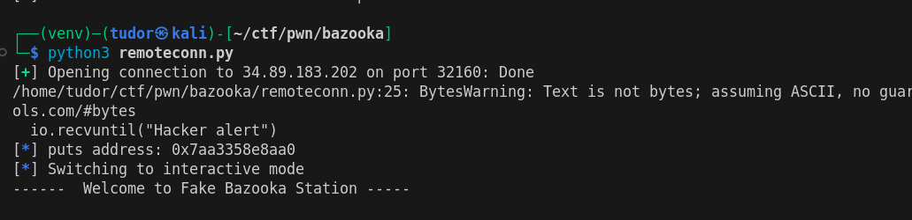
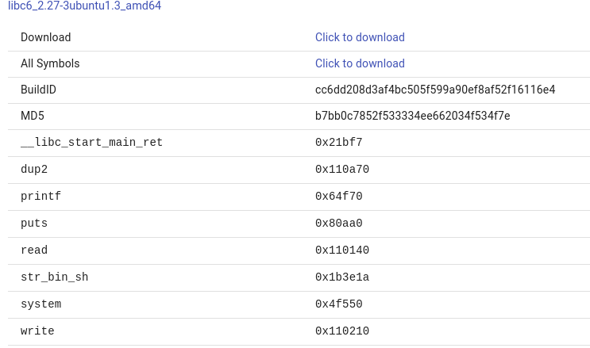
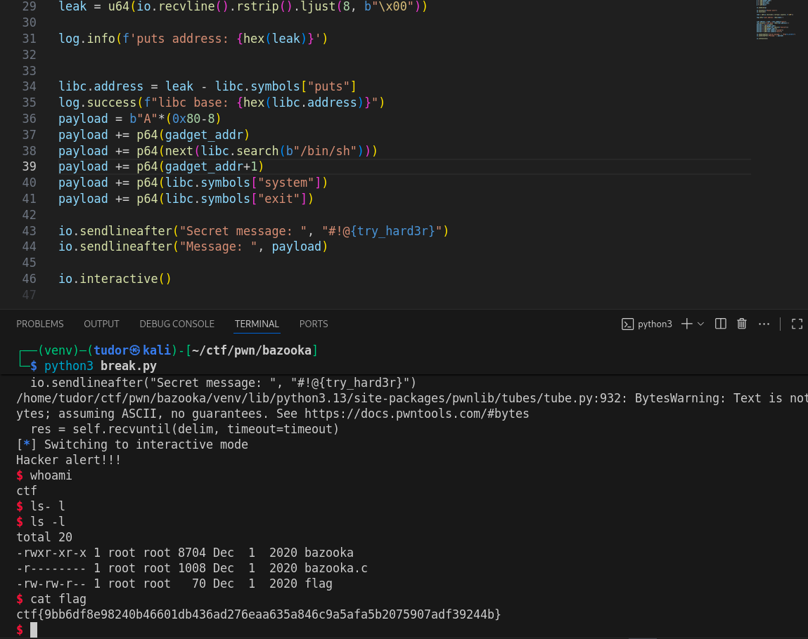

# Write-up: 
##  bazooka  

**Category:** Pwn
**Platform:** CyberEdu
**URL:** `https://app.cyber-edu.co/challenges/ae81c600-347c-11eb-a2b9-a539e3b969ab`

---

`No canary found` that means we can overwrite the stack and make the program return to a function we choose through a rope gadget.

First, I will wind the offset to which the program crashes:

With 112 bytes I overwrote the %ebp, and since we are on 64 bits architecture, I need 8 more bytes to overwrite the instruction pointer(%rip)

Next, I need to get the gadget address:

  

`0x4008f3 pop rdi; ret`

Since the binary it s dynamically linked at runtime, we have to find the base address of the libc library using the address of `puts(plt)` and also `puts(got)`.

In this way, I will make puts(plt) call with puts(got) argument to find the address of puts in libc.
I will also need the `puts` function offset in libc so I can finally get the libc base address and proceed with the next step in my roping exploit.

`0x4005b0  puts@plt`

`0x601018 puts@got`

There it is the address of puts function in libc. It s still changing at every run but it's more than enough.

When I ran the program on the remote host, I got an address with the last 3 nibbles different from mine `aa0`.

After a quick search online on what libc version this could be, I found this:

Last time, I used `one_gadget` to find me the offset to an execve(/bin/sh). This time, I'll use the old good method with system(/bin/sh).

