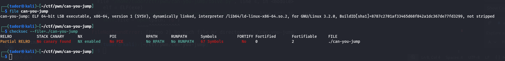
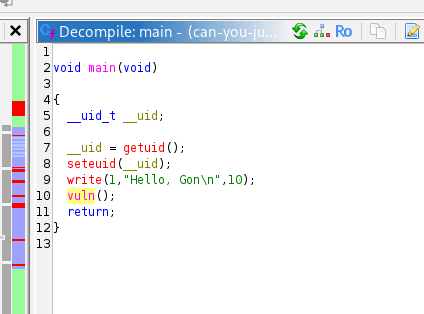
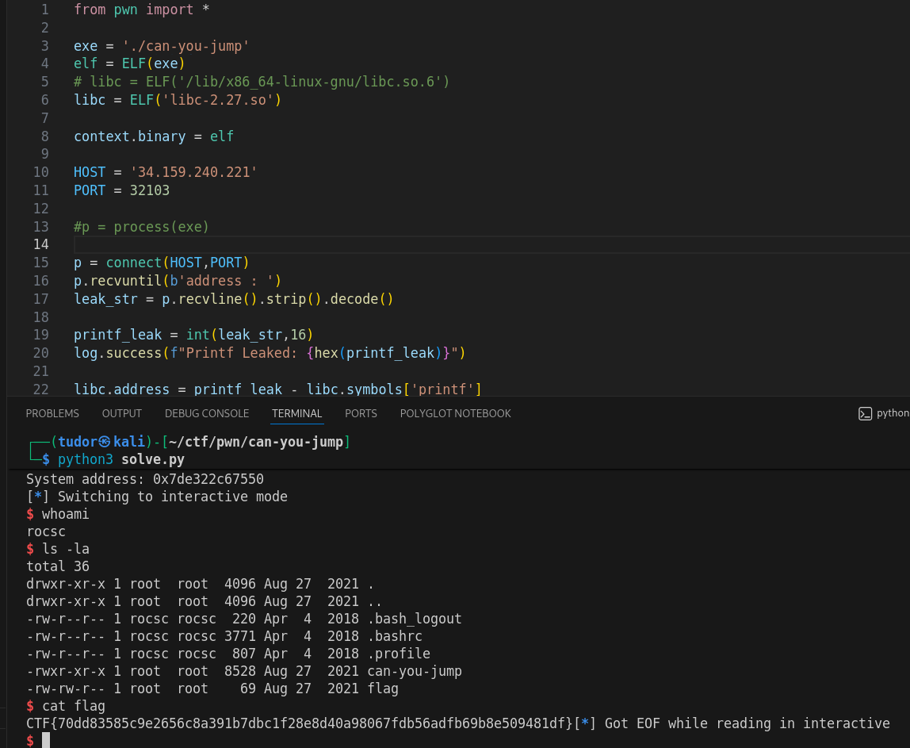

# Write-up: 
##  can-you-jump  

**Category:** Pwn
**Platform:** CyberEdu
**URL:** `https://app.cyber-edu.co/challenges/d9e1d410-0719-11ec-a889-9149e5df5aaf`

---

First, I looked at the binary info:



No canary and no PIE... this should be easy :D

I again used ghidra to see the decompiled file




Since `local_48` has only 56 bytes and the read functions reads up to 256 bytes, we have a buffer overflow exploit.
They already give us a big gift since it s that time of the year(Christmas):
    => the address of the printf function
I will get the base address of the libc and from there we will find the address of the gadgets inside the libc: `system` , `/bin/sh` and also `pop rdi; ret`

To overwrite the `rip`, we need to calculate the exact offset to the ret address:
local_48 is located at $rbp-0x48
local_10 is located at $rbp-0x10

since the buffer starts at rbp - 72, we need to fill exactly 72 bytes to reach the saved $rbp and another 8 for the `pop rdi; ret` gadget.

final payload:

``` bash

offset = 72

payload = flat(
    b'A' * offset,
    ret_gadget,
    pop_rdi,
    bin_sh,
    system_addr
)

```

