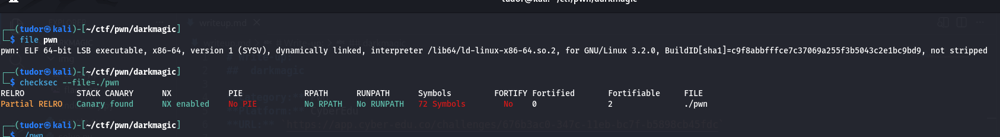
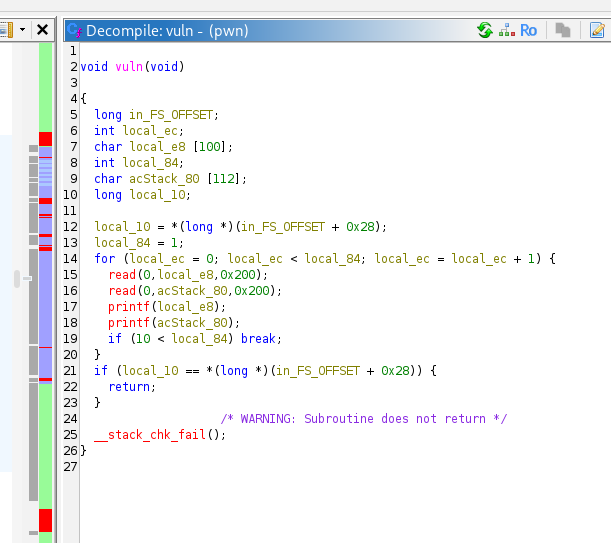
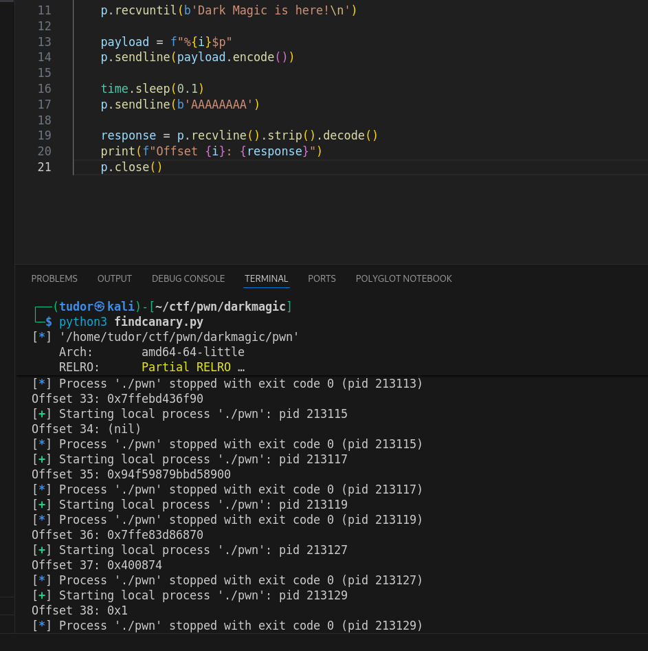
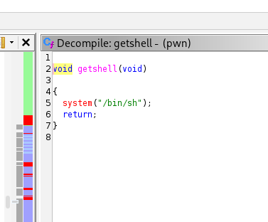
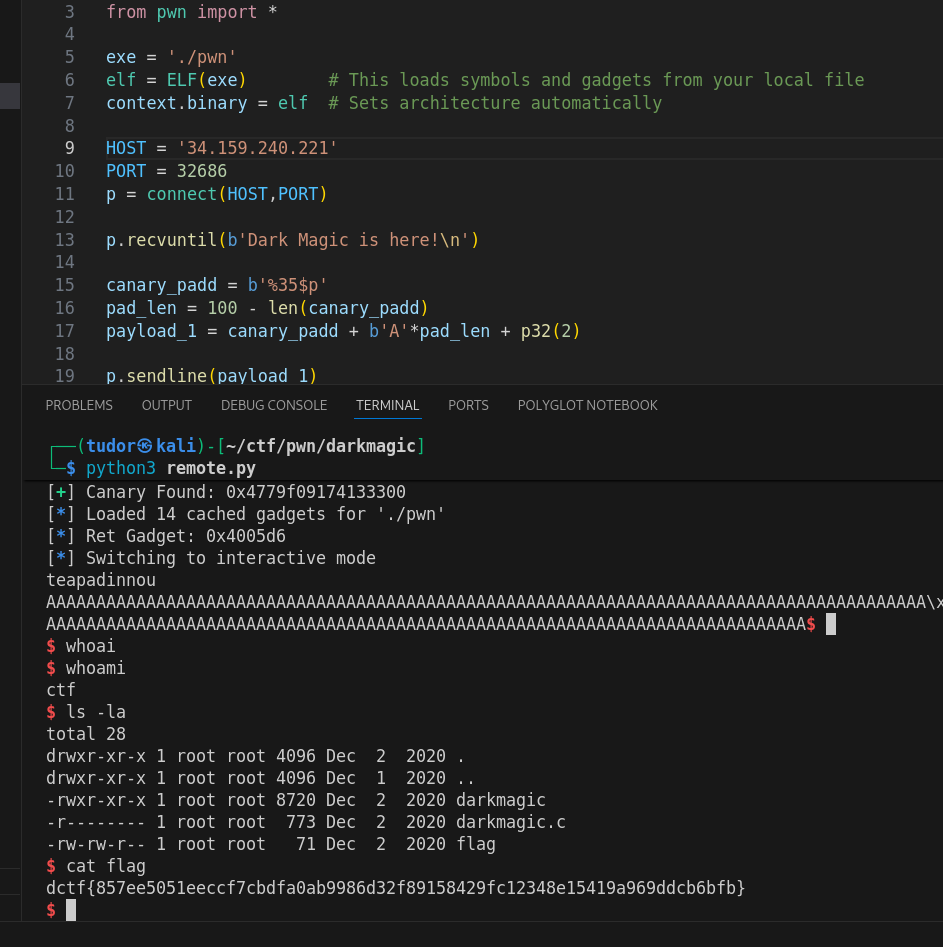

# Write-up: 
##  darkmagic

**Category:** Pwn
**Platform:** CyberEdu
**URL:** `https://app.cyber-edu.co/challenges/676b3ac0-347c-11eb-bc7f-b5898cb45fdc`

---



PIE disabled => static function addresses
Canary enabled => must leak to bypass

The core logic resides in vuln function: 



# Buffer Overflow 
=> the function defines two buffers : local_e8(100 bytes), acStack_80(112 bytes)
=> both reads 512 bytes, allowing a massive stack overflow

# Format String Leak
=> the function prints both buffers directly, allowing us to leak stack values(the canary mostly) using format `%p`



The code executes read before printf

To overflow the return address, we need the canary
But we won't get the canary leak until after printf executes.
But read has already passed

Strategy => Loop extension
the loop contor variable `local_84` is initially set to 1
local_e8 is located at rbp-0xe8. It is 100 bytes in size. The loop counter is at rbp-0x84

`0x38 - 0x84 = 100 bytes` => the first input buffer is near the loop counter

The first payload contains the format string(to leak the canary) and fills the buffer to overwrite local_84 with 0x02.

``` bash

canary_padd = b'%35$p'
pad_len = 100 - len(canary_padd)
payload_1 = canary_padd + b'A'*pad_len + p32(2)

```

The counter becomes 2 so we are allowed the second iteration:
we capture the leak from pass 1, and use the second iteration's read to perform the standard ret2win to the funciton which executes `system("/bin/sh")`:



Because we are jumping to getshell, the stack must be 16-byte aligned. Jumping directly to getshell misaligns stack by 8 bytes. We solve this by adding a ret gadget:

``` bash

rop = ROP(elf)
ret_gadget = rop.find_gadget(['ret'])[0]
log.info(f"Ret Gadget: {hex(ret_gadget)}")


```

`remote.py` is the solution for the remote challenge and `solve.py` for the local code

We craft the full payload and get rce!


