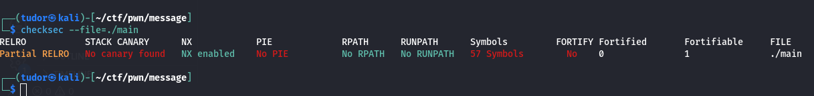
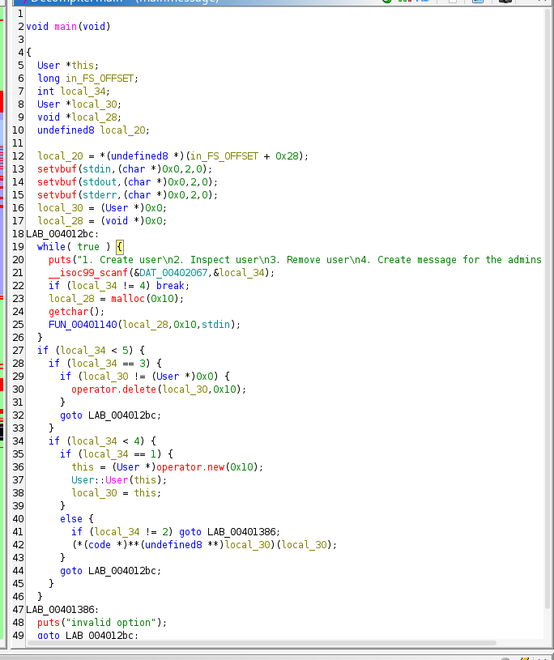
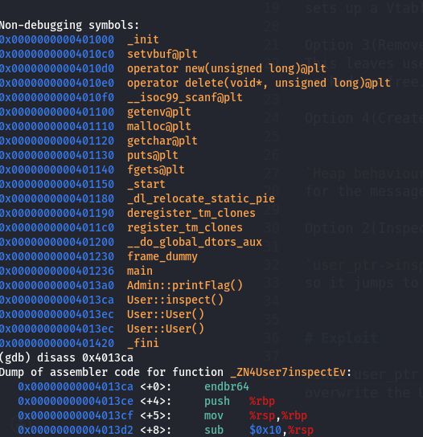
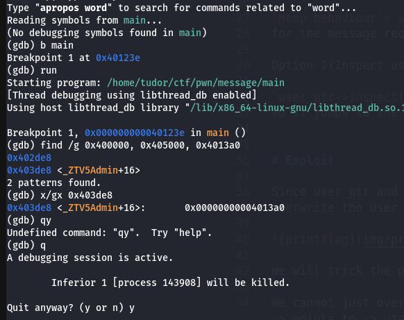
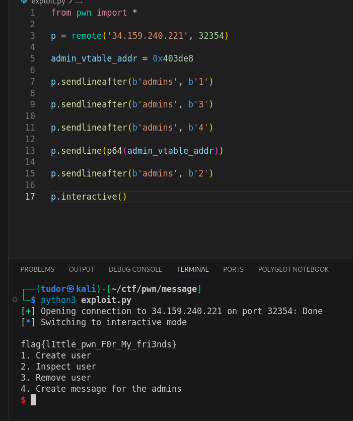

# Write-up: 
##  message 

**Category:** Pwn
**Platform:** CyberEdu
**URL:** `https://app.cyber-edu.co/challenges/01f57ec0-44a1-11ed-9665-05277963b86b`

---

Runninc `checksec` shows the binary's standard protection:

I used ghidra to read the core logic for the options of the code:

Option 1(Create user): allocates 0x10 bytes using operator new(16). It runs the User contructor which
sets up a Vtable(virtual table) pointer in the first 8 bytes of the chunk.

Option 3(Remove user): frees the user_ptr using delete but fails to set the pointer to null.
This leaves user_ptr as a dangling pointer. it still points to the heap memory address, but that memory is now marked as free.

Option 4(Create message): allocates 0x10 bytes using malloc  and reads user input into it.

`Heap behaviour`: since the user chunk(16 bytes) was just freed, the heap allocator recycles that exact same chunk
for the message request to improve performance. the `user_ptr` now effectively points to our message data

Option 2(Inspect user): uses the original user_ptr to call a virtual function.

`user_ptr->inspect();`
so it jumps to the first 8 bytes of the object(the vtable pointer) at the function address fount there.

# Exploit

Since user_ptr and msg_ptr point to the exact same heap memory address(`Use-After-Free` exploit), we can overwrite the User object's vtable pointer with our own address via the message input.

We will trick the program into jumping to `Admin::printflag()`

We cannot just overwrite the pointer with the address of printFlag directly. C++ virtual functions work: Object -> points to -> vtable -> points to the function

The program expects the vtable address:

This is the address in memory that stores `0x4013a0` at index0 => the admin vtable

Crafting the exploit:
1. Create user
2. Remove user
3. Create message => `0x403de8` in little endian, now user_ptr sees 0x403de8 as its vtable
4. Inspect user => program reads the first 8 bytes of chunk (0x403de8) it goes there and reads the first entry 0x4013a0 and it calls the printFlag() function

