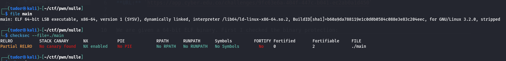
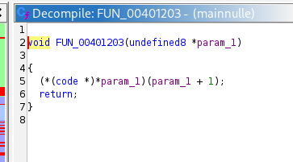
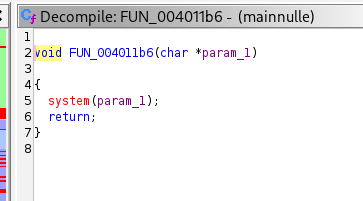
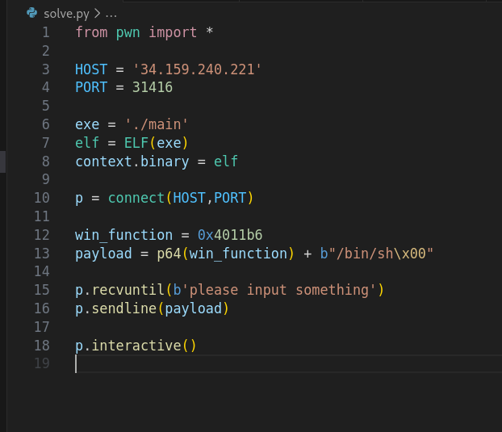
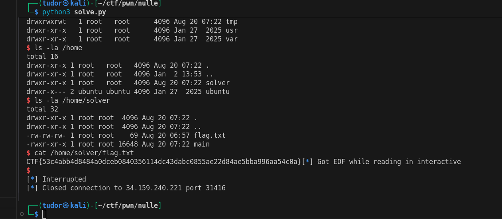

# Write-up: 
##  nulle 

**Category:** Pwn
**Platform:** CyberEdu
**URL:** `https://app.cyber-edu.co/challenges/9fc63e6a-404f-447c-b041-ec2ab0a1d450`

---

We are given a 64-bit ELF binary. First I checked the binary protection:

No PIE : the code addresses are static so we can hardcode function addresses in the exploit

When I tried to run the program i got seg fault.
Using ghidra, I analyzed the flow:

-> the main function reads 100 bytes of user input into a global buffer at address `0x404060`
-> the function main passes this buffer to FUN_00401203

The prg treats the data buffer asa structure containing a function pointer.
It dereferences the first 8 bytes of our input and treats them as a memory address to call. We control the RIP.

`param1 + 1` the argument: it calculates the address of the next 8 bytes and passes it as the first argument

We need to redirect the function to jump to the win_function that is executing a command:

I will construct a payload that sets the jump target to the address of FUN_004011b6 and set the argument to the string "/bin/sh".

There it is our flag!

