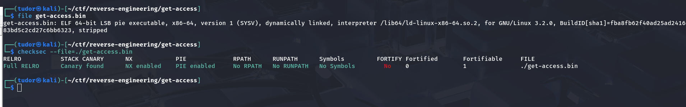
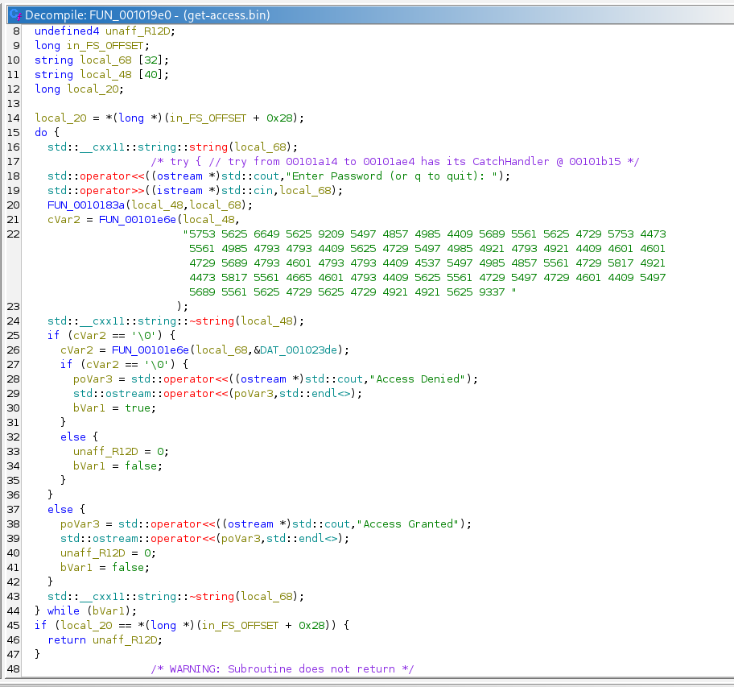
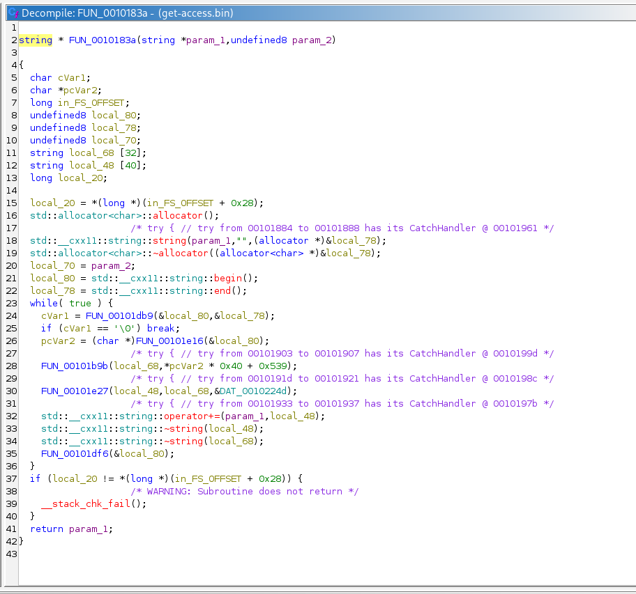
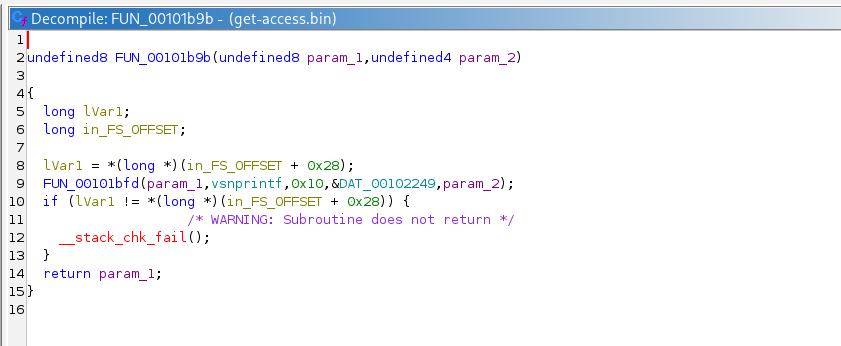
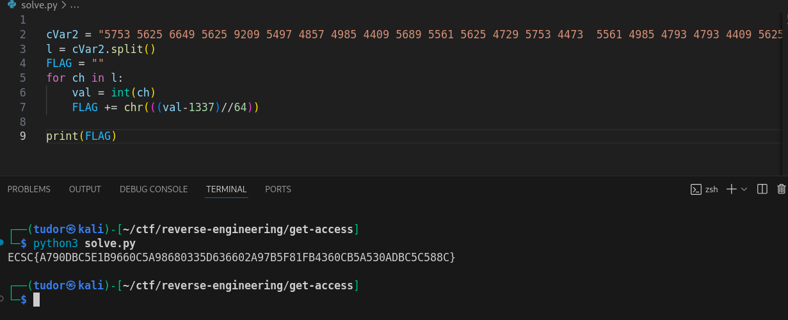

# Write-up: 
##  get-access 

**Category:** Reverse Engineering
**Platform:** CyberEdu
**URL:** `https://app.cyber-edu.co/challenges/5590e030-7f21-11ea-9a28-a5732a49fa0f`

---

First thing I did was checking the file permissions and properties:

The file is using dynamically linked libraries, all the debugging symbols are erased(rip gdb).
`Full RELRO` => full prevention against GOT tables overwrite
`Canary found` => it detects writing on stack
`NX enabled` => can't inject shellcode on stack/heap and execute it

So it's a well protected executable.

I ran the code and saw that is was requesting a password in a loop, until I give the right password.
Let's take a look at the .elf in `ghidra`:

After a quick analyze, `cVar2` gets the result of the comparision between that long string and `local_48`.
If `cVar2` is different than 0, the program outputs "Access Granted" and breaks from the loop.

The instruction before `cVar2 = FUN_00101e6e(local_48...` is `FUN_0010183a(local_48,local_68);`. local_68 has our input  `std::operator>>((istream *)std::cin,local_68);`. Let's see what this function does:

It looks complicated but it's not that bad. What this function really does is converting every character from our input by multiplying it with `0x40=64` and then adding `0x539=1337` to the final value.

`FUN_00101b9b(local_68,*pcVar2 * 0x40 + 0x539);`

So, in order to get the flag, we have to reverse this procedure. I used a python script and got the flag!

