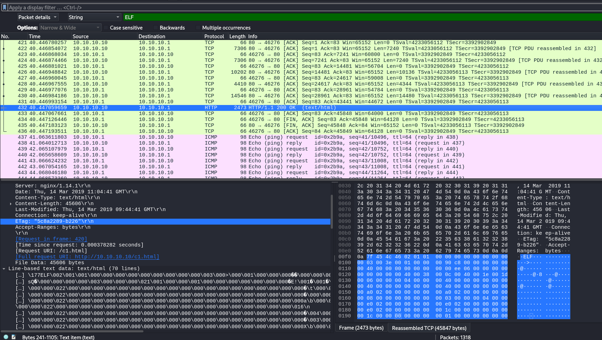
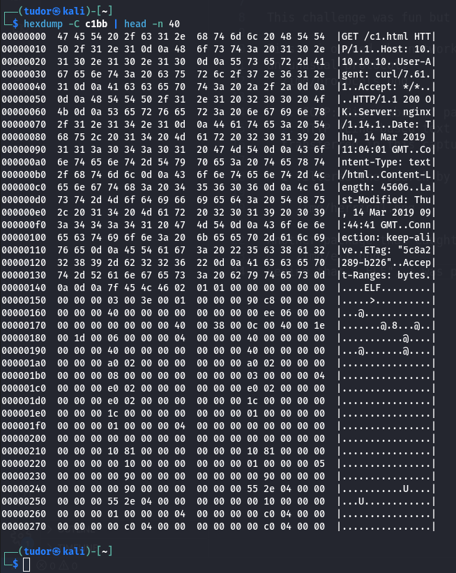
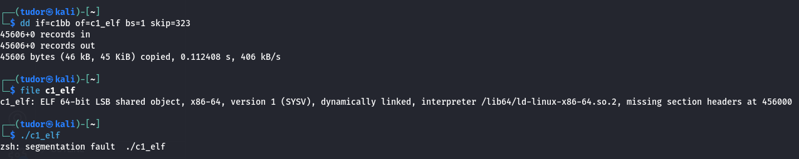
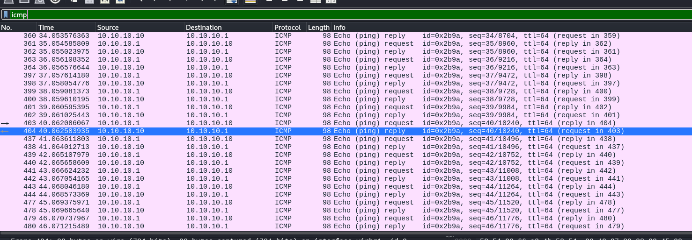
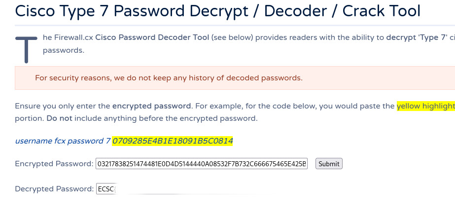

# Write-up

**Category:** Network
**Platform:** CyberEdu
**URL:** `https://app.cyber-edu.co/challenges/55ef0910-7f21-11ea-b1bf-ed1feede8572`
---

This challenge was fun but there were a lot of red herrings :DDD

First, i opened the network capture in wireshark and i took a look at `Protocol Hierarchy` to see if there was
an unusual protocol:

  

  1. `ICMP`: Big number of packages (312 packets, 23.7% of total). This is a good lead on "unusual communications"
  2. `HTTP` (`data-text-lines protocol`). This is the winner; Line-based text data represents 92.5% of TOTAL bytes
  transferred in this capture

  I filtered the search by data-text-lines protocol and i found some fake leads, some of them like those:
    


Another package that caught my attention was this one:
    

Seeing that `.ELF`, i was pretty sure that i have to extract some executable from this package:
    

I extracted the executable using this command:
```bash
    dd if=c1bb of=c1_elf bs=1 skip=323
```

But, as I said, there were some red herrings :)))
    

Ok, after this fake lead, I looked at the ICMP comms.
My motivation was simple: back in the "Protocol Hierarchy", `ICMP` was the second most suspicious protocol. An unusually high number of packets (312) for a simple "ping" perfectly fits the challenge name, "Unusual Communications".

I filtered the display in Wireshark with icmp and saw a long, sequential conversation between `10.10.10.10` and `10.10.10.1`.

A normal ping packet has a very small, often repetitive payload. These packets, however, each contained a substantial data payload, confirmed by the Length: 98 bytes.
    

I clicked on the next reply packet, and it contained a different chunk of data. This was the trigger. It was obvious that a file was being exfiltrated, split into small chunks, with each chunk hidden inside the payload of an ICMP reply packet.


## The Motivation for the Script

It was impossible to manually copy and paste the data payload from over 300 packets and reassemble them in the correct order. The only way to solve this was to automate the extraction.

Therefore, I wrote a simple Python script using the scapy library to:

    ## 1. Read the captura.pcapng file.

    ## 2. Iterate through every single packet.

    ## 3. Filter for packets that were both ICMP and an echo reply.

    ## 4. Extract the raw data (.load) from each of these packets.

    ## 5. Concatenate all these small data chunks in the correct order.

    ## 6. Write the final, reassembled data to a new file, which I named flag.png.


This is the script I used:
```bash

    from scapy.all import *

    # citesc fisierul .pcapng
    packets = rdpcap('captura.pcapng')


    ping_packets = []

    for packet in packets:
        #caut doar pachetele ICMP si de tip reply
        if 'ICMP' in packet.summary() and 'reply' in packet.summary():
            # extrag doar datele din pachet si le adaug la lista
            ping_packets.append(packet.load)

    #trebuie sa lipesc toate pachetele la loc
    ping_data = b''.join(ping_packets)

    with open('flag.png', 'wb') as f:
        f.write(ping_data)
                          
```
                        
This is the obtained image:
    

As we can see, it contains an username, a password and the digit `7`.
To finish this challenge, we take another look at the challenge description and we find a hint: 
`screenshot of the password from a CISCO router`

This might mean that we need to use a `CISCO password decoder`, more precisely, "type 7" decoder:
   
