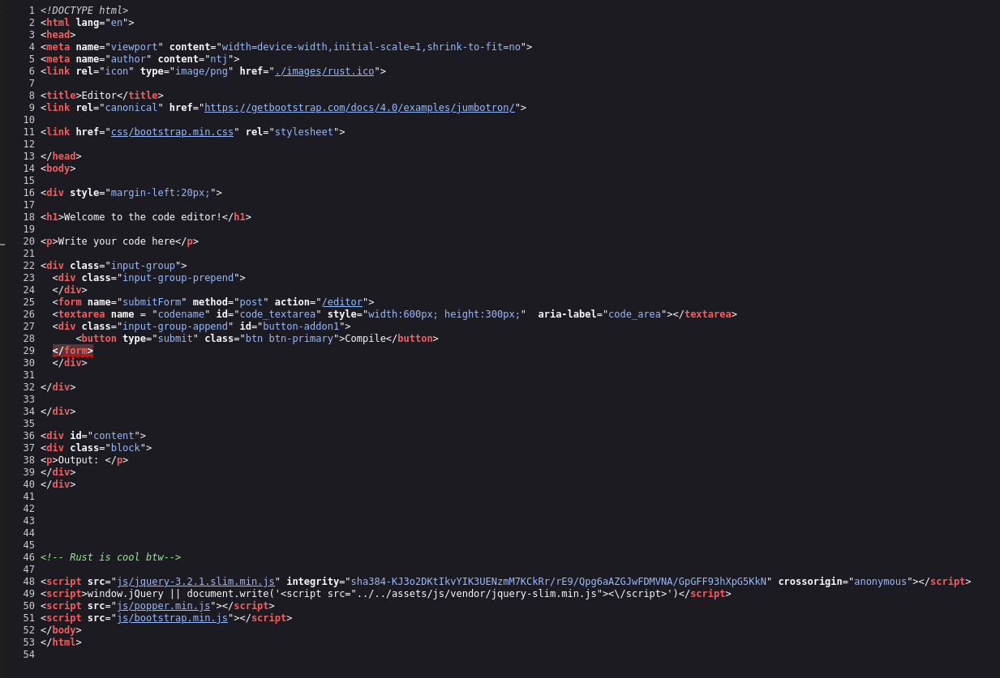
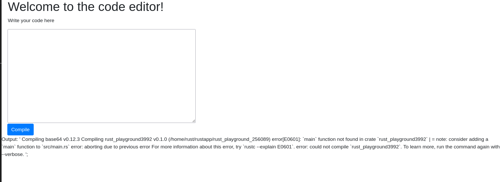
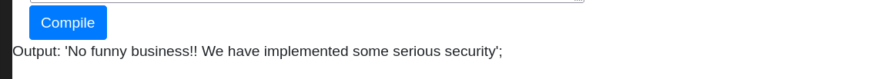
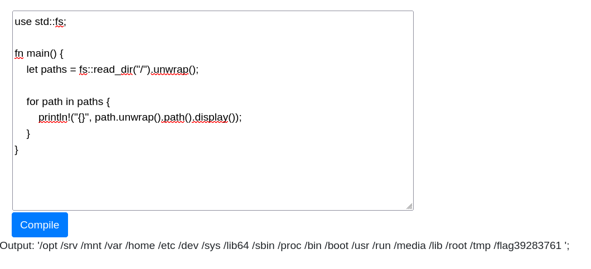

# Write-up: 
##  cargo

**Category:** Web
**Platform:** CyberEdu
**URL:** `https://app.cyber-edu.co/challenges/f4f38180-1387-11eb-b2c5-7d132e215aa9`

---

I used a fuzzing command with `gobuster` to see if the web page has other sub-pages or directories:


The `/editor` looks like it compiles your rust commands and gives back your output:



Let's test this by pressing the compile button:



It confirms that the server is taking my code and is trying to compile it using the Rust compiler `rustc`

The server creates a temporary rust project for my code `rust_playground_102478`.

This error give me a map of the server 
`/home/rust/rustapp/rust_playground_102478`

1. The process is most likely running by a user named `rust`
2. The application is located in `/home/rust/rustapp/`

I think this challenge is designed to use `Remote Code Execution(RCE)` exploit. I will try to output the files that are in the same directory as our temporary code:

``` rust
use std::fs;

fn main() {
    let paths = fs::read_dir("./").unwrap();

    for path in paths {
        println!("{}", path.unwrap().path().display())
    }
}

```


Nothing important here, let's get back to `/home/rust/`:

``` rust

use std::fs;

fn main() {
    let paths = fs::read_dir("/home/rust/").unwrap();

    for path in paths {
        println!("{}", path.unwrap().path().display())
    }
}

```


I can see that there is a directory `/home/rust/.cargo/`, it has the same name as our challenge.

When I try to list the files in the cargo directory the server gives me this output: 



The server filters my path, I tried other methods to list the files in `/.cargo` directory but I haven t found a bypass method yet.

I changed the approach and took a look at the files in root directory:



There I found a folder name `flag39283761`. I read the content of this folder and found this:

`Output: '/flag39283761/flag2781263 '; `

Inside `flag2781263` was our flag!

