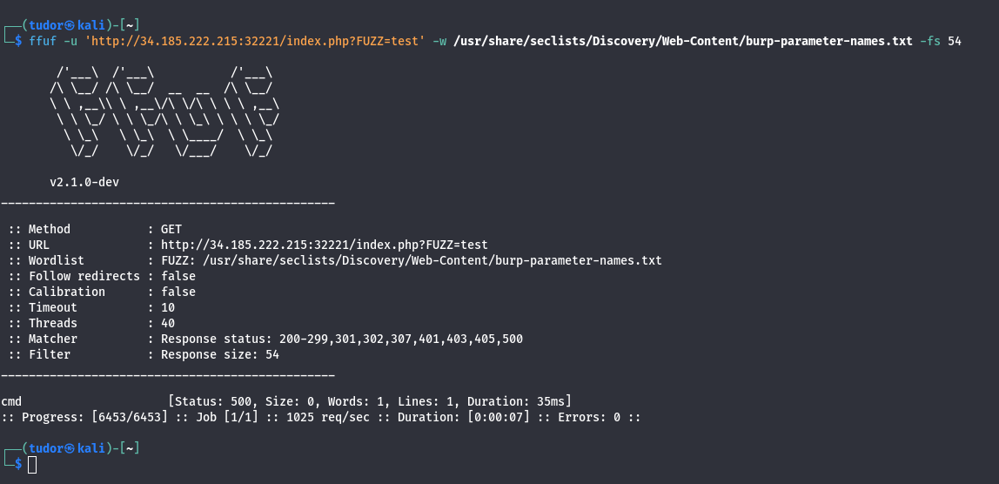
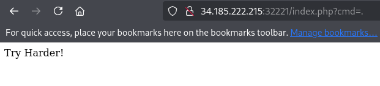
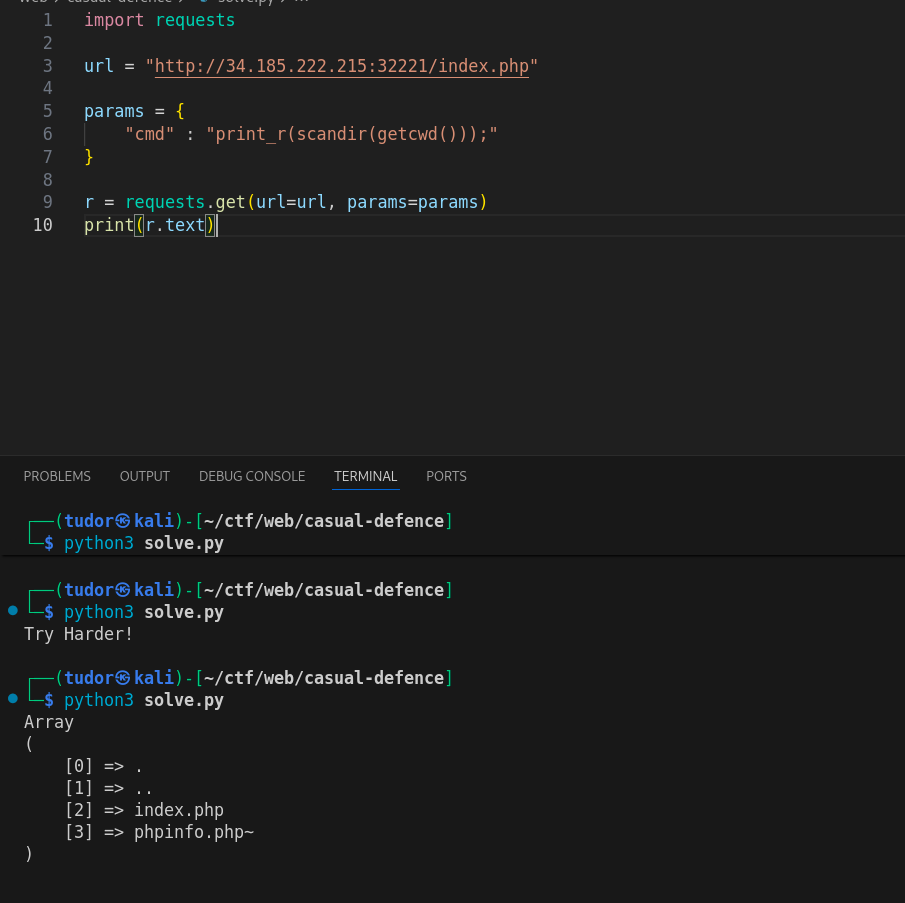
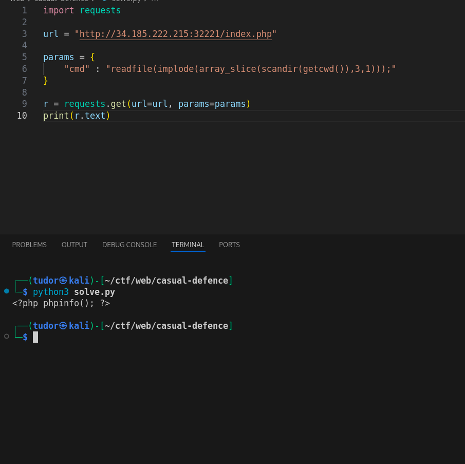
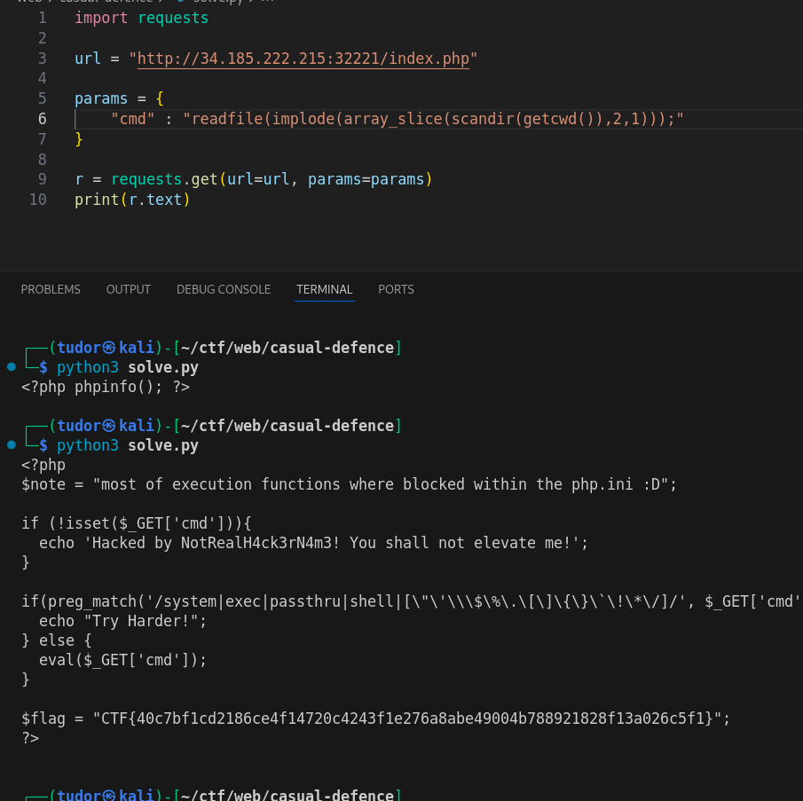

# Write-up: 
##  casual-defence 

**Category:** Web
**Platform:** CyberEdu
**URL:** `https://app.cyber-edu.co/challenges/2c3361b0-8a51-11ec-990b-89bb02cb006c`

---

On the main page I was welcomed by a message `Hacked by NotRealH4ck3rN4m3! You shall not elevate me!`.
I did some fuzzing on directories, I even searched for LFI using LFI_Jhaddix.txt list but didn t found anything.

Then, I did param fuzzing and got something:

The CMD parameter is our way to remote code execution. The problem is, the server's filter is very strict.
Characters like ` .\?'"{}[]$ ` can t bypass the filter and in exchange, the server is displaying one of the greatest and most annoying
messages :

`system` and `passthru` are also blocked.
Since `$`, `[]` and `.` are blocked, I can t chain my payload and use other request parameters (`$_GET[]`).

After a long time of searching and trying harder(more like hardly trying), I found a payload that got through the security filter
and displayed the files in current working directory:

I must use functional PHP to extract the second (index.php) and third item (phpinfo.php~) in the array.
The solution:
`array_slice` + `implode`

`readfile(implode(array_slice(scandir(getcwd()),3,1)));`

scandir(getcdw()) = gets the list
array_slice(..3,1) = extracts just the file at index 3(phpinfo.php~)
implode(...) = converts the array result into a plain string
readfile(...) = reads the file

Let s check index.php:

There it is the flag!