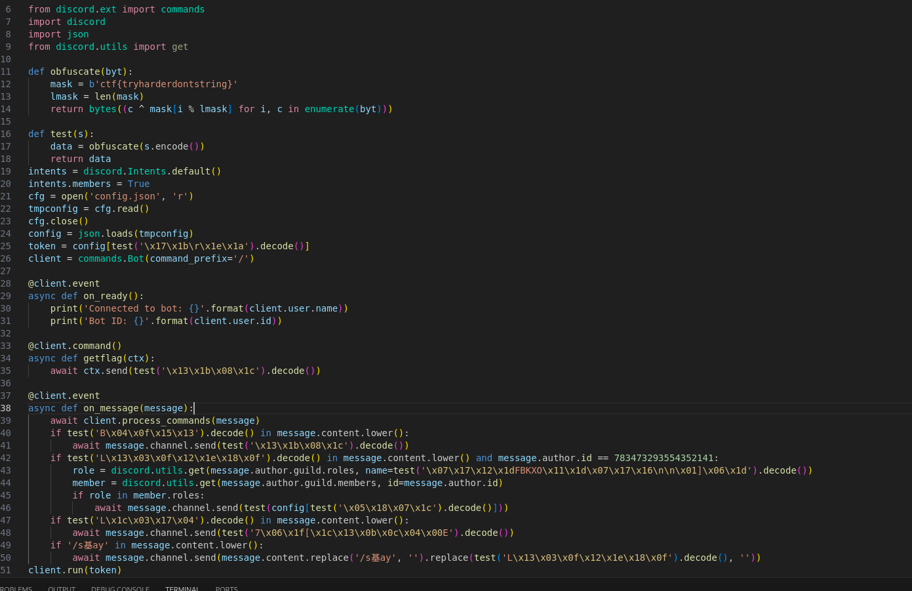
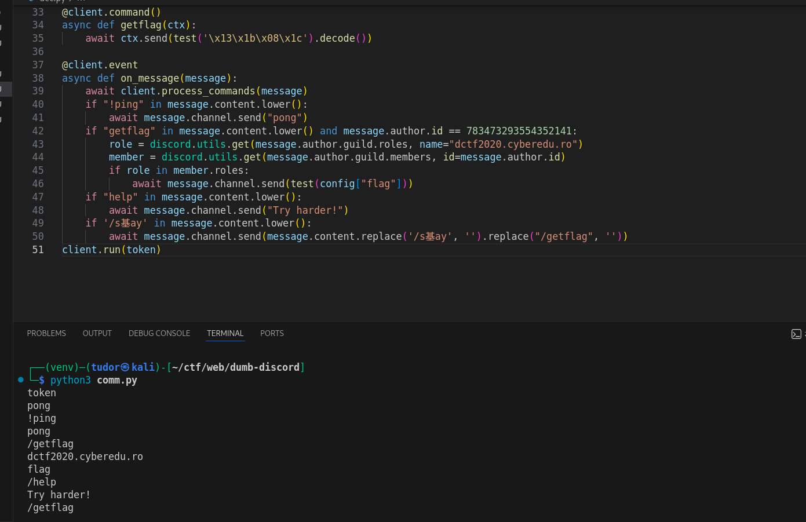
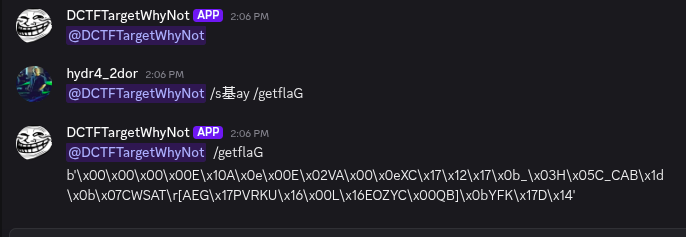
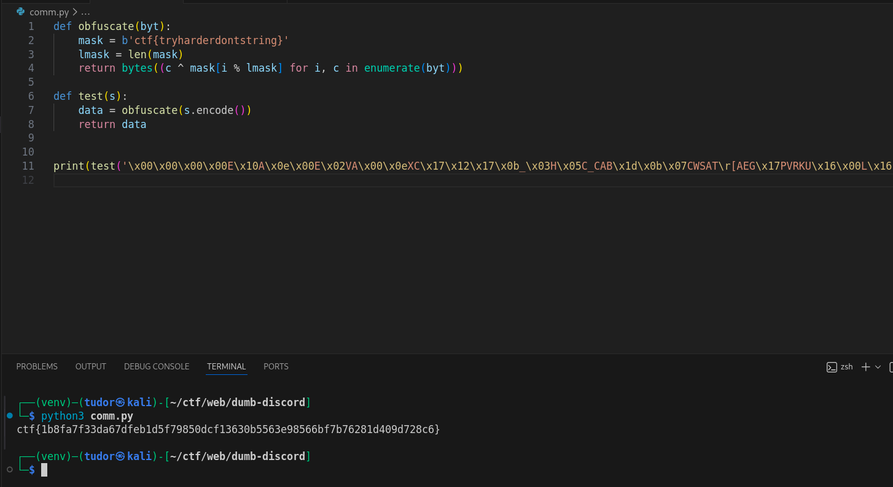

# Write-up: 
##  dumb-discord

**Category:** Web | Reverse Engineering | Misc
**Platform:** CyberEdu
**URL:** `https://app.cyber-edu.co/challenges/fdecf540-355c-11eb-a2f2-19541f35d063`

---

We get a python bytecode that I decompiled it using `https://pylingual.io`:

After xoring the strings in the script we know the commands the discord bot is using:

So I have to add the discord bot with the id `783473293554352141` on my server and give him `dctf2020.cyberedu.ro` role. In order to
force him execute the `/getflag` command, I'll use `/s基ay`. Since the bot it's replacing "/s基ay" but also "/getflag" with "" and he is converting al lthe commands to lowercase `message.content.lower()`, instead of "/getflag" I will send "/getflaG".

