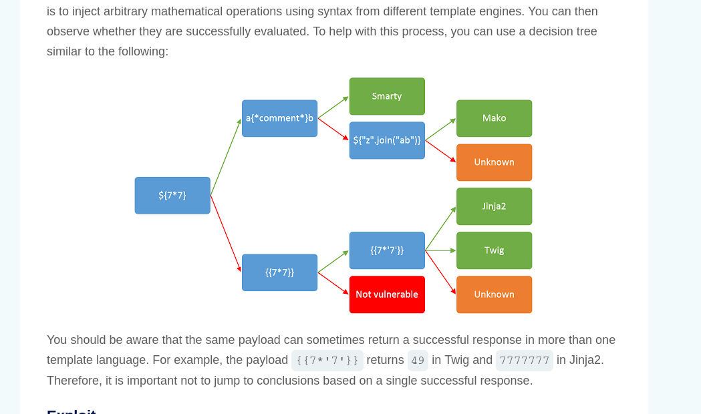
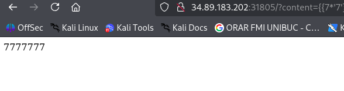
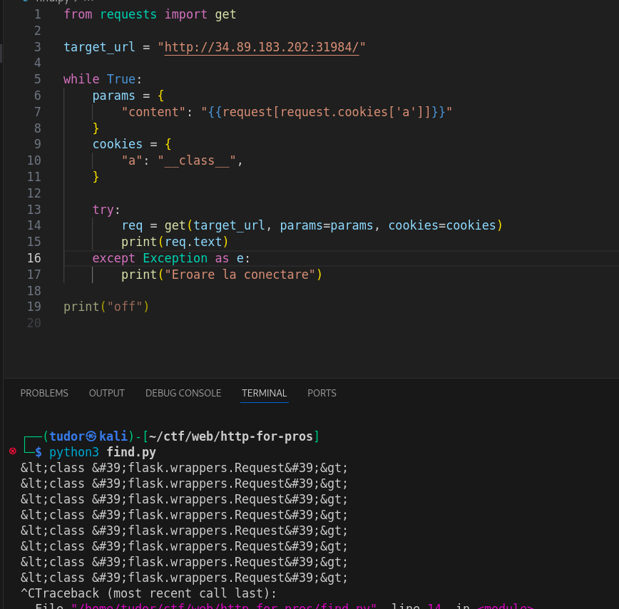
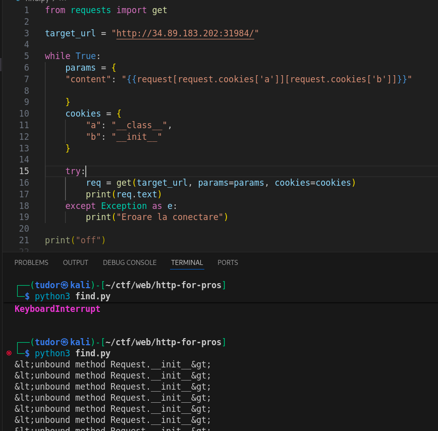
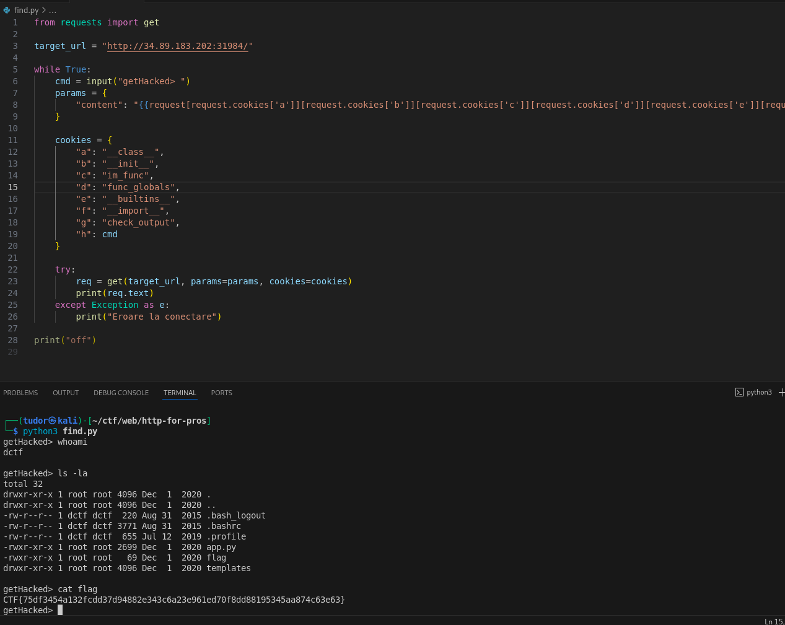

# Write-up: 
##  http-for-pros

**Category:** Web
**Platform:** CyberEdu
**URL:** `https://app.cyber-edu.co/challenges/61b008b0-347e-11eb-a4d5-3fa9f0895630`

---

The server just echos back my input.
It took me a while to think about a `Server-Side Template Injection` issue. For `{{6*7}}`, the server prompted `42`. 

First, I found out that the template engine the server is using is Jinja2(with the help of `https://portswigger.net/web-security/server-side-template-injection` schema):

I need to get RCE but there are a lot of blacklisted character, so it won't be easy finding a way in.

`_` sends back a blacklisted character message so I can't use classes

`MRO` = Method Resolution Order => is the order in which Python looks for a method in a hierarchy of classes

Starting from `__class__`, we have to go up in hierarchy until we find `system` and get a `shell`.

This article `https://onsecurity.io/article/server-side-template-injection-with-jinja2/` was truly amazing, a great source of inspiration for my next steps.

The `request` object is our key to victory. Inside this "big box" I ll hide the values I want to write in "content" variable.

First, I tried to put my malicious strings in other fiels, like "cl=__class__" but those were blocked too.
Then, I tried using the cookies:

This will work!

Most of the WAF filters are configured to scan the url(request.args) and (request.form), but when it comes to cookies, they are not paying enough attention.

I tried "__base__" and "__mro__" on cookies but those are blocked too.

I searched on google what methods are available inside `flask.wrappers.Request` class because the dir() method was blacklisted too.

'unbound method' confirms that it is Python2

`im_func` (short for Instance method function) => gives us the address of init

`func_globals` is a dictionary with all global variables inside the module where the init function was defined

Inside func_global there it is another dictionary named: `__builtins__`. It contains the function `__import__`(besides other functions like len, print etc).

Now, I have to call __import__ to import the module names `subprocess`. I need the `check_output` that s inside and set the shell equal to True to run a /bin/sh or /bin/bash on remote server.

