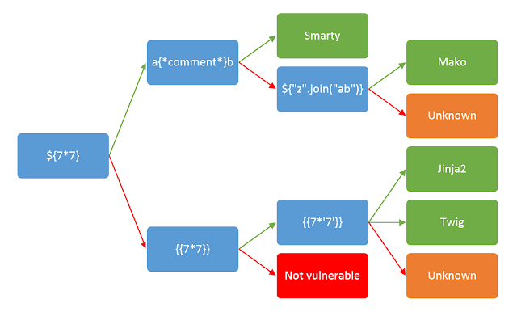
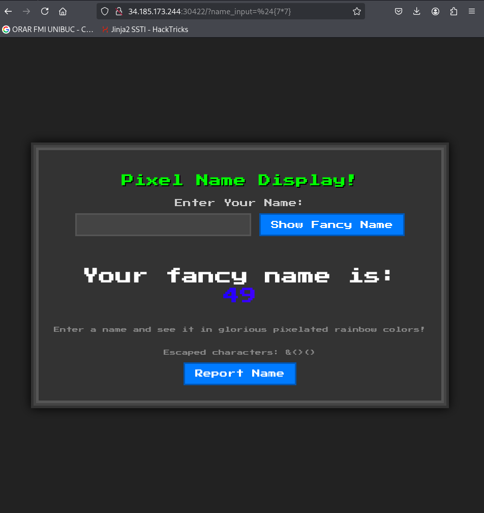
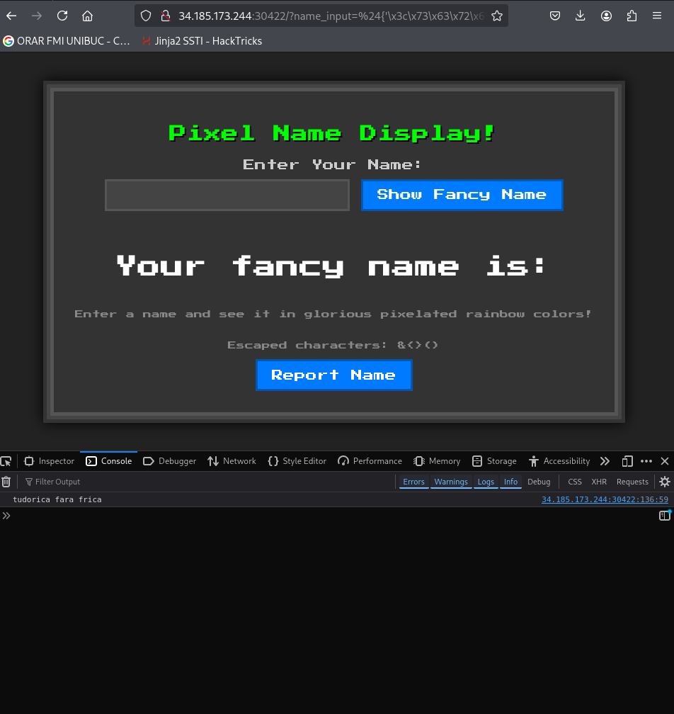
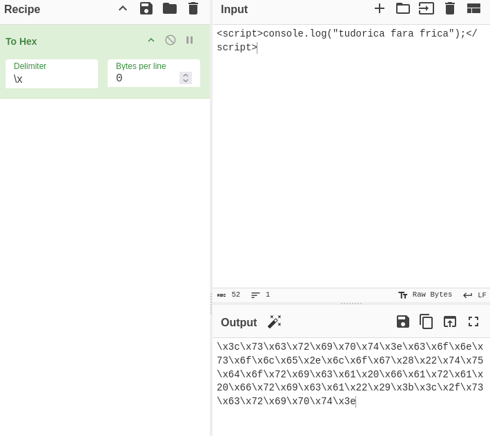
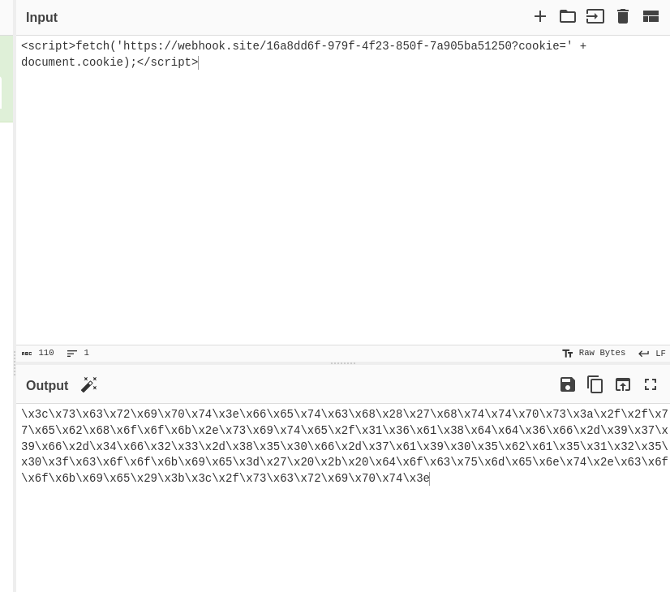
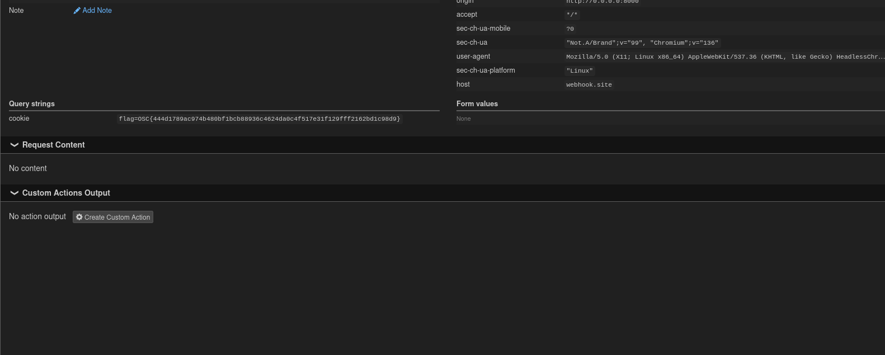

# Write-up: 
##  icseses

**Category:** Forensics
**Platform:** CyberEdu
**URL:** `https://app.cyber-edu.co/challenges/9eeaf674-10a5-4270-b1d0-5be7d9a618db`

---

The challenge is using Meko Engine as we can see in `main.py` and the value of the "name_input" is sanitized:

``` py
banned = ["s", "l", "(", ")", "self", "_", ".", "\"", "import", "eval", "exec", "os", ";", ",", "|"] 

```



Mako syntax is `${...}` and if we test it with ${7*7} we can see that this is SSTI vuln:



The script also escapes characters like $<>() so we have to find a way to bypass those.

`bot.py` tells us that the flag is a cookie named "flag" .

`chrome_opts.add_argument("--headless=new")`
The bot uses Selenium with Chrome. It launches a real Google chrome browser but without GUI. It runs entirely in the background but it has a full JavaScript enigne.

Before the bot visited any page, it manually injects our flag in a cookie into its own browser session.

The trigger: 

``` py

encoded_name = quote(name)
driver.get(f"{URL_BASE}/?name_input={encoded_name}")

```

The name variable comes from my input for "name_input". The browser loads the page with `name` injected in HTML.

The vulnerable code in main.py: 

``` py

templ = html_template.replace("NAME", escape_html(name_to_display))
template = Template(templ, lookup=lookup)

```
So Mako sees ${...} and executes what is inside.

Ok so the server didn't run my script I tried, just treated it as a text and sent it to the browser.

I can't write `s` but I can write \x73(hex for s) and it bypasses the check.

Mako runs ${'\x73'} and outputs "s"





So I have to fetch the flag from the bot's browser.
I'll use the `fetch(...)` command with `document.cookie`. Since I need to receive the response on a public IP,  `https://webhook.site` is the perfect destination address.



I crafted the payload and then sent it in the browser of the challenge. While I was waiting for a response on my webhook, I received the response containing the flag:


