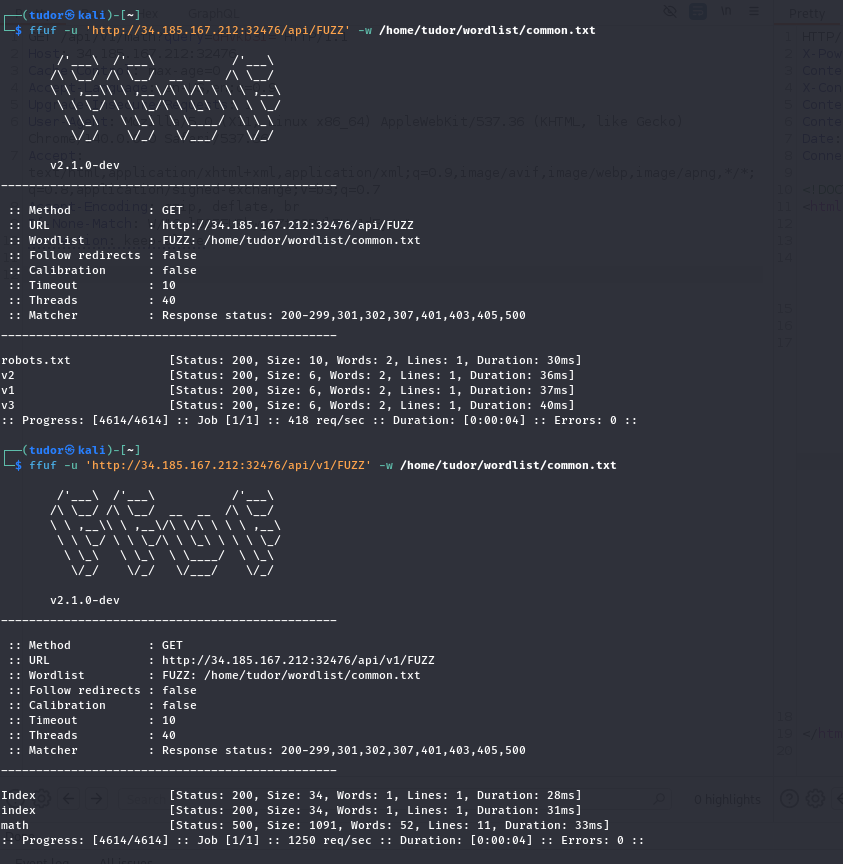
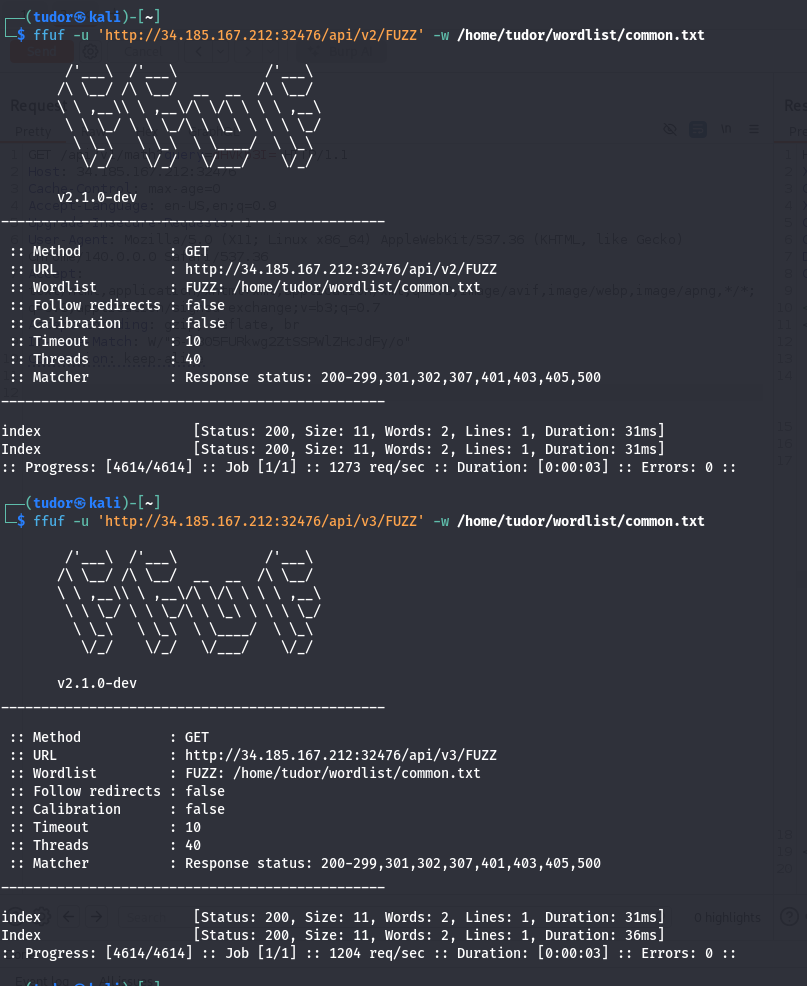
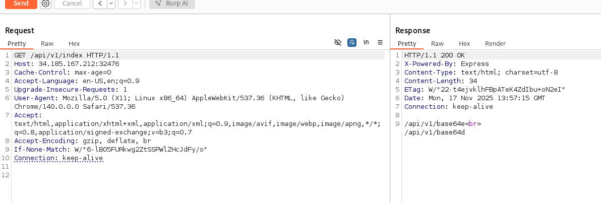
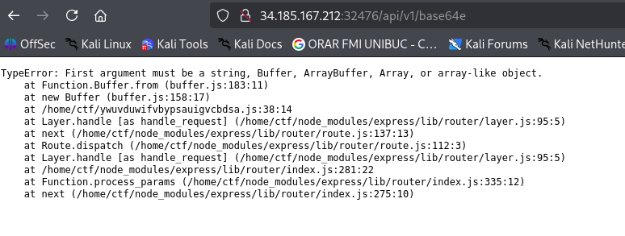
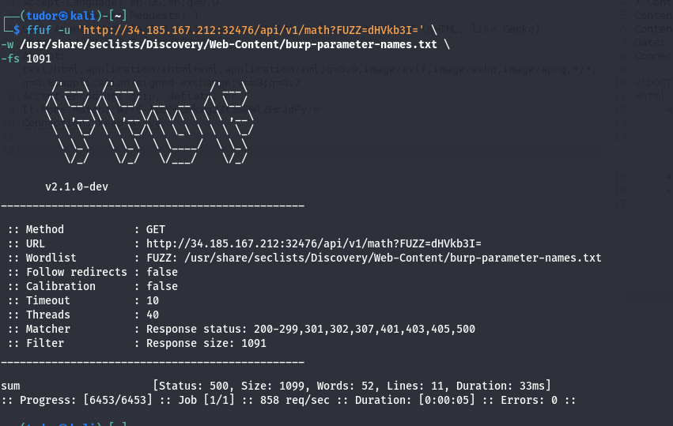
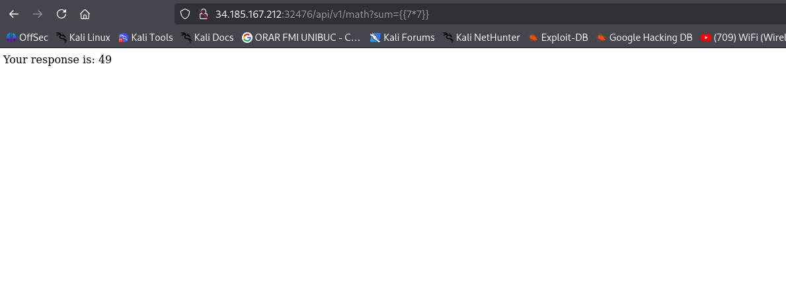
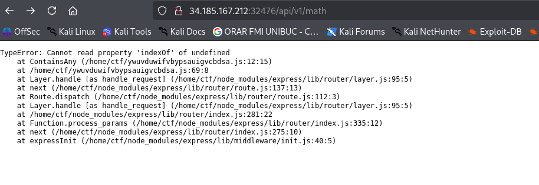
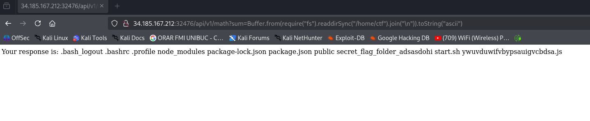
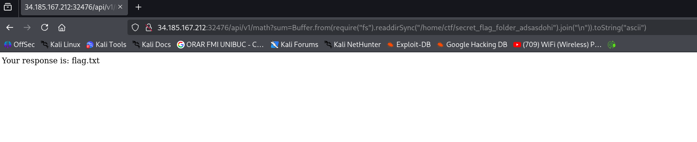
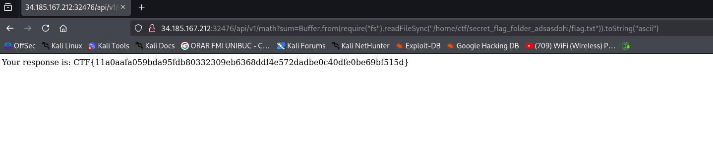

# Write-up: 
##  inodat

**Category:** Web
**Platform:** CyberEdu
**URL:** `https://app.cyber-edu.co/challenges/5a722a00-05ad-11ec-8626-6968aff1af43`

---

First, I did some fuzzing:




The `/api/v1/index/` page gave me another 2 enpdoints: 




Those 2 webpages required the "data" parameter and as you have guessed, one encodes the value of the param "data" and the other one DEcodes from base64 the value from "data". Maybe this will help us later.

Coming back to `api/v1/math`, I could not find any get parameters using `common.txt`.

I used the list `burp-parameter-names.txt` which contains more param words:





This is a `Server-Side Template Injection (SSTI)`. The server is evaluating the content inside the {{...}}.
Now, I have to find a way to list the files inside `/home/ctf` and bypassing the filter of the server.


As you can see, the author left some hints:

` at next (/home/ctf/node_modules/express/lib/router/index.js:275:10) ` -> the server is running Node.js
` /home/ctf ` -> the directory which keeps our flag(I hope so)

Also, a more important hint is that the server is using the Buffer object:

``` js
TypeError: First argument must be a string, Buffer, ArrayBuffer, Array, or array-like object.
    at Function.Buffer.from (buffer.js:183:11)
    at new Buffer (buffer.js:158:17)
    at /home/ctf/ywuvduwifvbypsauigvcbdsa.js:38:14

```

`https://stackoverflow.com/questions/19705972/buffer-entire-file-in-memory-with-node-js`

There it is the file system of /home/ctf:



`require("fs")` = imports Node.js bult-in "File-System" module( I can interact with files and dirs)
`.readdirSync("/home/ctf")` = reads the content of the /home/ctf directory and returns an array
`Buffer.from(...)` = this creates a buffer object with the resulted string(the list glued with join("\n"))
`toString("ascii")` = this converts binary data from the buffer back to ascii

Now we have to look inside `secret_flag_folder_adsasdohi`:



And there it is our flag!


