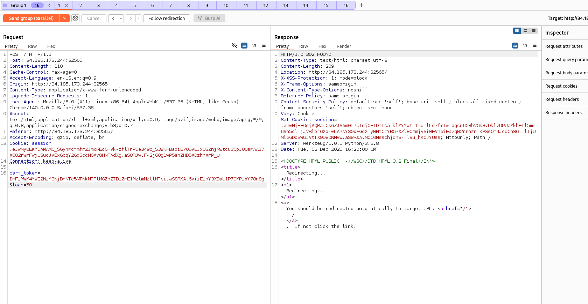
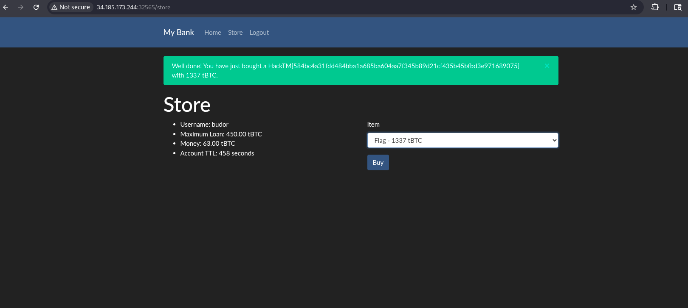

# Write-up: 
##  my-bank

**Category:** Web
**Platform:** CyberEdu
**URL:** `https://app.cyber-edu.co/challenges/55f21ce0-7f21-11ea-a10a-117aa12fee20`

---

This challenge is a classic `Race Condition` vulnerability.
The server has a tiny gap between checking if I used all my loan posibility and updating my account with the new loan.

I have to send multiple requests in parallel so I can abuse the server's vuln and then buy the flag.

Now we can buy the flag!

