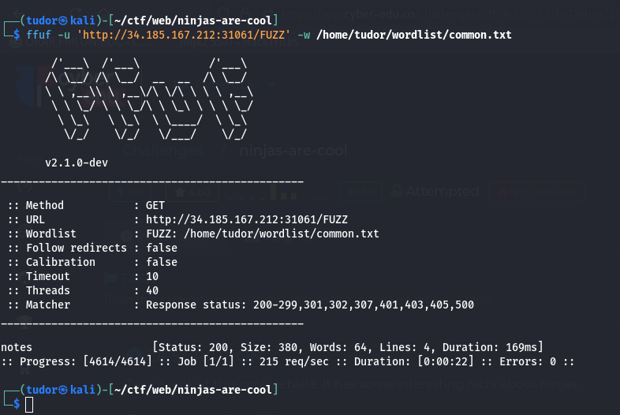
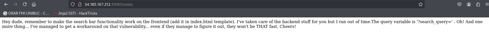
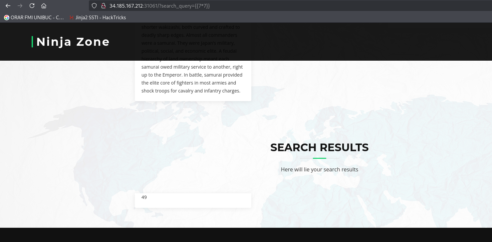
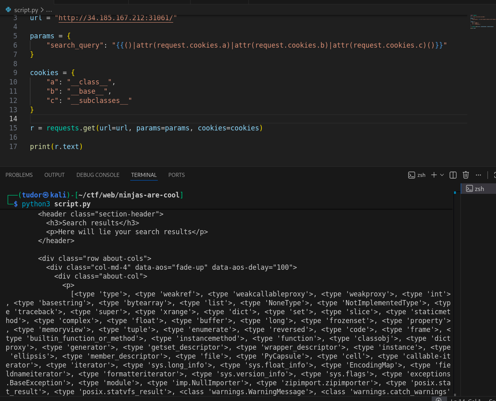
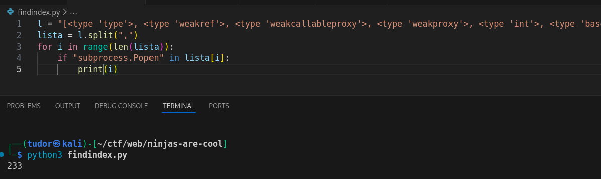
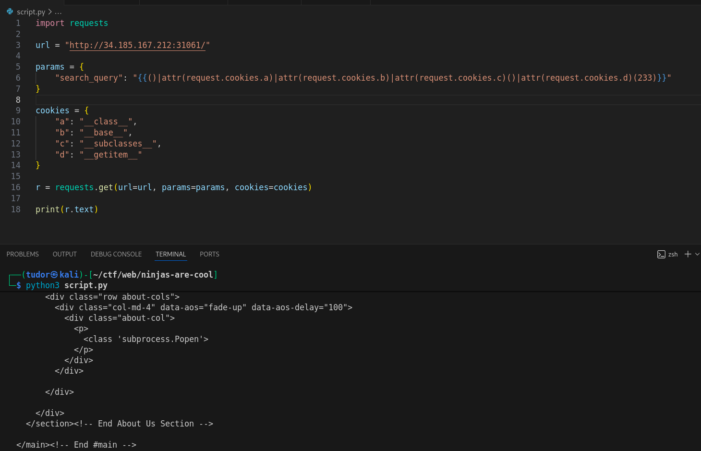
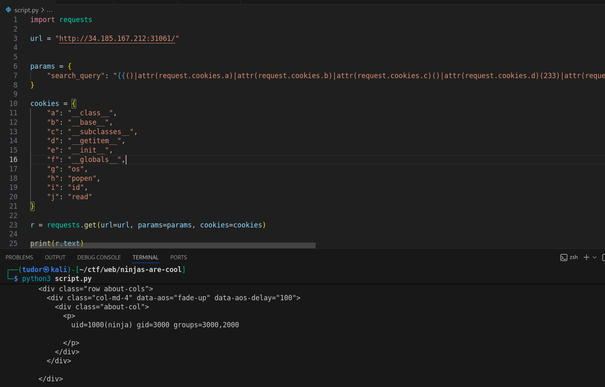
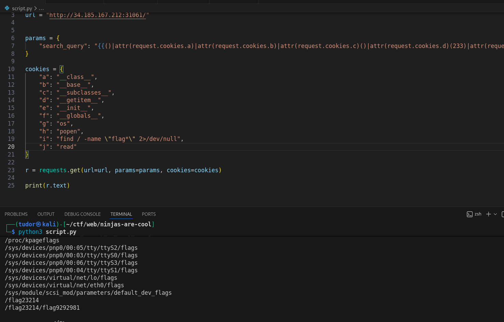
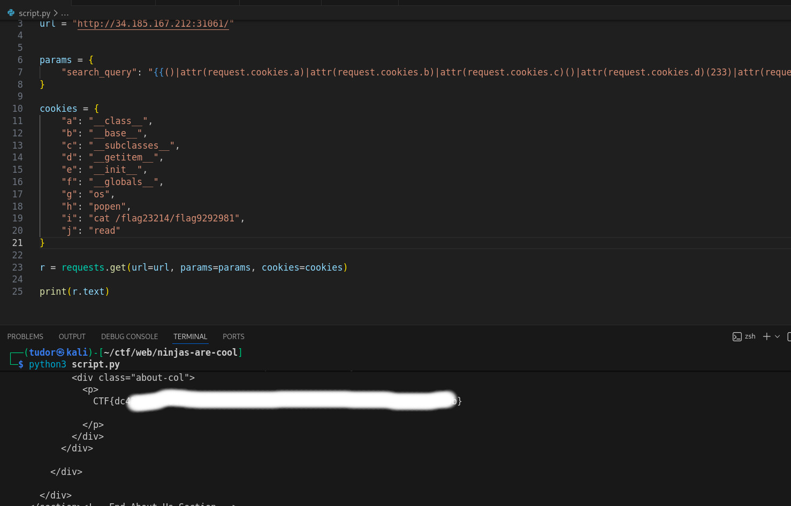

# Write-up: 
##  ninjas-are-cool

**Category:** Web
**Platform:** CyberEdu
**URL:** `https://app.cyber-edu.co/challenges/9fb1b330-137b-11eb-a72d-65d45aeb475b`

---

First, I did some fuzzing on directories and fount the "notes" page which tells us about the search functionality.

The server outputs at the end of the page, the value of the param "search_query":

Let's see if this application is vulnerable to `SSTI`(Server Side Template Injection):

There it is our vulnerability! Looks like a Jinja2 template engine. I'll try to find my way to a shell on the remote server by exploiting the python class inheritance.

The server blocks `__`. To get through their security, I'll send the strings "__class__", "__subclasses__" etc in the cookies and I will access them in the url. (I can also send the strings int the params and access them via request.args.NameOfTheArg).

Since the server also blocks `[]`, I will access the attributes with `attr` function.
Ex:
`?search_query={{()|attr(request.cookies.a)}}`.

I wrote a python script to receive the subclasses from the main class `object`:

The most powerful class from the subclasses is `<class 'subprocess.Popen'>`
We need its index in the list of all subclasses:

Since i can't use [] to access `__subclasses__()[233]` , I'll use the equivalent in python `__getitem__`.

`__init__.__globals__['os'].popen('command').read()`

The subprocess module needs to interact with the operating system. Therefore, it uses the `os` module(included in __globals__).

`os.popen(cmd)` executes the cmd and returns a file object. I used read() => it forces the exec of the cmd and reads the output buffer
I tried to run the cmd "id" and it worked:

I searched for "flag*" in the entire file system and got something:

There it is the flag!

