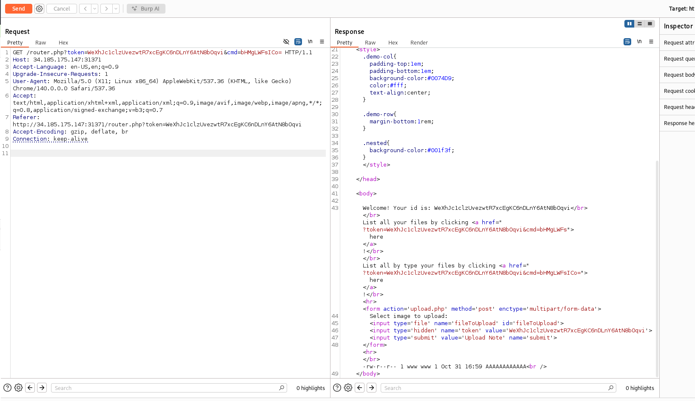
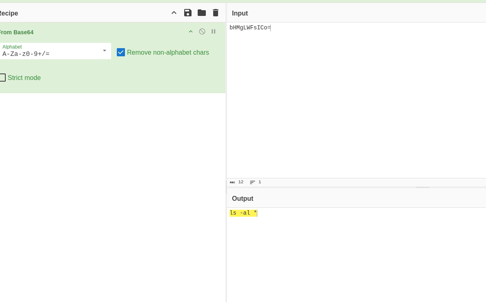
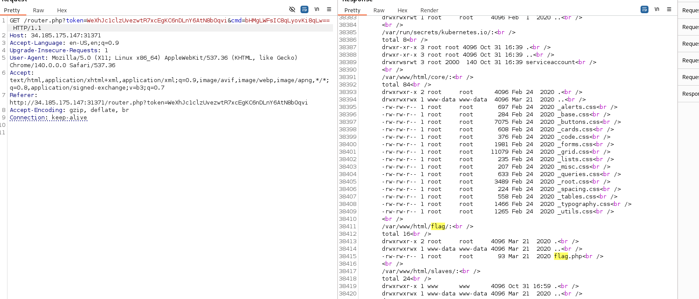
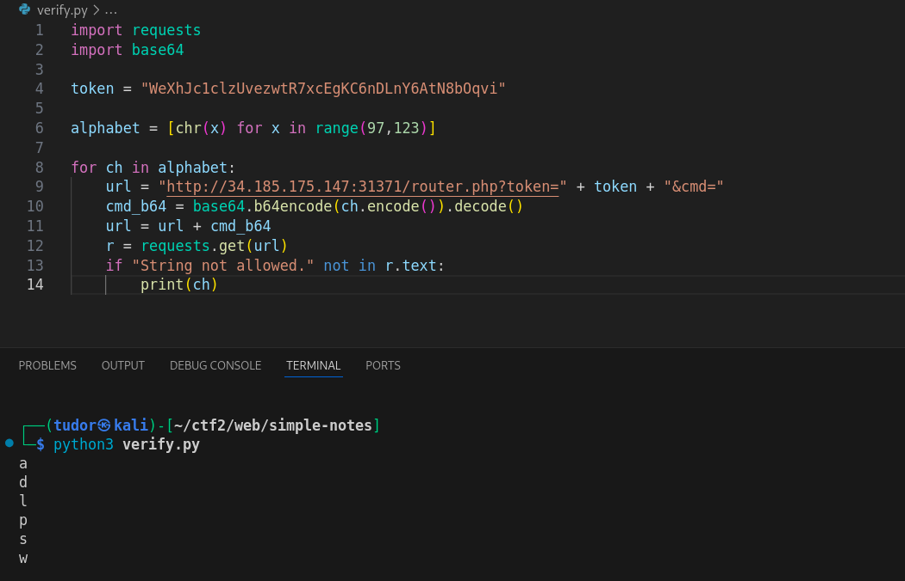
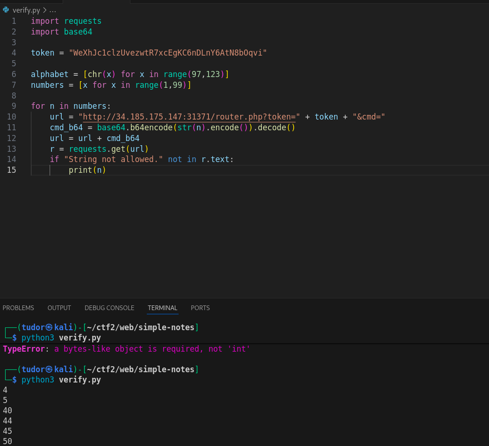
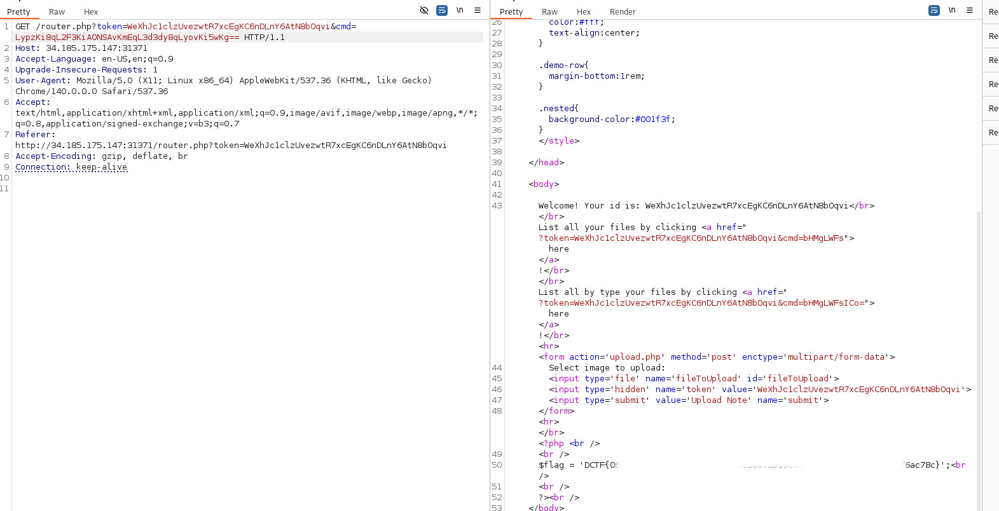

# Write-up: 
##  simple-notes

**Category:** Web
**Platform:** CyberEdu
**URL:** `https://app.cyber-edu.co/challenges/55db65a0-7f21-11ea-9951-01c1949481f1`

---

We get access to a simple web applicatin, where each user gets his own sandbox where he can upload small files and list them.

As we can see in this photo, I catched the request that is listing all the files I uploaded by type.

This GET request contains the `cmd` parameter with value `bHMgLWFsICo=`.
I decoded it from base64 and found that the command used is `ls -al *`.

The listing option from above only contains `ls -al`, so all the characters we can work with are `l s a - *`.

First I tried the value `ls -al /*/` => `bHMgLWFsIC8qLw==` but it was not deep enough.

Let's try with level 2 deepness `ls -al /*/*` => `bHMgLWFsIC8qLyo=` : we have to dig deeper.

Level 3 deepness `ls -al /*/*/*` => `bHMgLWFsIC8qLyovKg==` : found a `flag` directory in /var/www/html. Let's see what s inside:

Bingo! The flag is in `/var/www/html/flag/flag.php` file!

Now, how will we read the flag?

I ran a python script to find which other caracters are allowed in our request and got : `a d l p s w`

After some researching, one command that can help us is `awk`.  This can be used with wildcards, `aw*`.(cat,less, head).

the command we'll use is : `awk { number > 0} filename`
We will use again a script to find which numbers are allowed:

Let's use 44 for fun(even though every number from there would have worked the same)

the awk command is located in `/usr/bin/awk`, so we will use wildcards for this:

`/*s*/*/aw* 45 /*a*/www/*/*/*.p*` => `LypzKi8qL2F3KiA0NSAvKmEqL3d3dy8qLyovKi5wKg==`

There it is our flag!

