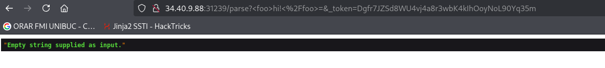
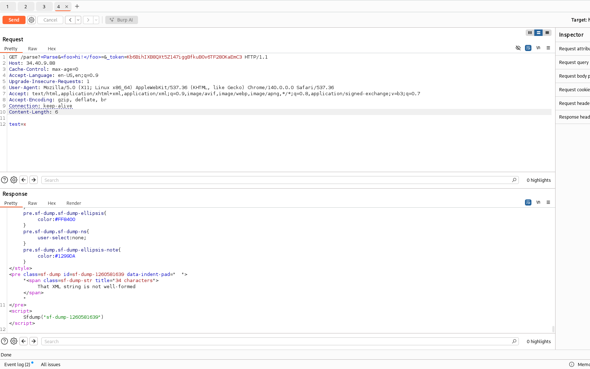
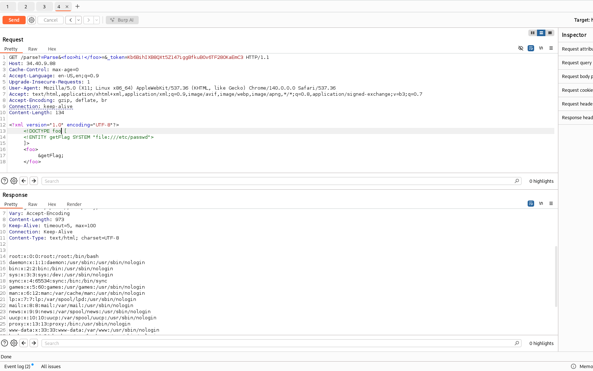
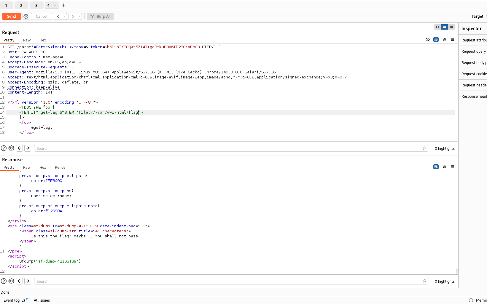
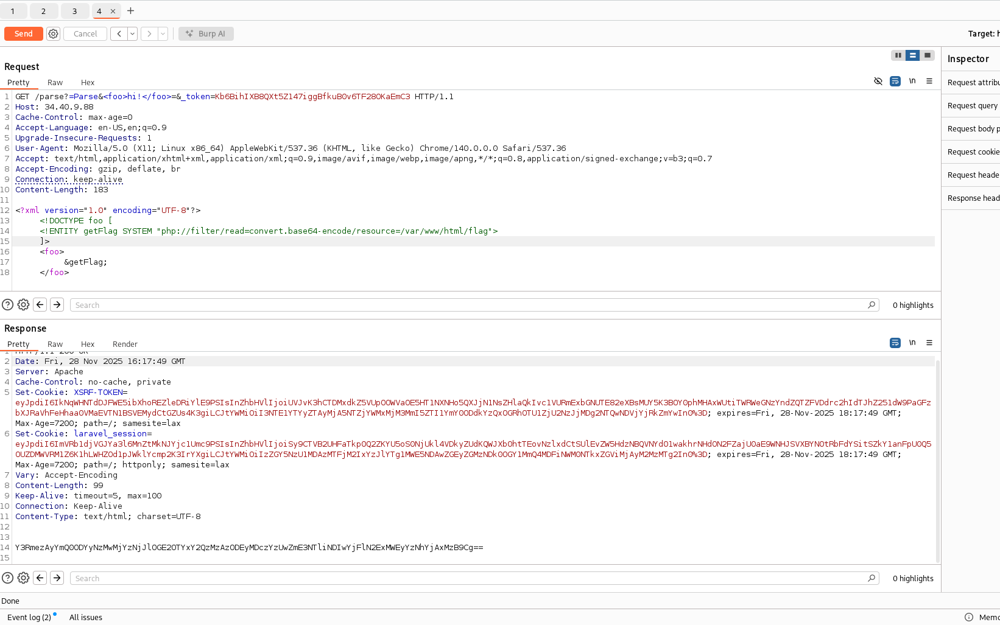
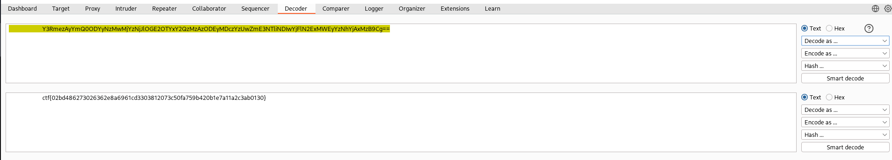

# Write-up: 
##  syntax-check

**Category:** Web
**Platform:** CyberEdu
**URL:** `https://app.cyber-edu.co/challenges/ec7dfd80-347b-11eb-b659-a357e0e69688`

---

I tried assigning a value to `<foo>hi!<%2Ffoo>=` but it didn t return me anything, it looks like the parser doesn't work.

Also, the request is kinda weird, `<foo>` `</foo>`. Those look like XML custom tags.
Maybe the server is running a script that expects XML input?
Let's see what informations we can extract from what we have.

After a lot of time searching for vulns, I got this:

This confirms my idea that the server is expecting XML data and we can navigate further into this challenge by trying `XXE` - `XML External Entity Injection` (https://portswigger.net/web-security/xxe).

I need to send in the request body some injection that retrieves `/var/www/html/flag`.

:( Try harder...

If the flag file contains any special XML characters, for "file://", the XML Parser would fail to interpret those characters and it would cause a syntax error(our case). I'll force the server to turn the content of the file in a safe alphanumeric string before inserting it into the XML tags by using the base64 encoding.

