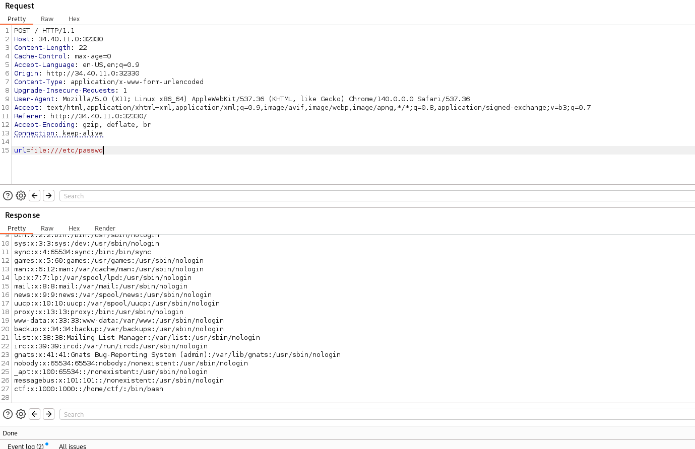
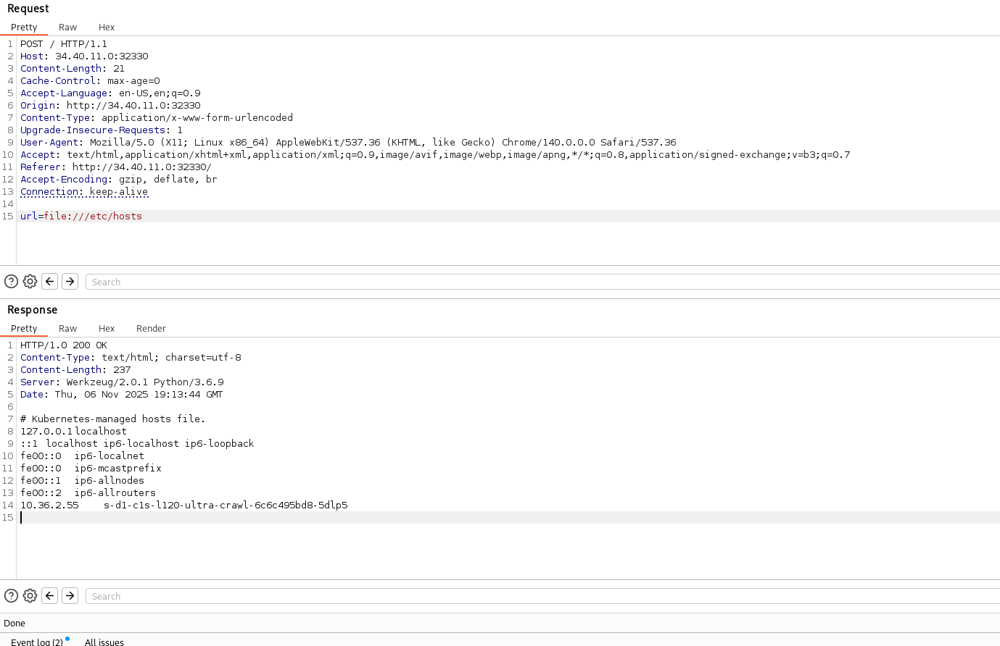
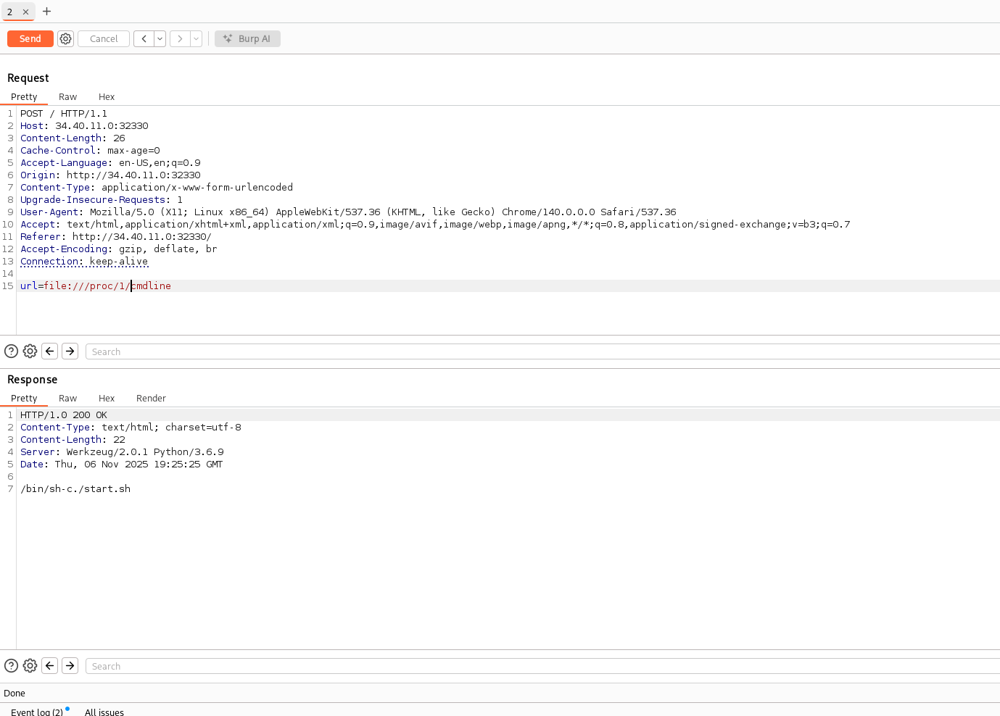
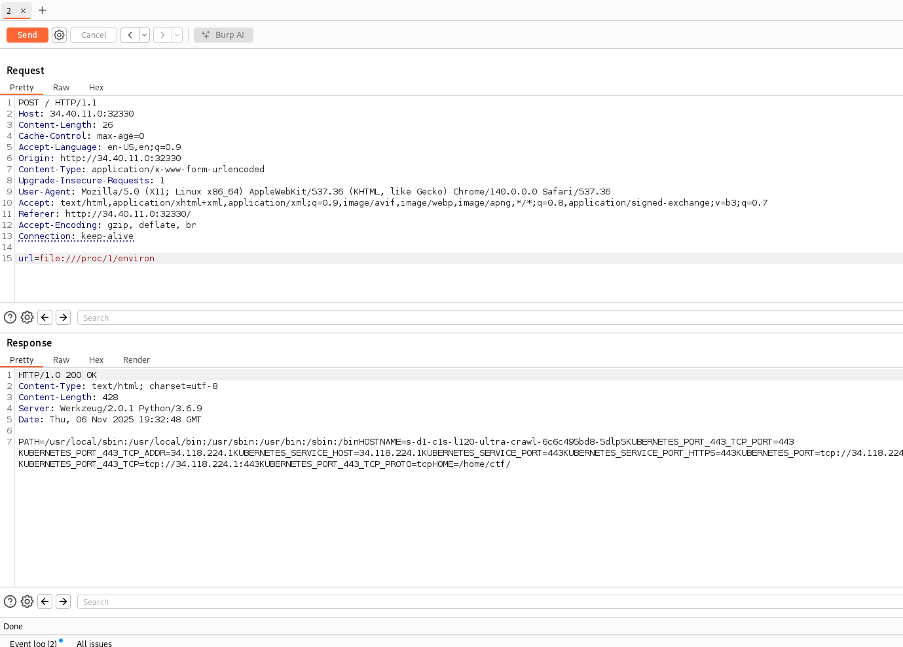
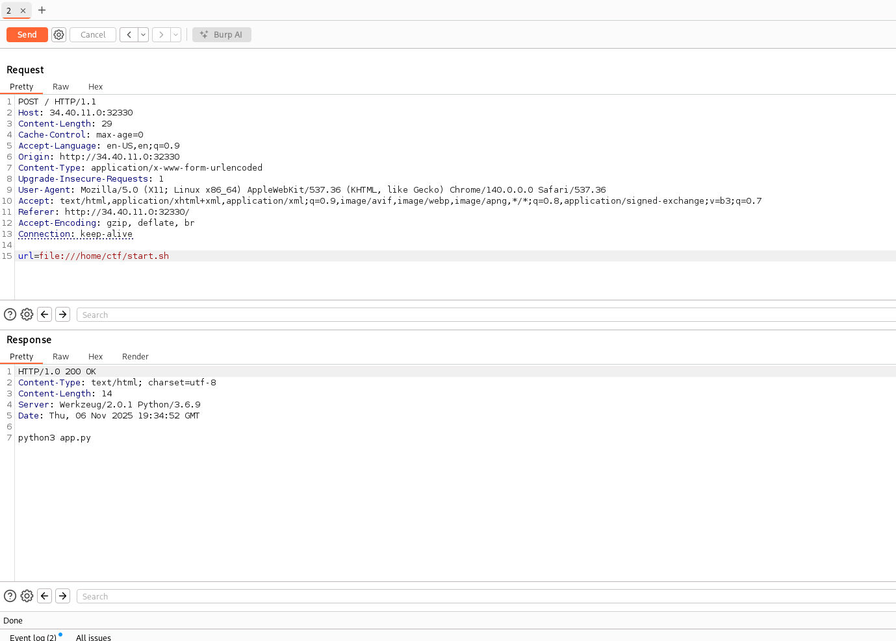
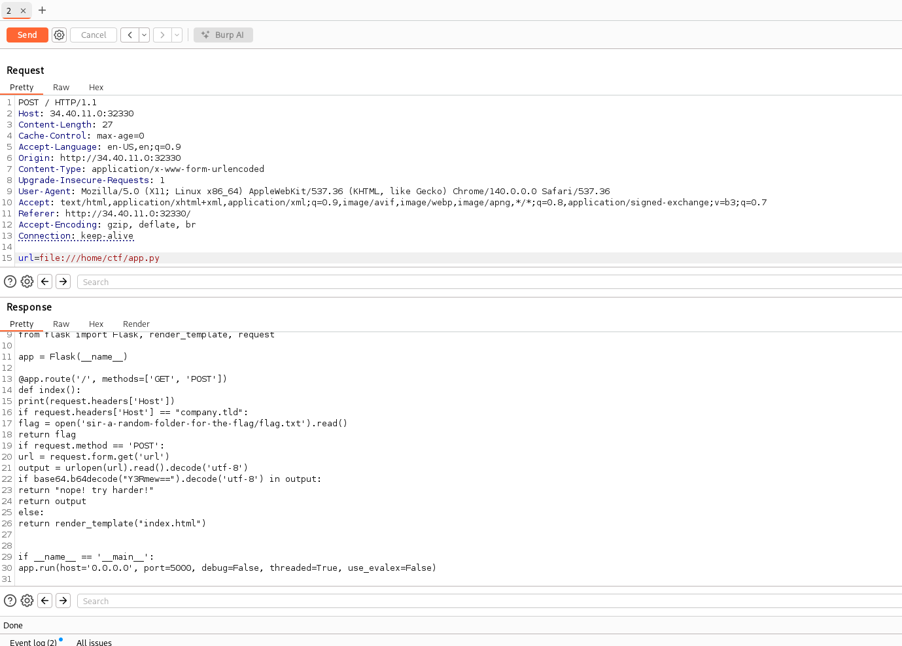
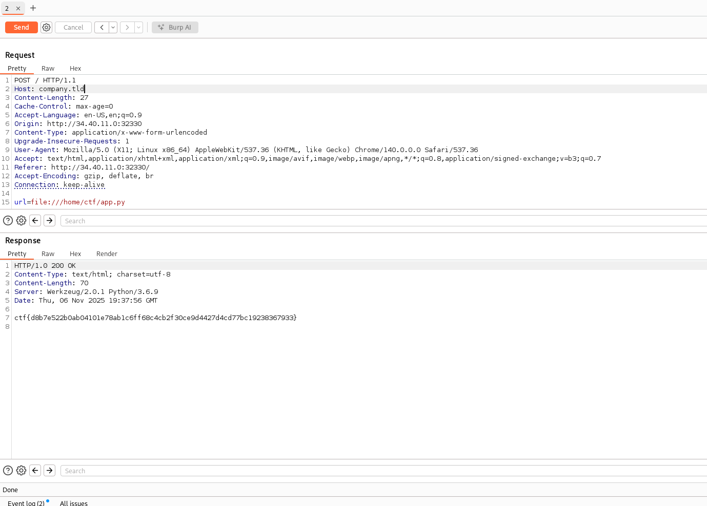

# Write-up: 
##  ultra-crawl

**Category:** Web
**Platform:** CyberEdu
**URL:** `https://app.cyber-edu.co/challenges/068dfcc0-03f6-11ec-a246-a32feca0e192`

---

The way the server acts, it looks like a server-side fetcher. We might have a SSRF exploit, or maybe XSS. Let's pay more attention.

Ok I didn't got anywhere :))))
While doing my best in finding something that leads me to an SSRF, i tested `file:///etc/passwd` and it worked

So we have a local file disclosure. We can see the user named `ctf` with `/home/ctf`. Our flag should be there!

Well, the `flag.txt` file does not exist there, so this it isn't as easy as I thought.

This output confirms the app runs in Kubernetes and gives me an internal IP and pod name to target.

Through the fetcher, I can ask the server process(the web app running in the container) to open URLs. That means I can also fetch besides http, special kernel paths under /proc that the process can read

`/proc` is a virtual filesystem provided by the linux kernel. it doesn't store files on disk - it exposes kernel and process information

`/proc/1/cmdline` = the command line (program + args) used to start PID 1

This tells me exactly how the container is starting the app.

Let's find the working directory of start.sh:

 

BINGO! `/home/ctf` is the cwd for start.sh

That's great! start.sh just runs python3 app.py. Let's read the content of app.py:

Only thing that's left is to modify our Host to 'company.tld' and get our flag!

